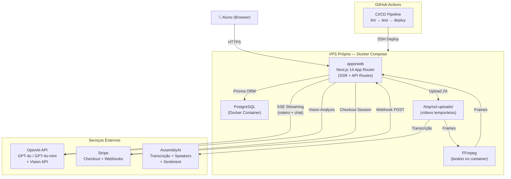
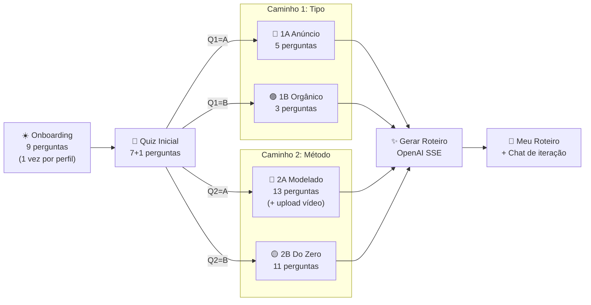
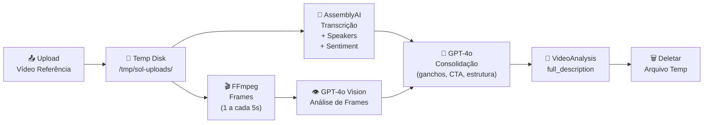

# SOL Fullstack Architecture Document

## Introduction

Este documento define a arquitetura completa do SOL, englobando frontend, backend e infraestrutura. Ele serve como a única fonte de verdade técnica para o desenvolvimento conduzido por agentes de IA, garantindo consistência em todas as camadas da stack. O projeto utiliza uma abordagem monolítica dentro de um monorepo para simplificar o deploy inicial em VPS própria, respeitando o princípio de zero lock-in da Eden Corporate.

### Starter Template or Existing Project

O projeto é baseado em uma estrutura proprietária da Eden Corporate, já inicializada como um monorepo Turborepo. Não foram utilizados templates externos de terceiros.

### Change Log

| Date       | Version | Description                          | Author           |
| ---------- | ------- | ------------------------------------ | ---------------- |
| 2026-02-25 | 1.0     | Initial fullstack architecture draft | Aria (Architect) |
| 2026-02-26 | 2.0     | Novo modelo de precificação: créditos como saldo interno em centavos de real, custo variável por mensagem (tiktoken + cotação USD-BRL), tabela ExchangeRate, metadados de tokens em CreditTransaction, AwesomeAPI como serviço externo | Aria (Architect) |
| 2026-02-26 | 2.1     | Refinamento de schema: User.credits → balanceCents + minBalanceCents, CreditTransaction com inputTokens/outputTokens/costUsd, ExchangeRate com currency+date (@@unique), funções packages/db com assinaturas refinadas | Aria (Architect) |
| 2026-02-27 | 3.0     | Novo modelo de precificação com gate pré-chamada: estimativa de custo máximo (input + MAX_OUTPUT_TOKENS=8192), saldo nunca negativo, remoção de minBalanceCents. Lazy exchange rate (on-demand via AwesomeAPI). CREDIT_PERCENTAGE substitui CREDIT_MARGIN_PERCENT. Funções estimateMaxCost/calculateRealCost. Campo maxOutputTokens em CreditTransaction. Constante MAX_OUTPUT_TOKENS=8192, MIN_COST_CENTS=100. | Aria (Architect) |
| 2026-02-27 | 4.0     | Suporte a anexos no chat (FR11/Story 2.5). Novas dependências: pdf-parse, mammoth, sharp. CreditTransaction com hasAttachments/attachmentTypes/attachmentTokens. POST /api/chat aceita multipart/form-data (retrocompatível com JSON). calculateImageCost() em token-counter.ts. Workflow atualizado com file processing. Runtime nodejs obrigatório. addCredits exchangeRate tornado obrigatório. | Aria (Architect) |
| 2026-02-28 | 5.0     | Admin Console (FR12/Story 4.2). Enum TransactionType adiciona `adjustment`. CreditTransaction ganha `grossAmountCents` (Int?) e `adminEmail` (String?). addCredits() refatorado para union type (purchase | adjustment). Webhook Stripe atualizado para registrar grossAmountCents. Novo módulo packages/db/src/admin.ts com queries de métricas (usuários, uso, financeiras, cotação). Nova rota POST /api/admin/add-credits. Workflow de adição manual de créditos documentado. |
| 2026-03-03 | 6.0     | Refatoração completa do modelo de precificação. Modelo anterior (centavos, câmbio diário, CREDIT_PERCENTAGE, AwesomeAPI) removido. Novo modelo: créditos por tokens (CREDITS_PER_M_INPUT=500, CREDITS_PER_M_OUTPUT=2000), configuráveis via admin (tabela pricing_config). Novas tabelas: PricingConfig, CreditPackage. Tabela ExchangeRate removida. User.balanceCents → User.credits. CreditTransaction: removidos exchangeRate/costUsd/grossAmountCents/maxOutputTokens, adicionados creditsPerMInput/creditsPerMOutput. Funções estimateMaxCost/calculateRealCost → calculateCredits/calculateMaxCredits. lib/pricing.ts substitui lib/exchange-rate.ts. Novas rotas admin: GET/PUT /api/admin/pricing, CRUD /api/admin/packages. Header X-Balance-Cents → X-Credits-Remaining + X-Credits-Used. | Aria (Architect) |
| 2026-03-03 | 7.0     | Evolução quiz-first (PRD v9.0). Novos modelos: OnboardingProfile, QuizSession, QuizAnswer, VideoAnalysis. Conversation ganha quizSessionId (nullable). Quiz engine como configuração estática em TypeScript (48 perguntas, lógica condicional showWhen). Pipeline de vídeo: AssemblyAI + FFmpeg + GPT-4o Vision. Novas rotas: /api/quiz/*, /api/onboarding/*, /api/video/*. 4 system prompts por combinação de caminhos. Docker atualizado com FFmpeg. Novas env vars: ASSEMBLYAI_API_KEY, VIDEO_*. Diagrama Mermaid inclui novos fluxos. Estrutura de pastas expandida com quiz/, video/, onboarding/. | Aria (Architect) |

---

## High Level Architecture

### Technical Summary

O SOL é um SaaS monolítico fullstack construído sobre Next.js 14 com App Router, hospedado em VPS própria via Docker Compose. O modelo de produto é **quiz-first + chat complementar**: o aluno responde um quiz estruturado (48 perguntas, 6 seções, 4 caminhos condicionais) e a IA gera um roteiro de criativo personalizado; o chat permite iterar/refinar depois. Frontend e backend coexistem no mesmo processo — páginas server-rendered em React Server Components e lógica de negócio em API Routes dentro de `apps/web/app/api/`. A camada de dados usa Prisma com PostgreSQL, ambos containerizados. Integrações externas incluem OpenAI (geração de roteiro e chat via SSE streaming, incluindo Vision API para imagens e análise de frames de vídeo), Stripe (pagamentos via Checkout + Webhooks) e AssemblyAI (transcrição de vídeo). O caminho 2A (Vídeo Modelado) suporta upload de vídeo de referência com pipeline de processamento: AssemblyAI (transcrição + speakers + emoção) → FFmpeg (extração de frames) → GPT-4o Vision (análise de frames) → GPT-4o (consolidação estrutural) → descrição textual persistida → vídeo deletado. O chat suporta anexos de arquivos (imagens, PDFs, DOCX, TXT, MD) processados em memória sem persistência. O modelo de precificação usa créditos por tokens: constantes configuráveis via admin (CREDITS_PER_M_INPUT, CREDITS_PER_M_OUTPUT) armazenadas no banco (tabela `pricing_config`). Antes de cada chamada à OpenAI (chat ou geração de roteiro), o backend calcula o custo máximo estimado em créditos e verifica saldo. Saldo nunca fica negativo. Pacotes de créditos configuráveis via admin. O painel administrativo em `/admin` (restrito a `role: ADMIN`) exibe métricas reais e permite gestão de precificação. O monorepo Turborepo com `packages/db` garante tipagem compartilhada.

### Platform and Infrastructure Choice

**Platform:** VPS Própria (Linux)
**Key Services:** Docker, Docker Compose, PostgreSQL 16, Nginx (Reverse Proxy)
**Deployment Host and Regions:** Brasil (São Paulo) para latência mínima.

### Repository Structure

**Structure:** Monorepo
**Monorepo Tool:** Turborepo
**Package Organization:**

- `apps/web`: Next.js application
- `packages/db`: Shared Prisma client and credit logic
- `packages/config`: Shared ESLint/TS configs

### High Level Architecture Diagram



### Quiz → Roteiro Flow Diagram



### Video Processing Pipeline Diagram



### Architectural Patterns

- **Monolith dentro de Monorepo:** Frontend (RSC) e backend (API Routes) no mesmo processo Next.js - _Rationale:_ Elimina complexidade de rede e simplifica deploy no MVP.
- **Server Components First:** Busca de dados via React Server Components - _Rationale:_ Elimina waterfalls de dados no client e melhora o TTFB.
- **Repository Pattern (packages/db):** Lógica física de créditos encapsulada em pacote compartilhado - _Rationale:_ Garante consistência ACID e permite reuso por scripts externos.
- **SSE Streaming:** Respostas da IA (roteiro e chat) via Server-Sent Events - _Rationale:_ Nativo em Next.js e ideal para UX de geração "ao vivo".
- **Webhook Idempotente:** Uso de `stripe_payment_id` UNIQUE - _Rationale:_ Previne crédito duplicado em caso de retentativas do Stripe.
- **Credits-per-Token Pricing:** Gate pré-chamada calcula custo máximo em créditos, verifica saldo e só executa se cobrir. Após streaming, deduz créditos reais. Mínimo: 1 crédito - _Rationale:_ Saldo nunca fica negativo.
- **Admin-Configurable Pricing:** Constantes e pacotes armazenados no banco, editáveis via painel admin - _Rationale:_ Operador ajusta precificação sem deploy.
- **Quiz Engine como Configuração Estática:** As 48 perguntas são definidas em arquivo TypeScript (`lib/quiz/questions.ts`), não no banco de dados. Cada pergunta tem `questionKey`, `section`, `type`, `title`, `options` e `showWhen` (lógica condicional) - _Rationale:_ Perguntas mudam raramente e deploy é necessário para mudanças estruturais. Respostas são armazenadas no banco (QuizAnswer).
- **Temporary Video Processing:** Vídeos armazenados temporariamente em disco e deletados após processamento via `try/finally` - _Rationale:_ Sem necessidade de storage persistente (S3, etc.), a descrição textual é tudo que persiste.
- **Pipeline Assíncrono de Vídeo:** Upload retorna imediatamente, processamento ocorre em background, frontend faz polling de status - _Rationale:_ Processamento leva 30-120 segundos, não pode bloquear a request HTTP.

---

## Tech Stack

| Category           | Technology         | Version           | Purpose                  | Rationale                                              |
| ------------------ | ------------------ | ----------------- | ------------------------ | ------------------------------------------------------ |
| Frontend Language  | TypeScript         | 5.x (strict)      | Toda a codebase          | Type safety end-to-end; `any` proibido                 |
| Frontend Framework | Next.js            | 14 (App Router)   | SSR, routing, API Routes | Monolith fullstack, zero servidor separado             |
| UI Components      | Shadcn/UI          | latest            | Design system            | Customizável, sem lock-in, baseado em Radix            |
| CSS Framework      | Tailwind CSS       | 3.x               | Estilização              | Utilitário-primeiro, integrado ao Shadcn               |
| AI Streaming       | Vercel AI SDK      | latest (lib only) | Streaming SSE no cliente | Abstrai lógica de streaming sem depender da plataforma |
| Backend            | Next.js API Routes | 14                | API REST interna         | Simplicidade e integração nativa com o app             |
| ORM                | Prisma             | 5.x               | Acesso ao banco          | Type-safe, migrations versionadas                      |
| Database           | PostgreSQL         | 16                | Persistência principal   | Self-hosted, production-grade, zero lock-in            |
| Auth               | NextAuth.js        | v5 (Auth.js)      | Sessão e auth            | Credentials Provider, JWT httpOnly                     |
| Payments           | Stripe SDK         | latest            | Checkout + Webhooks      | Gateway robusto com PIX nativo                         |
| Token Counting     | tiktoken           | latest            | Contagem precisa de tokens | Cálculo de custo real por mensagem antes/após chamada OpenAI |
| PDF Extraction     | pdf-parse          | latest            | Extração de texto de PDFs | Leve, sem dependências nativas. PDFs escaneados retornam string vazia (detectado e avisado) |
| DOCX Extraction    | mammoth            | latest            | Extração de texto de DOCX | Requer runtime Node.js (não edge). API Route deve ter `export const runtime = 'nodejs'` |
| Image Dimensions   | sharp              | latest            | Leitura de dimensões de imagens | Cálculo de custo Vision API (tiles 512×512). Requer runtime Node.js |
| Video Transcription| AssemblyAI SDK     | latest            | Transcrição de vídeo     | Transcrição com speakers e sentiment. Epic 7 (caminho 2A) |
| Video Frames       | FFmpeg             | latest            | Extração de frames       | Binário no Docker container (`apt-get install ffmpeg`). 1 frame a cada 5s |
| Infra              | Docker Compose     | latest            | Orquestração             | Simples para monolith em VPS                           |

### Configuration & Constants

**Pricing Constants (armazenadas no banco — tabela `pricing_config`, editáveis via admin):**

| Key                    | Default | Purpose                                                       |
| ---------------------- | ------- | ------------------------------------------------------------- |
| `CREDITS_PER_M_INPUT`  | `500`   | Créditos cobrados por 1M de tokens de input                  |
| `CREDITS_PER_M_OUTPUT` | `2000`  | Créditos cobrados por 1M de tokens de output                 |
| `MAX_OUTPUT_TOKENS`    | `8192`  | Teto de segurança para estimativa de custo máximo e `max_tokens` da OpenAI |

_Nota: Estas constantes NÃO são variáveis de ambiente. São armazenadas no banco e editáveis via painel admin._

**Credit Packages (armazenados no banco — tabela `credit_packages`, editáveis via admin):**

| Package  | Credits | Price (BRL) | priceInCents |
| -------- | ------- | ----------- | ------------ |
| Starter  | 100     | R$29,90     | 2990         |
| Pro      | 500     | R$99,90     | 9990         |
| Max      | 1200    | R$199,90    | 19990        |

**Application Constants (hardcoded):**

| Constant             | Value  | Purpose                                                       |
| -------------------- | ------ | ------------------------------------------------------------- |
| `MAX_FILE_SIZE`      | `10MB` | Tamanho máximo por arquivo anexado (10 × 1024 × 1024 bytes)  |
| `MAX_FILES_PER_MSG`  | `3`    | Máximo de arquivos por mensagem                              |
| `MAX_DOC_CHARS`      | `50000`| Limite de caracteres extraídos por documento (rejeitado se exceder) |

**Video Processing Constants (variáveis de ambiente):**

| Env Var                        | Default             | Purpose                                          |
| ------------------------------ | ------------------- | ------------------------------------------------ |
| `ASSEMBLYAI_API_KEY`           | (obrigatório)       | Chave da API AssemblyAI para transcrição         |
| `VIDEO_MAX_DURATION_SECONDS`   | `300`               | Duração máxima de vídeo (5 minutos)             |
| `VIDEO_MAX_SIZE_MB`            | `500`               | Tamanho máximo de upload                        |
| `VIDEO_TEMP_DIR`               | `/tmp/sol-uploads`  | Diretório temporário no container               |

**Encoding:** `cl100k_base` (tiktoken) — compatível com GPT-4o e GPT-4o-mini.

**MIME Types Permitidos:**

| Categoria | MIME Types |
| --------- | ---------- |
| Imagens   | `image/jpeg`, `image/png`, `image/gif`, `image/webp` |
| Documentos| `application/pdf`, `text/plain`, `text/markdown`, `application/vnd.openxmlformats-officedocument.wordprocessingml.document` |

---

## Data Models

### User

**Purpose:** Representa o aluno autenticado e seu saldo de créditos.

```typescript
interface User {
  id: string; // cuid
  email: string;
  passwordHash: string;
  credits: number; // saldo de créditos (inteiro, nunca negativo — gate garante)
  role: 'USER' | 'ADMIN';
  createdAt: Date;
  updatedAt: Date;
}
```

### Conversation

**Purpose:** Agrupa mensagens em uma sessão de chat.

```typescript
interface Conversation {
  id: string;
  userId: string;
  title: string;
  createdAt: Date;
}
```

### CreditTransaction

**Purpose:** Registro auditável de movimentações de créditos com metadados de consumo completos.

```typescript
interface CreditTransaction {
  id: string;
  userId: string;
  amount: number; // créditos (positivo = compra/adjustment, negativo = consumo)
  type: 'purchase' | 'consumption' | 'adjustment';
  description: string | null;
  stripePaymentId: string | null; // unique — idempotência de webhook (apenas purchase)
  adminEmail: string | null; // email do admin executor (apenas adjustment)
  inputTokens: number | null; // tokens de input consumidos (apenas consumption)
  outputTokens: number | null; // tokens de output consumidos (apenas consumption)
  modelUsed: string | null; // modelo OpenAI utilizado (ex: "gpt-4o", "gpt-4o-mini")
  creditsPerMInput: number | null; // snapshot da config no momento do consumo (auditoria)
  creditsPerMOutput: number | null; // snapshot da config no momento do consumo (auditoria)
  hasAttachments: boolean; // se a mensagem incluiu arquivos (default false)
  attachmentTypes: string[]; // tipos MIME dos arquivos (default [])
  attachmentTokens: number | null; // tokens adicionais gerados pelos arquivos
  pipelineType: string | null;
  assemblyAiCostUsd: number | null;
  elevenLabsCostUsd: number | null;
  videoDurationSeconds: number | null;
  createdAt: Date;
}
```

**Invariantes por tipo:**

| Campo | `purchase` | `consumption` | `adjustment` |
|---|---|---|---|
| `stripePaymentId` | ✅ obrigatório (idempotência) | null | null |
| `adminEmail` | null | null | ✅ obrigatório (auditoria) |
| `inputTokens/outputTokens` | null | ✅ | null |
| `modelUsed` | null | ✅ | null |
| `creditsPerMInput/creditsPerMOutput` | null | ✅ snapshot | null |

### PricingConfig

**Purpose:** Constantes de precificação configuráveis via admin.

```typescript
interface PricingConfig {
  id: string;
  key: string; // unique — ex: "CREDITS_PER_M_INPUT", "CREDITS_PER_M_OUTPUT", "MAX_OUTPUT_TOKENS"
  value: number;
  updatedAt: Date;
  updatedBy: string; // email do admin que alterou
}
```

### CreditPackage

**Purpose:** Pacotes de créditos disponíveis para compra.

```typescript
interface CreditPackage {
  id: string;
  name: string; // ex: "Starter", "Pro", "Max"
  credits: number; // créditos concedidos na compra
  priceInCents: number; // preço em centavos BRL para o Stripe
  active: boolean; // pacotes inativos não aparecem na página de compra
  createdAt: Date;
  updatedAt: Date;
}
```

### OnboardingProfile

**Purpose:** Perfil persistente do aluno — um por produto/nicho. Preenchido uma vez e reutilizado em todas as produções.

```typescript
interface OnboardingProfile {
  id: string;
  userId: string;
  name: string; // nome do produto/nicho (ex: "Curso Pilates na Parede")
  answers: Record<string, string>; // JSON — chave = questionKey (O1-O9), valor = resposta
  createdAt: Date;
  updatedAt: Date;
}
```

### QuizSession

**Purpose:** Uma execução do quiz — vincula onboarding + respostas + caminhos + roteiro gerado.

```typescript
interface QuizSession {
  id: string;
  userId: string;
  onboardingProfileId: string;
  path1: 'AD' | 'ORGANIC'; // Caminho 1: Anúncio Criativo (1A) ou Vídeo Orgânico (1B)
  path2: 'MODELED' | 'FROM_SCRATCH'; // Caminho 2: Vídeo Modelado (2A) ou Do Zero (2B)
  status: 'IN_PROGRESS' | 'COMPLETED' | 'ABANDONED';
  createdAt: Date;
  completedAt: Date | null;
}
```

**Relações:** `quizSession.user`, `quizSession.onboardingProfile`, `quizSession.answers[]`, `quizSession.conversation` (1:1, nullable), `quizSession.videoAnalysis` (1:1, nullable — só em 2A).

### QuizAnswer

**Purpose:** Resposta individual a uma pergunta do quiz.

```typescript
interface QuizAnswer {
  id: string;
  quizSessionId: string;
  section: 'INITIAL' | 'AD_CREATIVE' | 'ORGANIC_VIDEO' | 'MODELED_VIDEO' | 'FROM_SCRATCH_VIDEO';
  questionKey: string; // identificador único (ex: "Q1", "1A.2", "2A.5")
  answerType: 'TEXT' | 'SINGLE_SELECT' | 'MULTI_SELECT' | 'UPLOAD';
  answerValue: string; // valor da resposta (texto ou opção selecionada)
  createdAt: Date;
}
```

### VideoAnalysis

**Purpose:** Resultado do processamento de vídeo no caminho 2A (Vídeo Modelado).

```typescript
interface VideoAnalysis {
  id: string;
  quizSessionId: string;
  quizAnswerId: string; // FK — pergunta de upload (2A.2)
  transcription: string; // output AssemblyAI (transcrição com speakers e sentiment)
  frameDescriptions: string; // output da análise de frames via GPT-4o Vision
  structureAnalysis: string; // output da IA: ganchos, CTA, cortes, tom, técnicas de retenção
  fullDescription: string; // descrição consolidada que alimenta a geração do roteiro
  processingStatus: 'QUEUED' | 'PROCESSING' | 'COMPLETED' | 'FAILED';
  processingTimeMs: number;
  errorMessage: string | null;
  createdAt: Date;
}
```

**Invariante:** `fullDescription` é o campo que alimenta o prompt de geração do roteiro. Contém toda a informação extraída do vídeo em formato textual — o vídeo em si é descartado após processamento.

### Conversation (atualizado v9.0)

**Purpose:** Agrupa mensagens em um roteiro/conversa. Agora pode ser vinculado a um quiz.

```typescript
interface Conversation {
  id: string;
  userId: string;
  title: string;
  quizSessionId: string | null; // FK, nullable — null = chat livre (sem quiz)
  createdAt: Date;
}
```

---

## API Specification

### Chat API

`POST /api/chat`

- **Auth:** Requerido
- **Runtime:** `export const runtime = 'nodejs'` (obrigatório para mammoth e sharp)
- **Content-Type:** Aceita dois formatos (retrocompatível):
  - `application/json`: `{ conversationId?: string, message: string }` — fluxo sem anexos (existente, intocado)
  - `multipart/form-data`: campos `message` (string), `conversationId` (string?), `files` (File[], max 3) — fluxo com anexos
- **Detecção:** Via header `Content-Type`. Se JSON → fluxo existente sem alteração.
- **Response:** `text/event-stream` (SSE)
- **Headers de resposta:** `X-Credits-Remaining` (saldo de créditos após dedução), `X-Credits-Used` (créditos gastos na mensagem)
- **Status 400:** Retornado quando arquivo inválido (tipo MIME não permitido, >10MB, >50k chars, PDF escaneado sem texto)
- **Status 402:** Retornado quando `user.credits` é insuficiente para cobrir o custo máximo estimado em créditos (inputTokens/1M × CREDITS_PER_M_INPUT + MAX_OUTPUT_TOKENS/1M × CREDITS_PER_M_OUTPUT). O gate garante que o saldo cobre o pior caso antes de executar a chamada OpenAI.

#### Fluxo com Anexos (multipart/form-data)

1. Receber FormData: `message`, `conversationId`, `files` (max 3)
2. Validar cada arquivo: tipo MIME contra allowlist, tamanho ≤ 10MB. Se inválido → 400 com mensagem identificando qual arquivo e por quê
3. Processar cada arquivo:
   - **Imagem:** ler dimensões via sharp, calcular custo Vision via `calculateImageCost()`
   - **PDF:** extrair texto via pdf-parse. Se texto vazio → 400: "Este PDF não contém texto legível. Envie como imagem ou digite o conteúdo."
   - **DOCX:** extrair texto via mammoth
   - **TXT/MD:** ler conteúdo do buffer diretamente
4. Validar conteúdo extraído: se > 50.000 chars → 400: "Documento muito grande. Máximo: ~25 páginas de texto." (nunca truncar)
5. Calcular `totalInputTokens` = tokens das mensagens + tokens do texto extraído (tiktoken) + tokens fixos de imagens (Vision)
6. Determinar modelo: se há imagem → forçar `model = 'gpt-4o'` (Vision requer modelo completo); se não → lógica existente
7. Gate: `calculateMaxCredits(totalInputTokens, config)` — usa config do banco
8. Montar payload OpenAI: imagens como `content[].type: "image_url"` (base64 inline, detail "auto"); documentos como prefixo no texto: `[Documento: {filename}]\n{text}\n\n{message}`
9. Streaming SSE normal → dedução real com metadata: `hasAttachments: true`, `attachmentTypes`, `attachmentTokens`, `creditsPerMInput`, `creditsPerMOutput`

### Pricing Functions (apps/web/src/lib/pricing.ts)

_Substitui toda lógica de cotação cambial. Sem dependência externa._

**`getPricingConfig(): Promise<PricingConfig>`**

```typescript
interface PricingConfig {
  creditsPerMInput: number
  creditsPerMOutput: number
  maxOutputTokens: number
}
```

- Busca constantes da tabela `pricing_config` no banco
- Cache em memória de 60 segundos para evitar query a cada mensagem
- Retorna objeto tipado com as 3 constantes

**`calculateCredits(inputTokens, outputTokens, config): number`**

- Calcula créditos para consumo real: `Math.max(1, Math.ceil((inputTokens/1e6) * config.creditsPerMInput + (outputTokens/1e6) * config.creditsPerMOutput))`
- Mínimo: 1 crédito por mensagem

**`calculateMaxCredits(inputTokens, config): number`**

- Calcula gate (custo máximo estimado): `Math.max(1, Math.ceil((inputTokens/1e6) * config.creditsPerMInput + (config.maxOutputTokens/1e6) * config.creditsPerMOutput))`
- Usa `maxOutputTokens` do config como teto de segurança

### Credit Functions (apps/web/src/lib/credits.ts)

**`deductCredits(userId, credits, metadata)`**

```typescript
deductCredits(
  userId: string,
  credits: number,
  metadata: {
    inputTokens: number;
    outputTokens: number;
    modelUsed: string;
    creditsPerMInput: number;   // snapshot da config
    creditsPerMOutput: number;  // snapshot da config
    conversationTitle?: string;
    hasAttachments?: boolean;
    attachmentTypes?: string[];
    attachmentTokens?: number;
    pipelineType?: PipelineType;
    assemblyAiCostUsd?: number;
    elevenLabsCostUsd?: number;
    videoDurationSeconds?: number;
  }
): Promise<{ credits: number }>
```

- Executa em `$transaction` atômica: UPDATE atômico com `WHERE credits >= ${credits}`, insert `CreditTransaction`
- Saldo nunca fica negativo — o gate pré-chamada já garantiu cobertura do pior caso
- Lança `InsufficientBalanceError` se UPDATE não afeta nenhuma row

**`addCredits(userId, credits, options)`**

```typescript
type AddCreditsOptions =
  | {
      type: 'purchase'
      stripePaymentId: string   // obrigatório — idempotência via UNIQUE
    }
  | {
      type: 'adjustment'
      adminEmail: string        // obrigatório — auditoria
      description: string       // motivo do ajuste
    }

addCredits(
  userId: string,
  credits: number,
  options: AddCreditsOptions
): Promise<{ credits: number }>
```

- Executa em `$transaction` atômica: increment `credits`, insert `CreditTransaction`
- **`purchase`:** `credits` = número exato do pacote comprado. Idempotente via `stripePaymentId` UNIQUE. Sem conversão, sem porcentagem
- **`adjustment`:** adição manual pelo admin. Sem `stripePaymentId`. Registra `adminEmail` e `description`. Sem idempotência por design (admin confirma antes de executar)

### Token Counting Functions (packages/db)

**`calculateImageCost(width, height, detail)`**

```typescript
calculateImageCost(
  width: number,
  height: number,
  detail: 'low' | 'high' | 'auto'
): number // tokens
```

- `detail = 'low'`: sempre 85 tokens fixos
- `detail = 'high'`:
  1. Redimensionar para caber em 2048×2048 (escalar pela maior dimensão)
  2. Escalar para que menor dimensão = 768
  3. Calcular tiles de 512×512: `Math.ceil(scaledWidth / 512) × Math.ceil(scaledHeight / 512)`
  4. Custo = `(tiles × 170) + 85`
- `detail = 'auto'`: usar `'high'` se qualquer dimensão > 512, `'low'` caso contrário

_Nota: Esta função é adicionada em `packages/db/src/token-counter.ts` junto com as funções existentes de custo de texto._

### Payments API

`POST /api/payments/checkout`

- **Request:** `{ packageId: string }`
- **Lógica:**
  1. Buscar pacote ativo pelo `packageId` na tabela `credit_packages` → 404 se não encontrado ou inativo
  2. Criar sessão Stripe Checkout com `package.priceInCents`
  3. Metadata da sessão inclui `packageId` e `credits` para o webhook identificar o pacote
- **Response:** `{ sessionUrl: string }`

### Admin API

#### `POST /api/admin/add-credits`

- **Auth:** Requerido + `role: ADMIN` (verificado server-side — 403 se ausente ou insuficiente)
- **Request:** `{ userEmail: string, credits: number, reason: string }` (validação Zod)
  - `userEmail`: string email válido
  - `credits`: número inteiro positivo (créditos, não reais)
  - `reason`: string mínimo 3 caracteres
- **Lógica:**
  1. Verificar session e `role: ADMIN` → 403 se não
  2. Buscar usuário pelo `userEmail` → 404 se não encontrado
  3. `addCredits(userId, credits, { type: 'adjustment', adminEmail, description: "Ajuste manual por [adminEmail]: [reason]" })`
- **Response 200:** `{ success: true, userEmail, addedCredits, newCredits }`
- **Response 403:** Admin não autenticado
- **Response 404:** Usuário não encontrado

#### `GET /api/admin/pricing`

- **Auth:** Requerido + `role: ADMIN`
- **Response:** `{ config: PricingConfig, packages: CreditPackage[] }`
- Retorna pricing config atual e todos os pacotes (ativos e inativos)

#### `PUT /api/admin/pricing`

- **Auth:** Requerido + `role: ADMIN`
- **Request:** `{ creditsPerMInput?: number, creditsPerMOutput?: number, maxOutputTokens?: number }`
- Atualiza `pricing_config` no banco, registra `updatedBy` (email do admin)
- **Response 200:** `{ success: true, config: PricingConfig }`

#### `GET /api/admin/packages`

- **Auth:** Requerido + `role: ADMIN`
- **Response:** `{ packages: CreditPackage[] }` — todos os pacotes (ativos e inativos)

#### `POST /api/admin/packages`

- **Auth:** Requerido + `role: ADMIN`
- **Request:** `{ name: string, credits: number, priceInCents: number }`
- Cria novo pacote (ativo por default)
- **Response 201:** `{ package: CreditPackage }`

#### `PUT /api/admin/packages/[id]`

- **Auth:** Requerido + `role: ADMIN`
- **Request:** `{ name?: string, credits?: number, priceInCents?: number, active?: boolean }`
- Atualiza pacote existente (incluindo ativar/desativar)
- **Response 200:** `{ package: CreditPackage }`

#### `/admin` (Server Component Page)

- **Auth:** Verificação de `role: ADMIN` no Server Component → redirect `/chat` se não autorizado
- **Carregamento de dados:** `Promise.all([...queries])` para carregar todas as métricas em paralelo
- **Módulo de queries:** `packages/db/src/admin.ts`

### Admin Metrics Queries (packages/db/src/admin.ts)

Funções tipadas para alimentar o painel `/admin` via Server Components.

```typescript
// Métricas de Usuários
getUserMetrics(): Promise<{
  totalUsers: number
  activeUsers7d: number           // ≥1 mensagem nos últimos 7 dias
  usersWithoutCredits: number     // credits = 0
  newUsers30d: number
}>

getUsersPage(page: number, pageSize: 20): Promise<{
  users: Array<{ email, credits, totalMessages, createdAt }>
  total: number
}>

// Métricas de Uso
getUsageMetrics(): Promise<{
  totalMessages: number
  messagesToday: number
  messages7d: number
  totalInputTokens: number
  totalOutputTokens: number
  topModel: string
  topModelPercent: number
  avgTokensPerMessage: number
  messagesWithAttachments: number
  messagesWithoutAttachments: number
}>

// Métricas Financeiras
// Receita calculada via JOIN credit_transactions (type=purchase) com credit_packages para obter priceInCents
// Custo OpenAI estimado via tokens consumidos e pricing da API OpenAI
getFinancialMetrics(): Promise<{
  totalRevenueCents: number      // JOIN com credit_packages para obter priceInCents dos pacotes vendidos
  revenue30dCents: number
  estimatedOpenAICostUsd: number // estimado via tokens × pricing API OpenAI
  grossProfitCents: number       // revenue - estimatedCost (convertido para centavos)
  grossMarginPercent: number     // (profit / revenue) × 100
  markupPercent: number          // (revenue / cost) × 100
  creditsSold: number            // SUM(amount) WHERE type = 'purchase'
  creditsConsumed: number        // SUM(ABS(amount)) WHERE type = 'consumption'
  totalRetainedCredits: number   // SUM(credits) todos os usuários
}>
```

### Onboarding API

#### `GET /api/onboarding`

- **Auth:** Requerido
- **Response:** `{ profiles: OnboardingProfile[] }` — todos os perfis do usuário autenticado

#### `POST /api/onboarding`

- **Auth:** Requerido
- **Request:** `{ name: string, answers: Record<string, string> }` (validação Zod — todas as 9 perguntas obrigatórias)
- **Lógica:** Cria OnboardingProfile vinculado ao usuário
- **Response 201:** `{ profile: OnboardingProfile }`

#### `PUT /api/onboarding/[id]`

- **Auth:** Requerido (+ verificação que perfil pertence ao usuário)
- **Request:** `{ name?: string, answers?: Record<string, string> }`
- **Response 200:** `{ profile: OnboardingProfile }`

#### `DELETE /api/onboarding/[id]`

- **Auth:** Requerido (+ verificação que perfil pertence ao usuário)
- **Response 200:** `{ success: true }`

### Quiz API

#### `POST /api/quiz`

- **Auth:** Requerido
- **Request:** `{ onboardingProfileId: string }`
- **Lógica:** Cria QuizSession com status `IN_PROGRESS`, vinculada ao perfil de onboarding
- **Response 201:** `{ session: QuizSession }`

#### `GET /api/quiz/session/[id]`

- **Auth:** Requerido (+ verificação que session pertence ao usuário)
- **Response:** `{ session: QuizSession, answers: QuizAnswer[], videoAnalysis?: VideoAnalysis }`
- Retorna estado atual do quiz com respostas já dadas

#### `POST /api/quiz/answer`

- **Auth:** Requerido
- **Request:** `{ quizSessionId: string, questionKey: string, section: string, answerType: string, answerValue: string }`
- **Lógica:**
  1. Valida que questionKey é válida para a section
  2. Upsert: se resposta já existe para esse questionKey, atualiza; senão, insere
  3. Se questionKey é Q1 → atualiza `path1` na QuizSession (AD ou ORGANIC)
  4. Se questionKey é Q2 → atualiza `path2` na QuizSession (MODELED ou FROM_SCRATCH)
- **Response 200:** `{ answer: QuizAnswer, nextQuestion?: QuestionDefinition }`

#### `POST /api/quiz/generate`

- **Auth:** Requerido
- **Request:** `{ quizSessionId: string }`
- **Lógica:**
  1. Carrega: OnboardingProfile + todas as QuizAnswers + VideoAnalysis (se 2A)
  2. Monta prompt estruturado com system prompt específico por combinação de caminhos
  3. Conta `totalInputTokens` via tiktoken
  4. `getPricingConfig()` → `calculateMaxCredits(totalInputTokens, config)` → verifica saldo
  5. Se cobre → chama OpenAI com streaming SSE
  6. Cria Conversation com `quizSessionId`, primeira mensagem = roteiro gerado
  7. Marca QuizSession como `COMPLETED`
  8. Deduz créditos reais via `deductCredits()`
- **Response:** `text/event-stream` (SSE) — headers: `X-Credits-Remaining`, `X-Credits-Used`, `X-Conversation-Id`
- **Status 402:** Saldo insuficiente

### Video API

#### `POST /api/video/upload`

- **Auth:** Requerido
- **Request:** `multipart/form-data` com campo `video` (File) e `quizSessionId` (string)
- **Lógica:**
  1. Valida: tipo (mp4, mov, avi, webm), tamanho ≤ 500MB
  2. Salva em `VIDEO_TEMP_DIR` com nome único
  3. Cria VideoAnalysis com status `QUEUED`
  4. Inicia processamento assíncrono (não bloqueia resposta)
- **Response 201:** `{ videoAnalysisId: string, status: 'QUEUED' }`

#### `GET /api/video/status/[id]`

- **Auth:** Requerido (+ verificação que análise pertence ao usuário)
- **Response:** `{ id, status, processingTimeMs?, errorMessage? }`
- Frontend faz polling deste endpoint a cada 3 segundos durante processamento

### Quiz Engine (lib/quiz/questions.ts)

Definição estática das 48 perguntas em TypeScript:

```typescript
interface QuestionDefinition {
  questionKey: string;        // ex: "O1", "Q1", "1A.2", "2A.5"
  section: QuizSection;       // ONBOARDING | INITIAL | AD_CREATIVE | ORGANIC_VIDEO | MODELED_VIDEO | FROM_SCRATCH_VIDEO
  type: 'TEXT' | 'SINGLE_SELECT' | 'MULTI_SELECT' | 'UPLOAD';
  title: string;              // texto da pergunta
  example?: string;           // placeholder/exemplo
  options?: Array<{ key: string; label: string }>;
  required: boolean;
  showWhen?: {                // lógica condicional
    questionKey: string;      // ex: "Q3"
    value: string;            // ex: "B" (sem aparecer)
  };
}

// Exemplo de lógica condicional:
// Q3.1 tem showWhen: { questionKey: "Q3", value: "B" }
// → Só aparece quando Q3 = "Sem aparecer"
```

### Quiz Prompt Builder (lib/quiz/prompt-builder.ts)

Monta o prompt estruturado para geração do roteiro:

```typescript
buildQuizPrompt(
  onboardingProfile: OnboardingProfile,
  quizAnswers: QuizAnswer[],
  videoAnalysis?: VideoAnalysis
): { systemPrompt: string; userPrompt: string }
```

- 4 system prompts diferentes por combinação: `AD_MODELED`, `AD_FROM_SCRATCH`, `ORGANIC_MODELED`, `ORGANIC_FROM_SCRATCH`
- System prompt inclui: contexto do onboarding, respostas do quiz, análise do vídeo (se 2A)
- User prompt: instrução para gerar roteiro completo

### Video Processor (lib/video/processor.ts)

Orquestra o pipeline de processamento de vídeo:

```typescript
processVideo(
  videoPath: string,
  videoAnalysisId: string
): Promise<void>
```

1. Atualiza status → `PROCESSING`
2. `AssemblyAI.transcribe(videoPath)` → transcrição com speakers + sentiment
3. `FFmpeg.extractFrames(videoPath, interval=5)` → array de frame paths
4. `OpenAI.analyzeFrames(framePaths)` → descrição visual via GPT-4o Vision
5. `OpenAI.consolidate(transcription, frameDescriptions)` → análise estrutural (ganchos, CTA, cortes, tom)
6. Salva tudo no VideoAnalysis → status `COMPLETED`
7. `try/finally` → deleta arquivo de vídeo e frames temporários
8. Se qualquer etapa falhar → status `FAILED` com `errorMessage`
9. Timeout total: 3 minutos

---

## Core Workflows

### Chat & Credit Deduction (Credits per Token)

1. Aluno envia mensagem (com ou sem anexos).
2. **Detecção de formato:** Content-Type `application/json` → fluxo sem anexos; `multipart/form-data` → fluxo com anexos.
3. **[Se anexos]** Validar arquivos: tipo MIME contra allowlist, tamanho ≤ 10MB, máximo 3 arquivos.
4. **[Se anexos]** Processar cada arquivo em memória:
   - **Imagem:** ler dimensões via sharp, calcular tokens Vision via `calculateImageCost(width, height, 'auto')`.
   - **PDF:** extrair texto via pdf-parse. Se vazio → 400 (PDF escaneado).
   - **DOCX:** extrair texto via mammoth.
   - **TXT/MD:** ler buffer diretamente.
   - Validar: se > 50.000 chars → 400 (rejeitado, nunca truncado).
5. **[Se anexos com imagem]** Forçar `model = 'gpt-4o'` (Vision API requer modelo completo).
6. Backend monta contexto: system prompt + resumo das últimas 10 mensagens + mensagem nova + conteúdo extraído de documentos.
7. Conta `totalInputTokens` via `tiktoken`: tokens de mensagens + tokens de texto extraído + tokens fixos de imagens (Vision).
8. Busca pricing config: `const config = await getPricingConfig()` (cache 60s).
9. Calcula custo máximo em créditos: `const maxCredits = calculateMaxCredits(totalInputTokens, config)`.
10. **GATE:** `user.credits >= maxCredits`? Se **não** → retorna `402 Payment Required`, exibe prompt inline.
11. Se **cobre** → monta payload OpenAI (imagens como `image_url` base64, documentos como prefixo textual), chama com `max_tokens: config.maxOutputTokens`, streaming SSE.
12. Stream completo → calcula créditos reais: `const creditsUsed = calculateCredits(totalInputTokens, outputTokensReais, config)`.
13. Deduz créditos **reais** via `deductCredits(userId, creditsUsed, { inputTokens, outputTokens, modelUsed, creditsPerMInput: config.creditsPerMInput, creditsPerMOutput: config.creditsPerMOutput, conversationTitle, hasAttachments, attachmentTypes, attachmentTokens })`.
14. `CreditTransaction` registrada com todos os campos de auditoria (incluindo snapshot de config e anexos) dentro da mesma `$transaction`.
15. Saldo nunca fica negativo — gate garantiu cobertura do pior caso, créditos reais ≤ estimados.
16. Retorna headers `X-Credits-Remaining` (saldo após dedução) e `X-Credits-Used` (créditos gastos).
17. Buffers dos arquivos descartados — nenhuma persistência em disco, S3 ou banco.

### Purchase & Credit Addition (Stripe)

1. Aluno escolhe pacote na página `/credits` (pacotes carregados da tabela `credit_packages`).
2. `POST /api/payments/checkout` busca pacote ativo pelo `packageId`, cria sessão Stripe com `package.priceInCents` e metadata `{ packageId, credits }`.
3. Aluno completa pagamento via Stripe Checkout.
4. Stripe envia webhook `checkout.session.completed`.
5. Backend identifica o pacote pela metadata da sessão.
6. Credita o número exato de créditos do pacote: `addCredits(userId, package.credits, { type: 'purchase', stripePaymentId })`. Sem conversão, sem porcentagem.
7. Idempotência garantida via `stripePaymentId` UNIQUE.

### Admin Manual Credit Addition

1. Admin acessa `/admin` (protegido por `role: ADMIN` no Server Component).
2. Preenche formulário: email do usuário + quantidade de créditos (inteiro) + motivo.
3. Frontend exibe confirmação: "Adicionar X créditos ao saldo de [email]?"
4. Admin confirma → `POST /api/admin/add-credits` com `{ userEmail, credits, reason }`.
5. Backend valida (Zod) → verifica `role: ADMIN` server-side → busca usuário pelo email (404 se não encontrado).
6. Credita via `addCredits(userId, credits, { type: 'adjustment', adminEmail, description: "Ajuste manual por [adminEmail]: [reason]" })`.
7. `CreditTransaction` registrada com `type: adjustment`, `adminEmail`, `description`, `stripePaymentId: null`.
8. Retorna `{ success: true, userEmail, addedCredits, newCredits }`.
9. Sem passar pelo Stripe — sem taxa. Sem idempotência automática (admin confirma antes de executar).

### Quiz → Roteiro Generation

1. Aluno seleciona perfil de onboarding ou cria novo (9 perguntas).
2. `POST /api/quiz` cria QuizSession com status `IN_PROGRESS`.
3. Aluno responde Quiz Inicial (7+1 perguntas). Q1 define path1, Q2 define path2.
4. Sistema apresenta seções de perguntas baseado nos caminhos: 1A ou 1B (3-5 perguntas) + 2A ou 2B (11-13 perguntas).
5. Cada resposta salva via `POST /api/quiz/answer` (upsert por questionKey).
6. **[Se caminho 2A]** Aluno faz upload de vídeo via `POST /api/video/upload` → processamento assíncrono (ver workflow Video Processing).
7. Aluno finaliza quiz → `POST /api/quiz/generate`.
8. Backend carrega: OnboardingProfile + QuizAnswers + VideoAnalysis (se 2A).
9. `buildQuizPrompt()` monta prompt com system prompt específico por combinação (4 variantes).
10. Conta `totalInputTokens` via tiktoken.
11. **GATE:** `calculateMaxCredits(totalInputTokens, config)` → verifica saldo → 402 se insuficiente.
12. Chama OpenAI com streaming SSE → roteiro gerado token a token.
13. Cria Conversation com `quizSessionId`, primeira mensagem `assistant` = roteiro.
14. Marca QuizSession status `COMPLETED`.
15. Deduz créditos reais via `deductCredits()` com metadados completos.
16. Retorna SSE stream + headers `X-Credits-Remaining`, `X-Credits-Used`, `X-Conversation-Id`.
17. Aluno pode iterar via chat (mesma Conversation, mesma lógica de créditos do Chat workflow).

### Video Processing Pipeline

1. Aluno faz upload de vídeo na pergunta 2A.2.
2. `POST /api/video/upload` valida arquivo e salva em `VIDEO_TEMP_DIR`.
3. Cria `VideoAnalysis` com status `QUEUED`.
4. Inicia processamento assíncrono:
   a. Status → `PROCESSING`.
   b. **AssemblyAI:** envia arquivo → recebe transcrição com speakers e sentiment → salva `transcription`.
   c. **FFmpeg:** extrai frames (1 a cada 5 segundos) → salva temporariamente.
   d. **GPT-4o Vision:** analisa cada frame → salva `frameDescriptions`.
   e. **GPT-4o:** consolida transcrição + frames → ganchos, CTA, estrutura, tom → salva `structureAnalysis`.
   f. Gera `fullDescription` consolidada → salva no banco.
   g. Status → `COMPLETED`, registra `processingTimeMs`.
5. `try/finally` → deleta arquivo de vídeo e frames temporários.
6. Se qualquer etapa falhar → status `FAILED`, `errorMessage` preenchida.
7. Timeout total: 3 minutos — se exceder, marca como `FAILED`.
8. Frontend faz polling via `GET /api/video/status/[id]` a cada 3 segundos.
9. `fullDescription` alimenta o prompt de geração do roteiro (step 8 do workflow Quiz → Roteiro).

---

## Database Schema

```prisma
model User {
  id              String              @id @default(cuid())
  email           String              @unique
  passwordHash    String
  credits         Int                 @default(0)    // saldo de créditos (nunca negativo)
  role            Role                @default(USER)
  createdAt       DateTime            @default(now())
  updatedAt       DateTime            @updatedAt
  conversations       Conversation[]
  transactions        CreditTransaction[]
  onboardingProfiles  OnboardingProfile[]
  quizSessions        QuizSession[]
}

enum Role {
  USER
  ADMIN
}

model CreditTransaction {
  id                String          @id @default(cuid())
  userId            String
  user              User            @relation(fields: [userId], references: [id])
  amount            Int             // créditos (positivo = compra/adjustment, negativo = consumo)
  type              TransactionType // purchase | consumption | adjustment
  description       String?
  stripePaymentId   String?         @unique          // idempotência de webhook (apenas purchase)
  adminEmail        String?         // email do admin executor (apenas adjustment)
  inputTokens       Int?            // tokens de input consumidos (apenas consumption)
  outputTokens      Int?            // tokens de output consumidos (apenas consumption)
  modelUsed         String?         // modelo OpenAI (ex: "gpt-4o", "gpt-4o-mini")
  creditsPerMInput  Int?            // snapshot da config no momento do consumo (auditoria)
  creditsPerMOutput Int?            // snapshot da config no momento do consumo (auditoria)
  hasAttachments    Boolean         @default(false)
  attachmentTypes   String[]        @default([])
  attachmentTokens  Int?
  pipelineType      PipelineType?
  assemblyAiCostUsd Decimal?
  elevenLabsCostUsd Decimal?
  videoDurationSeconds Int?
  createdAt         DateTime        @default(now())

  @@index([userId])
  @@index([type])
}

enum TransactionType {
  purchase
  consumption
  adjustment
}

model PricingConfig {
  id        String   @id @default(cuid())
  key       String   @unique     // ex: "CREDITS_PER_M_INPUT", "CREDITS_PER_M_OUTPUT", "MAX_OUTPUT_TOKENS"
  value     Int
  updatedAt DateTime @updatedAt
  updatedBy String               // email do admin que alterou
}

model CreditPackage {
  id           String   @id @default(cuid())
  name         String               // ex: "Starter", "Pro", "Max"
  credits      Int                  // créditos concedidos na compra
  priceInCents Int                  // preço em centavos BRL para o Stripe
  active       Boolean  @default(true)
  createdAt    DateTime @default(now())
  updatedAt    DateTime @updatedAt
}

model OnboardingProfile {
  id            String        @id @default(cuid())
  userId        String
  user          User          @relation(fields: [userId], references: [id])
  name          String        // nome do produto/nicho
  answers       Json          // { O1: "...", O2: "...", ..., O9: "..." }
  createdAt     DateTime      @default(now())
  updatedAt     DateTime      @updatedAt
  quizSessions  QuizSession[]

  @@index([userId])
}

model QuizSession {
  id                    String             @id @default(cuid())
  userId                String
  user                  User               @relation(fields: [userId], references: [id])
  onboardingProfileId   String
  onboardingProfile     OnboardingProfile  @relation(fields: [onboardingProfileId], references: [id])
  path1                 Path1?             // definido quando Q1 é respondida
  path2                 Path2?             // definido quando Q2 é respondida
  status                QuizStatus         @default(IN_PROGRESS)
  createdAt             DateTime           @default(now())
  completedAt           DateTime?
  answers               QuizAnswer[]
  conversation          Conversation?      // 1:1 — roteiro gerado
  videoAnalysis         VideoAnalysis?     // 1:1 — só em caminho 2A

  @@index([userId])
  @@index([status])
}

enum Path1 {
  AD        // Caminho 1A: Anúncio Criativo
  ORGANIC   // Caminho 1B: Vídeo Orgânico
}

enum Path2 {
  MODELED       // Caminho 2A: Vídeo Modelado
  FROM_SCRATCH  // Caminho 2B: Vídeo do Zero
}

enum QuizStatus {
  IN_PROGRESS
  COMPLETED
  ABANDONED
}

model QuizAnswer {
  id              String        @id @default(cuid())
  quizSessionId   String
  quizSession     QuizSession   @relation(fields: [quizSessionId], references: [id])
  section         QuizSection
  questionKey     String        // ex: "Q1", "1A.2", "2A.5"
  answerType      AnswerType
  answerValue     String        // valor da resposta
  createdAt       DateTime      @default(now())
  videoAnalysis   VideoAnalysis?

  @@unique([quizSessionId, questionKey])  // uma resposta por pergunta por sessão
  @@index([quizSessionId])
}

enum QuizSection {
  INITIAL
  AD_CREATIVE
  ORGANIC_VIDEO
  MODELED_VIDEO
  FROM_SCRATCH_VIDEO
}

enum AnswerType {
  TEXT
  SINGLE_SELECT
  MULTI_SELECT
  UPLOAD
}

model VideoAnalysis {
  id                  String         @id @default(cuid())
  quizSessionId       String         @unique
  quizSession         QuizSession    @relation(fields: [quizSessionId], references: [id])
  quizAnswerId        String         @unique  // FK → pergunta de upload (2A.2)
  quizAnswer          QuizAnswer     @relation(fields: [quizAnswerId], references: [id])
  transcription       String?        // output AssemblyAI
  frameDescriptions   String?        // output análise de frames
  structureAnalysis   String?        // output IA: ganchos, CTA, cortes
  fullDescription     String?        // descrição consolidada
  processingStatus    VideoStatus    @default(QUEUED)
  processingTimeMs    Int?
  errorMessage        String?
  createdAt           DateTime       @default(now())
}

enum VideoStatus {
  QUEUED
  PROCESSING
  COMPLETED
  FAILED
}
```

_Nota: Conversation agora tem campo `quizSessionId` (nullable). Adicionar ao modelo existente:_

```prisma
model Conversation {
  id              String       @id @default(cuid())
  userId          String
  user            User         @relation(fields: [userId], references: [id])
  title           String
  quizSessionId   String?      @unique  // nullable — null = chat livre
  quizSession     QuizSession? @relation(fields: [quizSessionId], references: [id])
  messages        Message[]
  createdAt       DateTime     @default(now())

  @@index([userId])
}
```

_Nota: Saldo negativo é matematicamente impossível. O gate pré-chamada em `POST /api/chat` garante que `user.credits >= maxCredits` antes de executar a chamada OpenAI. Como os créditos reais são sempre ≤ créditos estimados, o saldo após dedução é sempre ≥ 0. A função `deductCredits()` usa UPDATE atômico com `WHERE credits >= ${creditsUsed}` como proteção adicional._

---

## Unified Project Structure

```plaintext
sol-saas/
├── apps/web/
│   └── src/
│       ├── app/
│       │   ├── (dashboard)/
│       │   │   ├── quiz/
│       │   │   │   ├── page.tsx                  # Iniciar novo quiz (selecionar onboarding)
│       │   │   │   └── [sessionId]/
│       │   │   │       └── page.tsx              # Quiz em andamento
│       │   │   ├── roteiros/
│       │   │   │   ├── page.tsx                  # "Meus Roteiros" (lista)
│       │   │   │   └── [id]/
│       │   │   │       └── page.tsx              # Roteiro + chat de iteração
│       │   │   ├── onboarding/
│       │   │   │   └── page.tsx                  # Gerenciar perfis de onboarding
│       │   │   ├── chat/page.tsx                 # Chat livre (complementar)
│       │   │   ├── dashboard/page.tsx            # Painel do usuário
│       │   │   └── credits/...                   # Compra de créditos
│       │   ├── api/
│       │   │   ├── chat/route.ts                 # Chat existente (mantido)
│       │   │   ├── quiz/
│       │   │   │   ├── route.ts                  # POST - criar quiz session
│       │   │   │   ├── answer/route.ts           # POST - salvar resposta
│       │   │   │   ├── generate/route.ts         # POST - gerar roteiro (SSE)
│       │   │   │   └── session/[id]/route.ts     # GET - estado do quiz
│       │   │   ├── video/
│       │   │   │   ├── upload/route.ts           # POST - upload de vídeo
│       │   │   │   └── status/[id]/route.ts      # GET - status processamento
│       │   │   ├── onboarding/
│       │   │   │   ├── route.ts                  # GET/POST - listar/criar perfis
│       │   │   │   └── [id]/route.ts             # PUT/DELETE - editar/deletar perfil
│       │   │   ├── payments/...                  # Stripe (mantido)
│       │   │   ├── webhooks/...                  # Webhooks (mantido)
│       │   │   └── admin/...                     # Admin (mantido)
│       │   └── ...
│       ├── components/
│       │   ├── quiz/
│       │   │   ├── quiz-engine.tsx               # Engine de renderização de perguntas
│       │   │   ├── quiz-progress.tsx             # Barra de progresso por seção
│       │   │   ├── quiz-sidebar.tsx              # Sidebar de navegação entre seções
│       │   │   └── question-types/
│       │   │       ├── text-question.tsx          # Pergunta tipo texto/aberta
│       │   │       ├── select-question.tsx        # Pergunta tipo seleção
│       │   │       └── upload-question.tsx        # Pergunta tipo upload
│       │   ├── video/
│       │   │   ├── video-upload.tsx              # Upload com drag & drop + progresso
│       │   │   └── processing-status.tsx         # Status do processamento
│       │   └── chat/...                          # Chat existente (mantido)
│       └── lib/
│           ├── quiz/
│           │   ├── questions.ts                  # Definição das 48 perguntas (configuração estática)
│           │   ├── conditions.ts                 # Lógica condicional (showWhen)
│           │   └── prompt-builder.ts             # Monta prompt a partir do quiz (4 variantes)
│           ├── video/
│           │   ├── processor.ts                  # Orquestra pipeline de vídeo
│           │   ├── assemblyai.ts                 # Client AssemblyAI
│           │   └── ffmpeg.ts                     # Wrapper FFmpeg (spawn + cleanup)
│           ├── pricing.ts                        # Funções de precificação (mantido)
│           └── credits.ts                        # Funções de créditos (mantido)
├── packages/db/                                  # Shared Prisma & Credit Logic
├── docker-compose.yml                            # VPS Orchestration
└── turbo.json                                    # Task Runner
```

---

## Security and Performance

- **Security:** JWT em cookies httpOnly, CSP headers rígidos, Rate Limiting por IP no Chat e Quiz. Tokens e custos internos nunca expostos ao frontend — aluno vê apenas créditos. UPDATE atômico previne race conditions. Validação de MIME type no servidor contra allowlist. Arquivos de chat processados em memória e descartados. Vídeos armazenados temporariamente em disco e deletados via `try/finally`. Rotas `/admin` e `/api/admin/*` verificam `role: ADMIN` server-side. Rotas de quiz/onboarding verificam que recursos pertencem ao usuário autenticado.
- **Performance:** Resposta da primeira palavra em < 3s via SSE (chat e geração de roteiro). RSC para carregamento zero-latency. Pricing config cacheada em memória por 60s. Processamento de vídeo é assíncrono (não bloqueia request HTTP).
- **Memory (Anexos):** Limite de 10MB/arquivo × 3 = 30MB max por request (chat). Vídeos processados em disco, não em memória (até 500MB). Cleanup automático via `try/finally`.
- **Reliability:** Idempotência via `stripe_payment_id`. Gate pré-chamada garante saldo nunca negativo. QuizAnswer upsert (@@unique por quizSessionId+questionKey) previne duplicatas. VideoAnalysis com timeout de 3 minutos e error handling por etapa.
- **Auditoria:** Cada `CreditTransaction` registra campos específicos por tipo (snapshot de config em cada transação). QuizSession mantém histórico completo de respostas. VideoAnalysis mantém resultados intermediários (transcrição, frames, análise).

---

## Testing Strategy

- **Backend:** Unit tests para lógica de créditos e pricing usando Vitest.
- **Unit - Pricing:** Testes de `calculateCredits()` e `calculateMaxCredits()` com diferentes volumes de tokens, verificando mínimo de 1 crédito. Testes de `getPricingConfig()` com cache e fallback.
- **Unit - Token Counting:** Testes de contagem de tokens via tiktoken para diferentes tamanhos de input.
- **Unit - Image Cost:** Testes de `calculateImageCost()` para detail low (85 tokens), high (tiles 512×512) e auto (threshold 512).
- **Integration - Chat:** Testes de API Route para o fluxo de chat com mock de OpenAI, verificando gate em créditos, dedução real, headers `X-Credits-Remaining` e `X-Credits-Used`.
- **Integration - Anexos:** Testes de POST /api/chat com multipart/form-data: validação de MIME type, rejeição >10MB, rejeição >50k chars, PDF escaneado, retrocompatibilidade com JSON.
- **Unit - addCredits:** Testes dos dois modos de `addCredits()`: `purchase` (com `stripePaymentId`, idempotência) e `adjustment` (com `adminEmail` e `description`, sem idempotência).
- **Unit - deductCredits:** Testes de dedução com snapshot de config (`creditsPerMInput`, `creditsPerMOutput`), verificando transação atômica e saldo nunca negativo.
- **Unit - Admin Metrics:** Testes das funções em `packages/db/src/admin.ts` com dados seedados: receita via JOIN com `credit_packages`, custo estimado via tokens, lucro/margem/markup, métricas de uso.
- **Integration - Admin API:** Testes de `POST /api/admin/add-credits`: autenticação (401), autorização (403 para `role: USER`), usuário não encontrado (404), validação Zod (400), adição bem-sucedida (200) com verificação de `CreditTransaction` e `credits` atualizados.
- **Integration - Admin Pricing API:** Testes de GET/PUT `/api/admin/pricing` e CRUD `/api/admin/packages`: autorização, validação, persistência e cache invalidation.
- **Integration - Webhook:** Testes de `POST /api/webhooks/stripe` verificando que créditos do pacote são creditados corretamente via metadata da sessão.
- **Unit - Quiz Engine:** Testes da lógica condicional (`showWhen`), navegação entre seções, validação de perguntas obrigatórias, determinação de path1/path2 baseado em respostas.
- **Unit - Quiz Prompt Builder:** Testes de `buildQuizPrompt()` para as 4 combinações de caminhos, verificando que system prompt e user prompt contêm contexto correto.
- **Integration - Quiz API:** Testes de `POST /api/quiz`, `POST /api/quiz/answer` (upsert, validação), `POST /api/quiz/generate` (gate de créditos, criação de Conversation com quizSessionId).
- **Integration - Onboarding API:** Testes de CRUD completo (`POST/GET/PUT/DELETE /api/onboarding`), verificação que perfil pertence ao usuário.
- **Unit - Video Processor:** Testes com mocks de AssemblyAI, FFmpeg e OpenAI. Verificação de timeout (3 min), cleanup de arquivos temporários, error handling por etapa.
- **Integration - Video API:** Testes de upload (validação de tipo/tamanho), polling de status, processamento completo com mocks.

---

## Checklist Results Report

### Executive Summary

- **Readiness:** HIGH (Pronto para implementação por agentes Dev)
- **Project Type:** Fullstack Monolith
- **Critical Risks:**
  - Pressão no DB devido à falta de cache (Redis) no MVP — mitigado por cache em memória de 60s para pricing config.
  - Gate conservador (MAX_OUTPUT_TOKENS=8192) pode bloquear usuários com saldo suficiente para mensagens curtas — aceitável como trade-off de segurança financeira.
  - Anexos processados em memória: pico teórico de 30MB/request × 200 concorrentes = ~6GB — mitigado por ser cenário improvável + monitoramento em produção.
  - Alterações de pricing config pelo admin afetam imediatamente novas mensagens — mitigado por snapshot em cada transação para auditoria.

### Section Analysis

- Requirements Alignment: 100% (PRD v9.0 — quiz-first + video processing)
- Tech Stack: 100% (AssemblyAI + FFmpeg adicionados)
- Implementation Guidance: 100% (Quiz Engine, Video Pipeline, Prompt Builder documentados)

### Architecture Veredict: ✅ READY FOR IMPLEMENTATION

---

## Next Steps & Handoff

### Scrum Master Prompt

> @sm — O PRD (v9.0) e a Arquitetura (v7.0) do SOL foram atualizados. Crie user stories para Epic 6 (Quiz & Onboarding — 7 stories: 6.1–6.7) e Epic 7 (Video Processing — 5 stories: 7.1–7.5). Siga o padrão das stories existentes em `docs/stories/`.

### Dev Expert Prompt

> @dev — Inicie a implementação do Epic 6 (Quiz & Onboarding) conforme PRD v9.0 e Arquitetura v7.0. Comece por Story 6.1 (Schema) e Story 6.3 (Quiz Engine). Garanta TypeScript strict e a estrutura de pastas definida.
