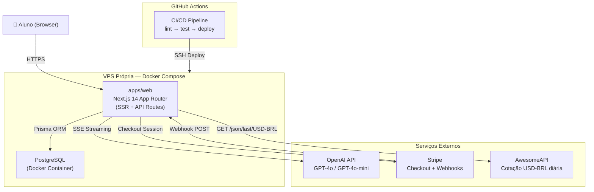

# SOL Fullstack Architecture Document

## Introduction

Este documento define a arquitetura completa do SOL, englobando frontend, backend e infraestrutura. Ele serve como a única fonte de verdade técnica para o desenvolvimento conduzido por agentes de IA, garantindo consistência em todas as camadas da stack. O projeto utiliza uma abordagem monolítica dentro de um monorepo para simplificar o deploy inicial em VPS própria, respeitando o princípio de zero lock-in da Eden Corporate.

### Starter Template or Existing Project

O projeto é baseado em uma estrutura proprietária da Eden Corporate, já inicializada como um monorepo Turborepo. Não foram utilizados templates externos de terceiros.

### Change Log

| Date       | Version | Description                          | Author           |
| ---------- | ------- | ------------------------------------ | ---------------- |
| 2026-02-25 | 1.0     | Initial fullstack architecture draft | Aria (Architect) |
| 2026-02-26 | 2.0     | Novo modelo de precificação: créditos como saldo interno em centavos de real, custo variável por mensagem (tiktoken + cotação USD-BRL), tabela ExchangeRate, metadados de tokens em CreditTransaction, AwesomeAPI como serviço externo | Aria (Architect) |
| 2026-02-26 | 2.1     | Refinamento de schema: User.credits → balanceCents + minBalanceCents, CreditTransaction com inputTokens/outputTokens/costUsd, ExchangeRate com currency+date (@@unique), funções packages/db com assinaturas refinadas | Aria (Architect) |

---

## High Level Architecture

### Technical Summary

O SOL é um SaaS monolítico fullstack construído sobre Next.js 14 com App Router, hospedado em VPS própria via Docker Compose. Frontend e backend coexistem no mesmo processo — páginas server-rendered em React Server Components e lógica de negócio em API Routes dentro de `apps/web/app/api/`. A camada de dados usa Prisma com PostgreSQL, ambos containerizados. Integrações externas incluem OpenAI (chat via SSE streaming), Stripe (pagamentos via Checkout + Webhooks) e AwesomeAPI (cotação USD-BRL diária para cálculo de custo por mensagem). O modelo de precificação é baseado em custo real: cada mensagem consome tokens da OpenAI, cujo custo é convertido para reais via cotação do dia e deduzido do saldo interno do aluno. O monorepo Turborepo com `packages/db` garante tipagem compartilhada e permite extrair serviços no futuro sem refatoração significativa.

### Platform and Infrastructure Choice

**Platform:** VPS Própria (Linux)
**Key Services:** Docker, Docker Compose, PostgreSQL 16, Nginx (Reverse Proxy)
**Deployment Host and Regions:** Brasil (São Paulo) para latência mínima.

### Repository Structure

**Structure:** Monorepo
**Monorepo Tool:** Turborepo
**Package Organization:**

- `apps/web`: Next.js application
- `packages/db`: Shared Prisma client and credit logic
- `packages/config`: Shared ESLint/TS configs

### High Level Architecture Diagram



### Architectural Patterns

- **Monolith dentro de Monorepo:** Frontend (RSC) e backend (API Routes) no mesmo processo Next.js - _Rationale:_ Elimina complexidade de rede e simplifica deploy no MVP.
- **Server Components First:** Busca de dados via React Server Components - _Rationale:_ Elimina waterfalls de dados no client e melhora o TTFB.
- **Repository Pattern (packages/db):** Lógica física de créditos encapsulada em pacote compartilhado - _Rationale:_ Garante consistência ACID e permite reuso por scripts externos.
- **SSE Streaming:** Respostas da IA via Server-Sent Events - _Rationale:_ Nativo em Next.js e ideal para UX de chat "vivo".
- **Webhook Idempotente:** Uso de `stripe_payment_id` UNIQUE - _Rationale:_ Previne crédito duplicado em caso de retentativas do Stripe.
- **Token-Based Pricing:** Custo por mensagem calculado com base em consumo real de tokens (tiktoken) × cotação USD-BRL do dia - _Rationale:_ Alinha custo operacional ao consumo real, protege margem independente de variação cambial ou de modelo.
- **Exchange Rate Caching:** Cotação consultada 1x/dia via AwesomeAPI, armazenada em `exchange_rates` com fallback em 3 níveis - _Rationale:_ Minimiza dependência externa e garante operação contínua mesmo com API indisponível.

---

## Tech Stack

| Category           | Technology         | Version           | Purpose                  | Rationale                                              |
| ------------------ | ------------------ | ----------------- | ------------------------ | ------------------------------------------------------ |
| Frontend Language  | TypeScript         | 5.x (strict)      | Toda a codebase          | Type safety end-to-end; `any` proibido                 |
| Frontend Framework | Next.js            | 14 (App Router)   | SSR, routing, API Routes | Monolith fullstack, zero servidor separado             |
| UI Components      | Shadcn/UI          | latest            | Design system            | Customizável, sem lock-in, baseado em Radix            |
| CSS Framework      | Tailwind CSS       | 3.x               | Estilização              | Utilitário-primeiro, integrado ao Shadcn               |
| AI Streaming       | Vercel AI SDK      | latest (lib only) | Streaming SSE no cliente | Abstrai lógica de streaming sem depender da plataforma |
| Backend            | Next.js API Routes | 14                | API REST interna         | Simplicidade e integração nativa com o app             |
| ORM                | Prisma             | 5.x               | Acesso ao banco          | Type-safe, migrations versionadas                      |
| Database           | PostgreSQL         | 16                | Persistência principal   | Self-hosted, production-grade, zero lock-in            |
| Auth               | NextAuth.js        | v5 (Auth.js)      | Sessão e auth            | Credentials Provider, JWT httpOnly                     |
| Payments           | Stripe SDK         | latest            | Checkout + Webhooks      | Gateway robusto com PIX nativo                         |
| Token Counting     | tiktoken           | latest            | Contagem precisa de tokens | Cálculo de custo real por mensagem antes/após chamada OpenAI |
| Exchange Rate      | AwesomeAPI         | REST              | Cotação USD-BRL diária   | API gratuita, sem autenticação, fallback configurável  |
| Infra              | Docker Compose     | latest            | Orquestração             | Simples para monolith em VPS                           |

---

## Data Models

### User

**Purpose:** Representa o aluno autenticado e seu saldo interno.

```typescript
interface User {
  id: string; // cuid
  email: string;
  passwordHash: string;
  balanceCents: number; // saldo interno em centavos de real (pode ser levemente negativo até minBalanceCents)
  minBalanceCents: number; // limite de saldo negativo (default: -200 = -R$2,00)
  createdAt: Date;
  updatedAt: Date;
}
```

### Conversation

**Purpose:** Agrupa mensagens em uma sessão de chat.

```typescript
interface Conversation {
  id: string;
  userId: string;
  title: string;
  createdAt: Date;
}
```

### CreditTransaction

**Purpose:** Registro auditável de movimentações financeiras com metadados de custo completos.

```typescript
interface CreditTransaction {
  id: string;
  userId: string;
  amount: number; // centavos de real (positivo = crédito, negativo = débito)
  type: 'purchase' | 'consumption';
  description: string | null;
  stripePaymentId: string | null; // unique — idempotência de webhook
  exchangeRate: number | null; // Decimal — cotação USD-BRL no momento da transação
  inputTokens: number | null; // tokens de input consumidos (apenas para consumption)
  outputTokens: number | null; // tokens de output consumidos (apenas para consumption)
  modelUsed: string | null; // modelo OpenAI utilizado (ex: "gpt-4o", "gpt-4o-mini")
  costUsd: number | null; // Decimal — custo em dólar da chamada OpenAI (apenas para consumption)
  createdAt: Date;
}
```

### ExchangeRate

**Purpose:** Cache diário de cotação cambial para cálculo de custo.

```typescript
interface ExchangeRate {
  id: string;
  currency: string; // par cambial (ex: "USD-BRL")
  rate: number; // Decimal — cotação (ex: 5.45)
  date: Date; // data da cotação (sem horário, ex: 2026-02-26)
  createdAt: Date;
}
// Constraint: @@unique([currency, date])
```

---

## API Specification

### Chat API

`POST /api/chat`

- **Auth:** Requerido
- **Request:** `{ conversationId?: string, message: string }`
- **Response:** `text/event-stream` (SSE)
- **Headers de resposta:** `X-Balance-Remaining` (saldo em centavos de real após dedução)
- **Status 402:** Retornado quando `balanceCents` é insuficiente para cobrir o custo estimado do input (tokens × preço do modelo × cotação USD-BRL).

### Exchange Rate Functions (packages/db)

**`getExchangeRate(currency: string): Promise<Decimal>`**

1. Busca cotação do dia na tabela `exchange_rates` onde `currency` = par e `date` = hoje
2. Se encontrar, retorna `rate`
3. Se não encontrar, busca última cotação disponível para o par
4. Se não existir nenhuma, retorna `FALLBACK_USD_BRL_RATE` do `.env`

**`updateExchangeRate(currency: string, rate: Decimal): Promise<ExchangeRate>`**

1. Faz upsert na tabela `exchange_rates` com `currency` + `date` = hoje
2. Chamada pelo cron/API Route que consulta AwesomeAPI: `GET https://economia.awesomeapi.com.br/json/last/USD-BRL`

### Credit Functions (packages/db)

**`deductCredits(userId, costCents, metadata)`**

```typescript
deductCredits(
  userId: string,
  costCents: number,
  metadata: {
    exchangeRate: Decimal;
    inputTokens: number;
    outputTokens: number;
    modelUsed: string;
    costUsd: Decimal;
  }
): Promise<{ balanceCents: number }>
```

- Valida `balanceCents - costCents >= minBalanceCents`
- Executa em `$transaction` atômica: decrement `balanceCents`, insert `CreditTransaction`

**`addCredits(userId, amountCents, stripePaymentId, exchangeRate?)`**

```typescript
addCredits(
  userId: string,
  amountCents: number,
  stripePaymentId: string,
  exchangeRate?: Decimal
): Promise<{ balanceCents: number }>
```

- Executa em `$transaction` atômica: increment `balanceCents`, insert `CreditTransaction`
- Idempotente via `stripePaymentId` UNIQUE

### Payments API

`POST /api/payments/checkout`

- **Request:** `{ packageId: string }`
- **Response:** `{ sessionUrl: string }`

---

## Core Workflows

### Chat & Credit Deduction (Token-Based)

1. Aluno envia mensagem.
2. Backend conta tokens de input com precisão via `tiktoken` (system prompt + histórico + mensagem nova).
3. Backend busca cotação USD-BRL do dia via `getExchangeRate("USD-BRL")`.
4. Calcula custo estimado do input em USD: `inputTokens × preço_input_modelo`.
5. Converte para centavos de real: `costUsd × exchangeRate × 100`.
6. Verifica se `balanceCents >= costInputCents` (ou se `balanceCents - costInputCents >= minBalanceCents`).
7. Se **não** cobre → retorna `402 Payment Required`, exibe prompt inline de créditos insuficientes.
8. Se **cobre** → faz chamada à OpenAI com streaming (SSE).
9. Streaming termina → conta tokens reais de output.
10. Calcula custo real total em USD: `costUsd = (inputTokens × preço_input + outputTokens × preço_output)`.
11. Converte para centavos de real: `costCents = Math.ceil(costUsd × exchangeRate × 100)`.
12. Deduz via `deductCredits(userId, costCents, { exchangeRate, inputTokens, outputTokens, modelUsed, costUsd })`.
13. Registra `CreditTransaction` com todos os campos de auditoria via `$transaction` atômica.
14. Se `balanceCents` ficou negativo (até `minBalanceCents`) → próxima mensagem será bloqueada.
15. Retorna header `X-Balance-Remaining` com `balanceCents` atualizado.

### Purchase & Credit Addition

1. Aluno escolhe pacote e finaliza compra via Stripe Checkout.
2. Stripe envia webhook `checkout.session.completed`.
3. Backend calcula saldo a creditar: `amountCents = valor_pago_centavos × (CREDIT_MARGIN_PERCENT / 100)`.
4. Busca cotação atual via `getExchangeRate("USD-BRL")` para registro.
5. Credita via `addCredits(userId, amountCents, stripePaymentId, exchangeRate)` em transação atômica (idempotente).

### Exchange Rate Refresh

1. Cron job ou API Route executa diariamente (ex: 9h BRT).
2. Consulta AwesomeAPI: `GET https://economia.awesomeapi.com.br/json/last/USD-BRL`.
3. Salva via `updateExchangeRate("USD-BRL", rate)` (upsert com `currency` + `date` de hoje).
4. Se a API falhar, `getExchangeRate()` usa última cotação disponível.
5. Se não existir nenhuma cotação, `getExchangeRate()` retorna `FALLBACK_USD_BRL_RATE` do `.env`.

---

## Database Schema

```prisma
model User {
  id              String              @id @default(cuid())
  email           String              @unique
  passwordHash    String
  balanceCents    Int                 @default(0)    // saldo interno em centavos de real
  minBalanceCents Int                 @default(-200) // limite de saldo negativo (-R$2,00)
  createdAt       DateTime            @default(now())
  updatedAt       DateTime            @updatedAt
  conversations   Conversation[]
  transactions    CreditTransaction[]
}

model CreditTransaction {
  id              String   @id @default(cuid())
  userId          String
  user            User     @relation(fields: [userId], references: [id])
  amount          Int      // centavos de real (positivo = crédito, negativo = débito)
  type            String   // "consumption" | "purchase"
  description     String?
  stripePaymentId String?  @unique
  exchangeRate    Decimal? // cotação USD-BRL no momento da transação
  inputTokens     Int?     // tokens de input consumidos
  outputTokens    Int?     // tokens de output consumidos
  modelUsed       String?  // modelo OpenAI (ex: "gpt-4o", "gpt-4o-mini")
  costUsd         Decimal? // custo em dólar da chamada OpenAI
  createdAt       DateTime @default(now())
}

model ExchangeRate {
  id        String   @id @default(cuid())
  currency  String   // par cambial (ex: "USD-BRL")
  rate      Decimal  // cotação (ex: 5.45)
  date      DateTime @db.Date // data da cotação (sem horário)
  createdAt DateTime @default(now())

  @@unique([currency, date])
}
```

_Nota: CHECK CONSTRAINT `balanceCents >= minBalanceCents` garantida via validação na função `deductCredits()` em `packages/db`. O campo `minBalanceCents` é per-user e pode ser ajustado individualmente (ex: -200 centavos = -R$2,00 como default)._

---

## Unified Project Structure

```plaintext
sol-saas/
├── apps/web/               # Next.js App
├── packages/db/            # Shared Prisma & Credit Logic
├── docker-compose.yml      # VPS Orchestration
└── turbo.json              # Task Runner
```

---

## Security and Performance

- **Security:** JWT em cookies httpOnly, CSP headers rígidos, Rate Limiting por IP no Chat. Cotação e custos internos nunca expostos ao frontend — aluno vê apenas créditos e estimativa de scripts.
- **Performance:** Resposta da primeira palavra em < 3s via SSE. RSC para carregamento zero-latency de dados iniciais. Cotação USD-BRL cacheada por dia na tabela `exchange_rates` (máximo 1 request externo por dia).
- **Reliability:** Idempotência via `stripe_payment_id` no banco. Cotação com fallback em 3 níveis (dia atual → última salva → env var). Limite de saldo negativo configurável como trava de segurança.
- **Auditoria:** Cada `CreditTransaction` registra `exchangeRate`, `inputTokens`, `outputTokens`, `modelUsed` e `costUsd` para rastreabilidade completa de custos.

---

## Testing Strategy

- **Backend:** Unit tests para o pacote `@repo/db` (lógica de créditos, cálculo de custo por token, conversão cambial) usando Vitest.
- **Integration:** Testes de API Route para o fluxo de chat com mock de OpenAI e mock de cotação.
- **Unit - Token Counting:** Testes de contagem de tokens via tiktoken para diferentes tamanhos de input.
- **Unit - Exchange Rate:** Testes de `getExchangeRate()` e `updateExchangeRate()` com mock de AwesomeAPI e cenários de fallback (cotação do dia, última disponível, env var).

---

## Checklist Results Report

### Executive Summary

- **Readiness:** HIGH (Pronto para implementação por agentes Dev)
- **Project Type:** Fullstack Monolith
- **Critical Risks:**
  - Gerenciamento manual de constraints SQL (limite de saldo negativo configurável).
  - Pressão no DB devido à falta de cache (Redis) no MVP.
  - Dependência de API externa (AwesomeAPI) para cotação — mitigado por fallback em 3 níveis.
  - Variação cambial pode impactar margem entre compras — mitigado por auditoria completa por transação.

### Section Analysis

- Requirements Alignment: 100%
- Tech Stack: 100%
- Implementation Guidance: 100%

### Architecture Veredict: ✅ READY FOR IMPLEMENTATION

---

## Next Steps & Handoff

### Dev Expert Prompt

> @dev — Inicie a implementação do Epic 1 (Foundation & Auth) conforme o PRD (`docs/prd.md`) e a Arquitetura (`docs/architecture.md`). Foque em: setup do monorepo Turborepo, docker-compose com PostgreSQL 16, e autenticação via NextAuth v5 com Credentials Provider. Garanta o uso de TypeScript strict e a estrutura definida no documento de arquitetura.

### UX Expert Prompt

> @ux — Desenvolva o layout principal e o chat baseado na paleta solar e dark mode definidos. Integre os componentes do Shadcn/UI conforme indicado na Seção 10 da Arquitetura.
