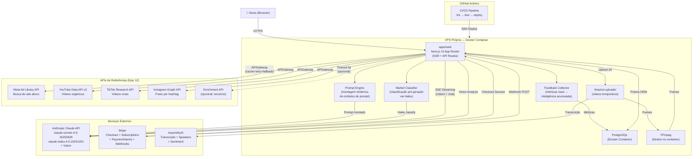
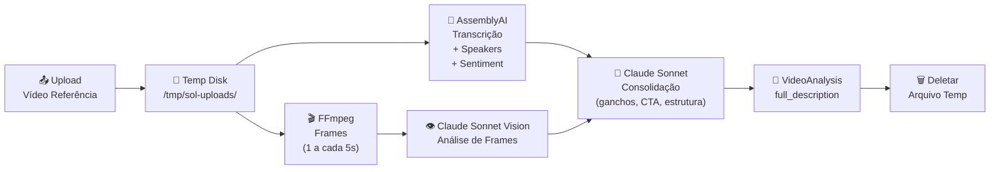

# SOL Fullstack Architecture Document

## Introduction

Este documento define a arquitetura completa do SOL, englobando frontend, backend e infraestrutura. Ele serve como a única fonte de verdade técnica para o desenvolvimento conduzido por agentes de IA, garantindo consistência em todas as camadas da stack. O projeto utiliza uma abordagem monolítica dentro de um monorepo para simplificar o deploy inicial em VPS própria, respeitando o princípio de zero lock-in da Eden Corporate.

### Starter Template or Existing Project

O projeto é baseado em uma estrutura proprietária da Eden Corporate, já inicializada como um monorepo Turborepo. Não foram utilizados templates externos de terceiros.

### Change Log

| Date       | Version | Description                          | Author           |
| ---------- | ------- | ------------------------------------ | ---------------- |
| 2026-02-25 | 1.0     | Initial fullstack architecture draft | Aria (Architect) |
| 2026-02-26 | 2.0     | Novo modelo de precificação: créditos como saldo interno em centavos de real, custo variável por mensagem (tiktoken + cotação USD-BRL), tabela ExchangeRate, metadados de tokens em CreditTransaction, AwesomeAPI como serviço externo | Aria (Architect) |
| 2026-02-26 | 2.1     | Refinamento de schema: User.credits → balanceCents + minBalanceCents, CreditTransaction com inputTokens/outputTokens/costUsd, ExchangeRate com currency+date (@@unique), funções packages/db com assinaturas refinadas | Aria (Architect) |
| 2026-02-27 | 3.0     | Novo modelo de precificação com gate pré-chamada: estimativa de custo máximo (input + MAX_OUTPUT_TOKENS=8192), saldo nunca negativo, remoção de minBalanceCents. Lazy exchange rate (on-demand via AwesomeAPI). CREDIT_PERCENTAGE substitui CREDIT_MARGIN_PERCENT. Funções estimateMaxCost/calculateRealCost. Campo maxOutputTokens em CreditTransaction. Constante MAX_OUTPUT_TOKENS=8192, MIN_COST_CENTS=100. | Aria (Architect) |
| 2026-02-27 | 4.0     | Suporte a anexos no chat (FR11/Story 2.5). Novas dependências: pdf-parse, mammoth, sharp. CreditTransaction com hasAttachments/attachmentTypes/attachmentTokens. POST /api/chat aceita multipart/form-data (retrocompatível com JSON). calculateImageCost() em token-counter.ts. Workflow atualizado com file processing. Runtime nodejs obrigatório. addCredits exchangeRate tornado obrigatório. | Aria (Architect) |
| 2026-02-28 | 5.0     | Admin Console (FR12/Story 4.2). Enum TransactionType adiciona `adjustment`. CreditTransaction ganha `grossAmountCents` (Int?) e `adminEmail` (String?). addCredits() refatorado para union type (purchase | adjustment). Webhook Stripe atualizado para registrar grossAmountCents. Novo módulo packages/db/src/admin.ts com queries de métricas (usuários, uso, financeiras, cotação). Nova rota POST /api/admin/add-credits. Workflow de adição manual de créditos documentado. |
| 2026-03-03 | 6.0     | Refatoração completa do modelo de precificação. Modelo anterior (centavos, câmbio diário, CREDIT_PERCENTAGE, AwesomeAPI) removido. Novo modelo: créditos por tokens (CREDITS_PER_M_INPUT=500, CREDITS_PER_M_OUTPUT=2000), configuráveis via admin (tabela pricing_config). Novas tabelas: PricingConfig, CreditPackage. Tabela ExchangeRate removida. User.balanceCents → User.credits. CreditTransaction: removidos exchangeRate/costUsd/grossAmountCents/maxOutputTokens, adicionados creditsPerMInput/creditsPerMOutput. Funções estimateMaxCost/calculateRealCost → calculateCredits/calculateMaxCredits. lib/pricing.ts substitui lib/exchange-rate.ts. Novas rotas admin: GET/PUT /api/admin/pricing, CRUD /api/admin/packages. Header X-Balance-Cents → X-Credits-Remaining + X-Credits-Used. | Aria (Architect) |
| 2026-03-03 | 7.0     | Evolução quiz-first (PRD v9.0). Novos modelos: OnboardingProfile, QuizSession, QuizAnswer, VideoAnalysis. Conversation ganha quizSessionId (nullable). Quiz engine como configuração estática em TypeScript (48 perguntas, lógica condicional showWhen). Pipeline de vídeo: AssemblyAI + FFmpeg + GPT-4o Vision. Novas rotas: /api/quiz/*, /api/onboarding/*, /api/video/*. 4 system prompts por combinação de caminhos. Docker atualizado com FFmpeg. Novas env vars: ASSEMBLYAI_API_KEY, VIDEO_*. Diagrama Mermaid inclui novos fluxos. Estrutura de pastas expandida com quiz/, video/, onboarding/. | Aria (Architect) |
| 2026-03-04 | 10.0    | Migração OpenAI → Anthropic Claude API. SDK: openai → @anthropic-ai/sdk. Modelos: GPT-4o → claude-sonnet-4-5-20250929, GPT-4o-mini → claude-haiku-4-5-20251001. tiktoken removido (contagem nativa da API Anthropic). Novos componentes: Prompt Engine, Market Classifier, Feedback Collector. Novos modelos: MarketClassification (JSON em QuizSession), ScriptPerformance, PerformanceMetrics, ExecutionAnalysis, PerformanceThreshold. Novos patterns: Prompt Engine Pattern, Pre-Generation Classification, Feedback Loop Pattern. Novos endpoints: /api/quiz/classify, /api/scripts/[id]/performance, /api/scripts/[id]/metrics, /api/scripts/[id]/upload-video, /api/scripts/[id]/execution-analysis, /api/admin/results, /api/admin/performance-thresholds, /api/admin/intelligence. Rate limiting para classificação e validação de upload de vídeo. | Aria (Architect) |
| 2026-03-05 | 11.0    | Epics 9, 10 e 11 — Monetização avançada. Epic 9 (Assinaturas Recorrentes): novos modelos SubscriptionPlan, UserSubscription, StripeProductRecord. Auto-provisionamento Stripe Products/Prices. Checkout mode=subscription com webhooks invoice.payment_succeeded/failed, customer.subscription.updated/deleted. Refatoração retroativa do Checkout existente para Stripe Customer + setup_future_usage. Epic 10 (Promoções & Upsell One-Click): modelos PromoCampaign, PromoDelivery. PaymentIntent one-click com confirm:true, off_session:true. Engine de popups com segmentação por filtros. Epic 11 (Programa de Indicação): modelo ReferralReward. referral_code auto-gerado no cadastro. Bônus na primeira compra. Campos novos em User: stripeCustomerId, referralCode, referredBy. TransactionType expandido: +subscription_renewal, +promo_purchase, +referral. Novas admin settings: SUBSCRIPTIONS_ENABLED, UPSELL_ENABLED, REFERRAL_ENABLED e config relacionada. Independente dos Epics 6-8. | Aria (Architect) |
| 2026-03-11 | 12.0    | Epic 12 (Ad Intelligence & Content Discovery). Novos modelos: CreativeReference, SearchCache, ApiConfiguration, CompetitorProfile. Novo enum ReferenceSource (META_AD_LIBRARY, TIKTOK, YOUTUBE, INSTAGRAM, MANUAL_UPLOAD, ENRICHMENT). API Gateway pattern com cache PostgreSQL, rate limiting em memória, retry com backoff, fallback chain (API → cache → stale → null). Service layer: api-gateway.ts, ad-library.ts, youtube-search.ts, tiktok-research.ts, instagram-search.ts, link-analyzer.ts, format-classifier.ts, enrichment.ts, competitor-analyzer.ts. Novos endpoints: /api/references/ads, /api/references/organic, /api/references/analyze-link, /api/references/select, /api/references/competitors, /api/admin/integrations. Novas env vars: META_AD_LIBRARY_ACCESS_TOKEN, YOUTUBE_API_KEY, TIKTOK_RESEARCH_CLIENT_KEY/SECRET, INSTAGRAM_ACCESS_TOKEN. Quiz Integration: ReferencePicker entre Quiz Inicial e Caminhos 2A/2B. | Aria (Architect) |

---

## High Level Architecture

### Technical Summary

O SOL é um SaaS monolítico fullstack construído sobre Next.js 14 com App Router, hospedado em VPS própria via Docker Compose. O modelo de produto é **quiz-first + chat complementar**: o aluno responde um quiz estruturado (48 perguntas, 6 seções, 4 caminhos condicionais) e a IA gera um roteiro de criativo personalizado; o chat permite iterar/refinar depois. Frontend e backend coexistem no mesmo processo — páginas server-rendered em React Server Components e lógica de negócio em API Routes dentro de `apps/web/app/api/`. A camada de dados usa Prisma com PostgreSQL, ambos containerizados. Integrações externas incluem Anthropic Claude API (geração de roteiro e chat via SSE streaming, incluindo Vision para imagens e análise de frames de vídeo), Stripe (pagamentos via Checkout + Webhooks + Subscriptions + PaymentIntents) e AssemblyAI (transcrição de vídeo). O caminho 2A (Vídeo Modelado) suporta upload de vídeo de referência com pipeline de processamento: AssemblyAI (transcrição + speakers + emoção) → FFmpeg (extração de frames) → Claude Sonnet Vision (análise de frames) → Claude Sonnet (consolidação estrutural) → descrição textual persistida → vídeo deletado. O chat suporta anexos de arquivos (imagens, PDFs, DOCX, TXT, MD) processados em memória sem persistência. O modelo de precificação usa créditos por tokens: constantes configuráveis via admin (CREDITS_PER_M_INPUT, CREDITS_PER_M_OUTPUT) armazenadas no banco (tabela `pricing_config`). Antes de cada chamada à Anthropic Claude API (chat ou geração de roteiro), o backend calcula o custo máximo estimado em créditos e verifica saldo. Saldo nunca fica negativo. Pacotes de créditos configuráveis via admin. O sistema suporta 3 modelos de monetização: **pacotes avulsos** (compra única via Stripe Checkout), **assinaturas recorrentes** (Stripe Subscriptions com renovação mensal automática via webhooks invoice.payment_succeeded) e **compra com 1 clique** (PaymentIntent off_session com payment method salvo). O sistema inclui **Prompt Engine** (montagem dinâmica de prompts), **Market Classifier** (classificação pré-geração via Haiku), **Feedback Collector** (métricas de performance de roteiros), **Promoções & Upsell** (campanhas segmentadas com popups e compra one-click) e **Programa de Indicação** (referral com bônus em créditos para indicador e indicado na primeira compra). O painel administrativo em `/admin` (restrito a `role: ADMIN`) exibe métricas reais, resultados por nicho/módulo, gerenciamento de planos de assinatura, campanhas promocionais, programa de referral e permite gestão de precificação e limiares de performance. O monorepo Turborepo com `packages/db` garante tipagem compartilhada.

### Platform and Infrastructure Choice

**Platform:** VPS Própria (Linux)
**Key Services:** Docker, Docker Compose, PostgreSQL 16, Nginx (Reverse Proxy)
**Deployment Host and Regions:** Brasil (São Paulo) para latência mínima.

### Repository Structure

**Structure:** Monorepo
**Monorepo Tool:** Turborepo
**Package Organization:**

- `apps/web`: Next.js application
- `packages/db`: Shared Prisma client and credit logic
- `packages/config`: Shared ESLint/TS configs

### High Level Architecture Diagram



### Quiz → Roteiro Flow Diagram


### Video Processing Pipeline Diagram



### Architectural Patterns

- **Monolith dentro de Monorepo:** Frontend (RSC) e backend (API Routes) no mesmo processo Next.js - _Rationale:_ Elimina complexidade de rede e simplifica deploy no MVP.
- **Server Components First:** Busca de dados via React Server Components - _Rationale:_ Elimina waterfalls de dados no client e melhora o TTFB.
- **Repository Pattern (packages/db):** Lógica física de créditos encapsulada em pacote compartilhado - _Rationale:_ Garante consistência ACID e permite reuso por scripts externos.
- **SSE Streaming:** Respostas da IA (roteiro e chat) via Server-Sent Events - _Rationale:_ Nativo em Next.js e ideal para UX de geração "ao vivo".
- **Webhook Idempotente:** Uso de `stripe_payment_id` UNIQUE - _Rationale:_ Previne crédito duplicado em caso de retentativas do Stripe.
- **Credits-per-Token Pricing:** Gate pré-chamada calcula custo máximo em créditos, verifica saldo e só executa se cobrir. Após streaming, deduz créditos reais. Mínimo: 1 crédito - _Rationale:_ Saldo nunca fica negativo.
- **Admin-Configurable Pricing:** Constantes e pacotes armazenados no banco, editáveis via painel admin - _Rationale:_ Operador ajusta precificação sem deploy.
- **Quiz Engine como Configuração Estática:** As 48 perguntas são definidas em arquivo TypeScript (`lib/quiz/questions.ts`), não no banco de dados. Cada pergunta tem `questionKey`, `section`, `type`, `title`, `options` e `showWhen` (lógica condicional) - _Rationale:_ Perguntas mudam raramente e deploy é necessário para mudanças estruturais. Respostas são armazenadas no banco (QuizAnswer).
- **Temporary Video Processing:** Vídeos armazenados temporariamente em disco e deletados após processamento via `try/finally` - _Rationale:_ Sem necessidade de storage persistente (S3, etc.), a descrição textual é tudo que persiste.
- **Pipeline Assíncrono de Vídeo:** Upload retorna imediatamente, processamento ocorre em background, frontend faz polling de status - _Rationale:_ Processamento leva 30-120 segundos, não pode bloquear a request HTTP.
- **Prompt Engine Pattern:** Montagem dinâmica de módulos de prompt em runtime. O Prompt Engine seleciona e combina blocos de prompt (system prompt, contexto de onboarding, respostas do quiz, análise de vídeo, classificação de mercado, inteligência acumulada) baseado nos dados da sessão. Cada módulo é independente e testável isoladamente. O prompt final é montado por composição, não por template estático - _Rationale:_ Permite evolução incremental dos prompts sem alterar a lógica de orquestração. Novos módulos podem ser adicionados sem impactar os existentes.
- **Pre-Generation Classification:** Antes de gerar o roteiro (Claude Sonnet), o sistema executa uma chamada rápida ao Claude Haiku (`POST /api/quiz/classify`) para classificar o mercado do aluno: nível de consciência (Schwartz), nível de sofisticação, persona resumida e ângulo recomendado. O resultado é armazenado como JSON na QuizSession (`marketClassification`) e alimenta o Prompt Engine na montagem do prompt de geração - _Rationale:_ Haiku é 10x mais rápido e barato que Sonnet. A classificação prévia permite que o Sonnet gere roteiros mais precisos sem gastar tokens de raciocínio em classificação. Separação de responsabilidades entre modelos.
- **Feedback Loop Pattern:** Métricas reais de performance dos roteiros (visualizações, CTR, retenção, conversões) são coletadas via `ScriptPerformance` e `PerformanceMetrics`, e alimentam a inteligência acumulada do sistema. O admin define limiares de performance (`PerformanceThreshold`) por nicho e módulo. A `ExecutionAnalysis` compara roteiro planejado vs. execução real. Esses dados enriquecem o Prompt Engine: roteiros futuros recebem contexto sobre o que funciona e o que não funciona para aquele nicho/público - _Rationale:_ Sistema fica mais inteligente com o tempo. Cada roteiro gerado contribui para melhorar os próximos. Dados reais substituem suposições.
- **API Gateway Pattern (Epic 12):** Toda chamada a API externa (Meta, YouTube, TikTok, Instagram, Enrichment) passa por um APIGateway genérico (`lib/services/api-gateway.ts`). O gateway gerencia: (1) Rate limiting em memória (`Map<provider, {count, resetAt}>`), (2) Cache via tabela `search_cache` no PostgreSQL (não Redis — zero lock-in), (3) Retry com exponential backoff (max 3 tentativas), (4) Fallback chain: API → cache fresh → cache stale → null. Timeout configurável por provider. Se API oficial falha: retorna cache stale se existir. Se enrichment falha: ignora silenciosamente. Se tudo falha: mensagem amigável + opção upload manual. Nunca propaga erro técnico ao frontend. Chaves de API NUNCA no banco — apenas nome da env var salvo em `api_configurations.api_key_env`.
- **Expert Profile Pattern:** Perfil pessoal do expert separado do perfil de produto (OnboardingProfile). O ExpertProfile contém 35 campos organizados em 6 seções (Dados Básicos, Personalidade, Valores, História, Comunidade, Referências), com relação 1:1 com User via `userId @unique`. O `completionPercentage` é calculado server-side no PUT (upsert) e retornado em todas as leituras. 14 campos obrigatórios e 21 opcionais permitem preenchimento progressivo - _Rationale:_ Separação entre identidade do expert e contexto do produto. O perfil pessoal é preenchido uma vez e alimenta todos os roteiros futuros, enquanto o OnboardingProfile varia por produto/nicho. O completionPercentage incentiva preenchimento completo sem bloquear o uso inicial.

---

## Tech Stack

| Category           | Technology         | Version           | Purpose                  | Rationale                                              |
| ------------------ | ------------------ | ----------------- | ------------------------ | ------------------------------------------------------ |
| Frontend Language  | TypeScript         | 5.x (strict)      | Toda a codebase          | Type safety end-to-end; `any` proibido                 |
| Frontend Framework | Next.js            | 14 (App Router)   | SSR, routing, API Routes | Monolith fullstack, zero servidor separado             |
| UI Components      | Shadcn/UI          | latest            | Design system            | Customizável, sem lock-in, baseado em Radix            |
| CSS Framework      | Tailwind CSS       | 3.x               | Estilização              | Utilitário-primeiro, integrado ao Shadcn               |
| AI SDK             | @anthropic-ai/sdk  | latest            | Client Anthropic Claude  | SDK oficial da Anthropic para chamadas à API Claude    |
| AI Streaming       | Vercel AI SDK      | latest (lib only) | Streaming SSE no cliente | Abstrai lógica de streaming sem depender da plataforma |
| Backend            | Next.js API Routes | 14                | API REST interna         | Simplicidade e integração nativa com o app             |
| ORM                | Prisma             | 5.x               | Acesso ao banco          | Type-safe, migrations versionadas                      |
| Database           | PostgreSQL         | 16                | Persistência principal   | Self-hosted, production-grade, zero lock-in            |
| Auth               | NextAuth.js        | v5 (Auth.js)      | Sessão e auth            | Credentials Provider, JWT httpOnly                     |
| Payments           | Stripe SDK         | latest            | Checkout + Webhooks      | Gateway robusto com PIX nativo                         |
| PDF Extraction     | pdf-parse          | latest            | Extração de texto de PDFs | Leve, sem dependências nativas. PDFs escaneados retornam string vazia (detectado e avisado) |
| DOCX Extraction    | mammoth            | latest            | Extração de texto de DOCX | Requer runtime Node.js (não edge). API Route deve ter `export const runtime = 'nodejs'` |
| Image Dimensions   | sharp              | latest            | Leitura de dimensões de imagens | Cálculo de custo Vision API (tiles 512×512). Requer runtime Node.js |
| Video Transcription| AssemblyAI SDK     | latest            | Transcrição de vídeo     | Transcrição com speakers e sentiment. Epic 7 (caminho 2A) |
| Video Frames       | FFmpeg             | latest            | Extração de frames       | Binário no Docker container (`apt-get install ffmpeg`). 1 frame a cada 5s |
| Charts             | Recharts           | latest            | Gráficos admin dashboard | MIT, declarativa, integrada ao React, sem lock-in      |
| Ad Search          | Meta Ad Library API| v17+              | Busca de ads ativos      | Oficial, gratuita, legal, zero lock-in                 |
| Video Search       | YouTube Data API v3| v3                | Busca de vídeos orgânicos| Oficial Google, quota generosa (10k units/dia), estável|
| Video Search       | TikTok Research API| v2                | Busca de vídeos virais   | Oficial TikTok, requer aprovação, feature flag         |
| Social Search      | Instagram Graph API| v18+              | Busca por hashtag        | Oficial Meta, via mesmo developer app                  |
| Infra              | Docker Compose     | latest            | Orquestração             | Simples para monolith em VPS                           |

### Configuration & Constants

**Pricing Constants (armazenadas no banco — tabela `pricing_config`, editáveis via admin):**

| Key                    | Default | Purpose                                                       |
| ---------------------- | ------- | ------------------------------------------------------------- |
| `CREDITS_PER_M_INPUT`  | `500`   | Créditos cobrados por 1M de tokens de input                  |
| `CREDITS_PER_M_OUTPUT` | `2000`  | Créditos cobrados por 1M de tokens de output                 |
| `MAX_OUTPUT_TOKENS`    | `8192`  | Teto de segurança para estimativa de custo máximo e `max_tokens` da Anthropic Claude API |

_Nota: Estas constantes NÃO são variáveis de ambiente. São armazenadas no banco e editáveis via painel admin._

**Credit Packages (armazenados no banco — tabela `credit_packages`, editáveis via admin):**

| Package  | Credits | Price (BRL) | priceInCents |
| -------- | ------- | ----------- | ------------ |
| Starter  | 100     | R$29,90     | 2990         |
| Pro      | 500     | R$99,90     | 9990         |
| Max      | 1200    | R$199,90    | 19990        |

**Application Constants (hardcoded):**

| Constant             | Value  | Purpose                                                       |
| -------------------- | ------ | ------------------------------------------------------------- |
| `MAX_FILE_SIZE`      | `10MB` | Tamanho máximo por arquivo anexado (10 × 1024 × 1024 bytes)  |
| `MAX_FILES_PER_MSG`  | `3`    | Máximo de arquivos por mensagem                              |
| `MAX_DOC_CHARS`      | `50000`| Limite de caracteres extraídos por documento (rejeitado se exceder) |

**Video Processing Constants (variáveis de ambiente):**

| Env Var                        | Default             | Purpose                                          |
| ------------------------------ | ------------------- | ------------------------------------------------ |
| `ASSEMBLYAI_API_KEY`           | (obrigatório)       | Chave da API AssemblyAI para transcrição         |
| `VIDEO_MAX_DURATION_SECONDS`   | `300`               | Duração máxima de vídeo (5 minutos)             |
| `VIDEO_MAX_SIZE_MB`            | `500`               | Tamanho máximo de upload                        |
| `VIDEO_TEMP_DIR`               | `/tmp/sol-uploads`  | Diretório temporário no container               |

**Ad Intelligence Constants (variáveis de ambiente — Epic 12):**

| Env Var                           | Default             | Purpose                                              |
| --------------------------------- | ------------------- | ---------------------------------------------------- |
| `META_AD_LIBRARY_ACCESS_TOKEN`    | (obrigatório)       | Token de acesso à Meta Ad Library API                |
| `YOUTUBE_API_KEY`                 | (obrigatório)       | Chave da YouTube Data API v3                         |
| `TIKTOK_RESEARCH_CLIENT_KEY`      | (obrigatório*)      | Client key da TikTok Research API (*feature flag)    |
| `TIKTOK_RESEARCH_CLIENT_SECRET`   | (obrigatório*)      | Client secret da TikTok Research API (*feature flag) |
| `INSTAGRAM_ACCESS_TOKEN`          | (obrigatório)       | Token da Instagram Graph API                         |
| `ENRICHMENT_API_KEY`              | (opcional)          | Chave de API de terceiro para enrichment             |
| `ENRICHMENT_API_URL`              | (opcional)          | URL da API de enrichment                             |

_* TikTok Research API requer aprovação. Se não aprovada, feature é desabilitada via `api_configurations` (sem erro). Env vars podem ficar vazias._

**Ad Intelligence Application Constants (hardcoded):**

| Constant                  | Value   | Purpose                                                       |
| ------------------------- | ------- | ------------------------------------------------------------- |
| `AD_CACHE_TTL_MS`         | `86400000` | TTL de cache para busca de ads (24h em ms)                 |
| `ORGANIC_CACHE_TTL_MS`    | `43200000` | TTL de cache para busca de orgânicos (12h em ms)           |
| `ENRICHMENT_TIMEOUT_MS`   | `5000`  | Timeout para chamadas ao enrichment (5s)                     |
| `MAX_COMPETITORS_PER_USER`| `5`     | Máximo de perfis de concorrentes por aluno                   |
| `BATCH_CLASSIFY_LIMIT`    | `5`     | Quantos resultados classificar automaticamente por busca     |

**Contagem de Tokens:** A API Anthropic retorna `usage.input_tokens` e `usage.output_tokens` nativamente em cada resposta — não é necessário biblioteca externa para contagem de tokens. A estimativa pré-chamada usa heurística de caracteres (1 token ≈ 4 caracteres).

**MIME Types Permitidos:**

| Categoria | MIME Types |
| --------- | ---------- |
| Imagens   | `image/jpeg`, `image/png`, `image/gif`, `image/webp` |
| Documentos| `application/pdf`, `text/plain`, `text/markdown`, `application/vnd.openxmlformats-officedocument.wordprocessingml.document` |

---

## Data Models

### User

**Purpose:** Representa o aluno autenticado e seu saldo de créditos.

```typescript
interface User {
  id: string; // cuid
  email: string;
  passwordHash: string;
  credits: number; // saldo de créditos (inteiro, nunca negativo — gate garante)
  role: 'USER' | 'ADMIN';
  stripeCustomerId: string | null; // Stripe Customer ID — criado na primeira compra (Epic 9)
  referralCode: string; // código de indicação único (8 chars uppercase, auto-gerado no cadastro) (Epic 11)
  referredBy: string | null; // userId de quem indicou este user (Epic 11)
  createdAt: Date;
  updatedAt: Date;
}
```

### Conversation

**Purpose:** Agrupa mensagens em uma sessão de chat.

```typescript
interface Conversation {
  id: string;
  userId: string;
  title: string;
  createdAt: Date;
}
```

### CreditTransaction

**Purpose:** Registro auditável de movimentações de créditos com metadados de consumo completos.

```typescript
interface CreditTransaction {
  id: string;
  userId: string;
  amount: number; // créditos (positivo = compra/adjustment, negativo = consumo)
  type: 'purchase' | 'consumption' | 'adjustment' | 'subscription_renewal' | 'promo_purchase' | 'referral';
  description: string | null;
  stripePaymentId: string | null; // unique — idempotência de webhook (apenas purchase)
  adminEmail: string | null; // email do admin executor (apenas adjustment)
  inputTokens: number | null; // tokens de input consumidos (apenas consumption)
  outputTokens: number | null; // tokens de output consumidos (apenas consumption)
  modelUsed: string | null; // modelo Anthropic utilizado (ex: "claude-sonnet-4-5-20250929", "claude-haiku-4-5-20251001")
  creditsPerMInput: number | null; // snapshot da config no momento do consumo (auditoria)
  creditsPerMOutput: number | null; // snapshot da config no momento do consumo (auditoria)
  hasAttachments: boolean; // se a mensagem incluiu arquivos (default false)
  attachmentTypes: string[]; // tipos MIME dos arquivos (default [])
  attachmentTokens: number | null; // tokens adicionais gerados pelos arquivos
  pipelineType: string | null;
  assemblyAiCostUsd: number | null;
  elevenLabsCostUsd: number | null;
  videoDurationSeconds: number | null;
  createdAt: Date;
}
```

**Invariantes por tipo:**

| Campo | `purchase` | `consumption` | `adjustment` |
|---|---|---|---|
| `stripePaymentId` | ✅ obrigatório (idempotência) | null | null |
| `adminEmail` | null | null | ✅ obrigatório (auditoria) |
| `inputTokens/outputTokens` | null | ✅ | null |
| `modelUsed` | null | ✅ | null |
| `creditsPerMInput/creditsPerMOutput` | null | ✅ snapshot | null |

### PricingConfig

**Purpose:** Constantes de precificação configuráveis via admin.

```typescript
interface PricingConfig {
  id: string;
  key: string; // unique — ex: "CREDITS_PER_M_INPUT", "CREDITS_PER_M_OUTPUT", "MAX_OUTPUT_TOKENS"
  value: number;
  updatedAt: Date;
  updatedBy: string; // email do admin que alterou
}
```

### CreditPackage

**Purpose:** Pacotes de créditos disponíveis para compra.

```typescript
interface CreditPackage {
  id: string;
  name: string; // ex: "Starter", "Pro", "Max"
  credits: number; // créditos concedidos na compra
  priceInCents: number; // preço em centavos BRL para o Stripe
  active: boolean; // pacotes inativos não aparecem na página de compra
  createdAt: Date;
  updatedAt: Date;
}
```

### OnboardingProfile

**Purpose:** Perfil persistente do aluno — um por produto/nicho. Preenchido uma vez e reutilizado em todas as produções.

```typescript
interface OnboardingProfile {
  id: string;
  userId: string;
  name: string; // nome do produto/nicho (ex: "Curso Pilates na Parede")
  answers: Record<string, string>; // JSON — chave = questionKey (O1-O9), valor = resposta
  createdAt: Date;
  updatedAt: Date;
}
```

### QuizSession

**Purpose:** Uma execução do quiz — vincula onboarding + respostas + caminhos + roteiro gerado.

```typescript
interface QuizSession {
  id: string;
  userId: string;
  onboardingProfileId: string;
  path1: 'AD' | 'ORGANIC'; // Caminho 1: Anúncio Criativo (1A) ou Vídeo Orgânico (1B)
  path2: 'MODELED' | 'FROM_SCRATCH'; // Caminho 2: Vídeo Modelado (2A) ou Do Zero (2B)
  status: 'IN_PROGRESS' | 'COMPLETED' | 'ABANDONED';
  marketClassification: MarketClassification | null; // JSON — preenchido por POST /api/quiz/classify
  createdAt: Date;
  completedAt: Date | null;
}
```

**Relações:** `quizSession.user`, `quizSession.onboardingProfile`, `quizSession.answers[]`, `quizSession.conversation` (1:1, nullable), `quizSession.videoAnalysis` (1:1, nullable — só em 2A).

### MarketClassification (JSON em QuizSession)

**Purpose:** Classificação de mercado gerada pelo Claude Haiku antes da geração do roteiro. Armazenada como campo JSON na QuizSession para informar o Prompt Engine sobre o nível de consciência, sofisticação e ângulo recomendado.

```typescript
interface MarketClassification {
  consciousnessLevel: 'UNAWARE' | 'PROBLEM_AWARE' | 'SOLUTION_AWARE' | 'PRODUCT_AWARE' | 'MOST_AWARE';
  // Nível de consciência do público-alvo segundo Eugene Schwartz
  sophisticationLevel: 1 | 2 | 3 | 4 | 5;
  // Nível de sofisticação do mercado (1 = virgem, 5 = saturado)
  personaSummary: string;
  // Resumo da persona-alvo em 2-3 frases (gerado pelo Haiku)
  recommendedAngle: string;
  // Ângulo de comunicação recomendado para o roteiro (ex: "autoridade", "história pessoal", "prova social")
  reasoning: string;
  // Raciocínio do modelo para as classificações acima (transparência para o admin)
}
```

**Armazenamento:** Campo `marketClassification` (JSON, nullable) na tabela `quiz_sessions`. Preenchido pelo endpoint `POST /api/quiz/classify` antes da geração do roteiro. O Prompt Engine usa esses dados para selecionar módulos de prompt adequados ao nível de consciência e sofisticação do mercado.

### QuizAnswer

**Purpose:** Resposta individual a uma pergunta do quiz.

```typescript
interface QuizAnswer {
  id: string;
  quizSessionId: string;
  section: 'INITIAL' | 'AD_CREATIVE' | 'ORGANIC_VIDEO' | 'MODELED_VIDEO' | 'FROM_SCRATCH_VIDEO';
  questionKey: string; // identificador único (ex: "Q1", "1A.2", "2A.5")
  answerType: 'TEXT' | 'SINGLE_SELECT' | 'MULTI_SELECT' | 'UPLOAD';
  answerValue: string; // valor da resposta (texto ou opção selecionada)
  createdAt: Date;
}
```

### VideoAnalysis

**Purpose:** Resultado do processamento de vídeo no caminho 2A (Vídeo Modelado).

```typescript
interface VideoAnalysis {
  id: string;
  quizSessionId: string;
  quizAnswerId: string; // FK — pergunta de upload (2A.2)
  transcription: string; // output AssemblyAI (transcrição com speakers e sentiment)
  frameDescriptions: string; // output da análise de frames via Claude Sonnet Vision
  structureAnalysis: string; // output da IA: ganchos, CTA, cortes, tom, técnicas de retenção
  fullDescription: string; // descrição consolidada que alimenta a geração do roteiro
  processingStatus: 'QUEUED' | 'PROCESSING' | 'COMPLETED' | 'FAILED';
  processingTimeMs: number;
  errorMessage: string | null;
  createdAt: Date;
}
```

**Invariante:** `fullDescription` é o campo que alimenta o prompt de geração do roteiro. Contém toda a informação extraída do vídeo em formato textual — o vídeo em si é descartado após processamento.

### ScriptPerformance

**Purpose:** Registro de performance de um roteiro gerado — métricas reais de execução reportadas pelo aluno (visualizações, cliques, conversões). Alimenta o Feedback Loop Pattern.

```typescript
interface ScriptPerformance {
  id: string;
  conversationId: string; // FK → Conversation (roteiro gerado), unique
  userId: string;
  contentType: 'PAID' | 'ORGANIC';
  status: 'PRODUCED' | 'PUBLISHED' | 'METRICS' | 'ANALYZED';
  niche: string; // extraído do onboarding profile
  modulesUsed: string[]; // módulos de prompt utilizados na geração
  awarenessLevel: number; // 1-5 (Schwartz)
  sophisticationLevel: number; // 1-5
  classification: 'TERRIBLE' | 'BAD' | 'AVERAGE' | 'GOOD' | 'EXCELLENT' | null;
  executionScore: number | null; // 1-5 (fidelidade roteiro vs produção)
  executionAnalysis: string | null; // resumo da análise comparativa
  createdAt: Date;
  updatedAt: Date;
}
```

**Relações:** `scriptPerformance.conversation`, `scriptPerformance.user`, `scriptPerformance.metrics[]`, `scriptPerformance.executionAnalysis` (1:1, nullable).

### PerformanceMetrics

**Purpose:** Métricas numéricas de performance de um roteiro — coletadas em múltiplos momentos (snapshots temporais).

```typescript
interface PerformanceMetrics {
  id: string;
  scriptPerformanceId: string; // FK → ScriptPerformance
  snapshotDay: number; // 1, 3, 7, 14 ou 30 (dias após publicação)
  // Métricas de mídia paga
  impressions: number | null;
  ctr: number | null; // click-through rate (0-100%)
  cpc: number | null; // custo por clique
  cpm: number | null; // custo por mil impressões
  cpa: number | null; // custo por aquisição
  roas: number | null; // return on ad spend
  hookRate: number | null; // taxa de retenção do gancho (0-100%)
  retention: number | null; // taxa de retenção geral (0-100%)
  // Métricas orgânicas
  views: number | null;
  likes: number | null;
  comments: number | null;
  shares: number | null;
  saves: number | null;
  createdAt: Date;
}
```

**Invariante:** Constraint unique em `(scriptPerformanceId, snapshotDay)`. Snapshots nos dias 1, 3, 7, 14, 30 após publicação permitem acompanhar evolução temporal.

### SubscriptionPlan (Epic 9)

**Purpose:** Plano de assinatura mensal com créditos automáticos.

```typescript
interface SubscriptionPlan {
  id: string;
  name: string;
  creditsMonthly: number;
  priceInCents: number; // BRL
  stripeProductId: string | null; // unique — auto-provisionado
  stripePriceId: string | null; // unique — auto-provisionado
  active: boolean; // default false — ativado após provisionamento
  sortOrder: number;
  createdAt: Date;
  updatedAt: Date;
}
```

### UserSubscription (Epic 9)

**Purpose:** Assinatura ativa do aluno — 1 por usuário.

```typescript
interface UserSubscription {
  id: string;
  userId: string; // unique — 1 assinatura ativa por user
  planId: string;
  stripeSubscriptionId: string; // unique
  stripeCustomerId: string;
  status: 'ACTIVE' | 'CANCELED' | 'PAST_DUE' | 'PAUSED';
  currentPeriodStart: Date;
  currentPeriodEnd: Date;
  cancelAtPeriodEnd: boolean;
  createdAt: Date;
  updatedAt: Date;
}
```

### StripeProductRecord (Epic 9)

**Purpose:** Histórico de Products e Prices provisionados no Stripe para um plano.

```typescript
interface StripeProductRecord {
  id: string;
  planId: string;
  stripeProductId: string;
  stripePriceId: string; // unique
  priceInCents: number;
  status: 'ACTIVE' | 'ARCHIVED';
  createdAt: Date;
}
```

### PromoCampaign (Epic 10)

**Purpose:** Campanha promocional segmentada criada pelo admin.

```typescript
interface PromoCampaign {
  id: string;
  name: string;
  title: string; // título exibido no popup
  message: string; // mensagem do popup
  offerType: 'CREDIT_PACKAGE' | 'SUBSCRIPTION_PLAN' | 'CUSTOM';
  offerId: string | null; // ID do pacote ou plano oferecido
  discountPercent: number | null; // 0-100
  filters: Record<string, unknown>; // JSON — critérios de segmentação
  status: 'DRAFT' | 'ACTIVE' | 'PAUSED' | 'ENDED';
  startsAt: Date | null;
  endsAt: Date | null;
  createdAt: Date;
  updatedAt: Date;
}
```

### PromoDelivery (Epic 10)

**Purpose:** Registro de entrega de campanha a um usuário específico.

```typescript
interface PromoDelivery {
  id: string;
  campaignId: string;
  userId: string;
  viewedAt: Date | null;
  clickedAt: Date | null;
  convertedAt: Date | null;
  dismissedAt: Date | null;
}
```

**Invariante:** Constraint unique em `(campaignId, userId)` — 1 entrega por campanha por user.

### ReferralReward (Epic 11)

**Purpose:** Registro de bônus de indicação entre dois usuários.

```typescript
interface ReferralReward {
  id: string;
  referrerId: string; // quem indicou
  referredId: string; // quem foi indicado
  triggerTransactionId: string | null; // compra que disparou o bônus
  referrerCredits: number;
  referredCredits: number;
  status: 'PENDING' | 'CREDITED' | 'EXPIRED';
  createdAt: Date;
  updatedAt: Date;
}
```

**Invariante:** Constraint unique em `(referrerId, referredId)` — 1 reward por par.

### ExecutionAnalysis

**Purpose:** Análise gerada pela IA sobre a execução de um roteiro — comparação entre o que foi planejado (roteiro) e o resultado real (métricas + vídeo).

```typescript
interface ExecutionAnalysis {
  id: string;
  scriptPerformanceId: string; // FK → ScriptPerformance (unique, 1:1)
  videoUrl: string | null; // referência ao upload (temporário)
  originalScript: string; // roteiro original gerado
  comparisonResult: string; // análise comparativa gerada por IA
  score: number; // 1-5 (fidelidade roteiro vs produção)
  improvementSuggestions: string[]; // sugestões de melhoria específicas
  createdAt: Date;
}
```

**Relação:** 1:1 com ScriptPerformance. Gerada via `POST /api/scripts/[id]/execution-analysis` com upload de vídeo produzido.

### PerformanceThreshold

**Purpose:** Limiares configuráveis de performance por nicho/módulo — definidos pelo admin para classificar roteiros como "bom", "médio" ou "baixo" desempenho.

```typescript
interface PerformanceThreshold {
  id: string;
  contentType: 'PAID' | 'ORGANIC';
  metricKey: string; // ex: "roas", "retention"
  terribleMax: number; // ≤ terribleMax = PÉSSIMO
  badMax: number; // ≤ badMax = RUIM
  averageMax: number; // ≤ averageMax = MEDIANO
  goodMax: number; // ≤ goodMax = BOM, > goodMax = EXCELENTE
  updatedAt: Date;
  updatedBy: string; // email do admin que alterou
}
```

**Invariante:** Constraint unique em `(contentType, metricKey)`. Classificação automática: PÉSSIMO (≤ terribleMax), RUIM (≤ badMax), MEDIANO (≤ averageMax), BOM (≤ goodMax), EXCELENTE (> goodMax). Seeds iniciais: PAID/roas (0.5, 1.0, 2.0, 4.0), ORGANIC/retention (0.10, 0.20, 0.35, 0.50).

### Conversation (atualizado v9.0)

**Purpose:** Agrupa mensagens em um roteiro/conversa. Agora pode ser vinculado a um quiz.

```typescript
interface Conversation {
  id: string;
  userId: string;
  title: string;
  quizSessionId: string | null; // FK, nullable — null = chat livre (sem quiz)
  createdAt: Date;
}
```

### ExpertProfile

**Purpose:** Perfil pessoal do expert — separado do perfil de produto (OnboardingProfile). Contém 35 campos em 6 seções, preenchido uma vez e reutilizado em todas as produções. Relação 1:1 com User.

```typescript
interface ExpertProfile {
  id: string;
  userId: string; // @unique — 1:1 com User

  // Seção 1: Dados Básicos (6 campos)
  fullName: string; // obrigatório
  displayName: string; // obrigatório
  email: string; // obrigatório
  phone: string | null;
  photoUrl: string | null;
  bio: string; // obrigatório

  // Seção 2: Personalidade (6 campos)
  communicationStyle: string; // obrigatório
  toneOfVoice: string; // obrigatório
  humorLevel: string | null;
  personalityTraits: string[]; // obrigatório
  contentPreferences: string | null;
  languageStyle: string; // obrigatório

  // Seção 3: Valores (6 campos)
  coreValues: string[]; // obrigatório
  mission: string; // obrigatório
  vision: string | null;
  causeOrPurpose: string | null;
  ethicalBoundaries: string | null;
  nonNegotiables: string[]; // obrigatório

  // Seção 4: História (6 campos)
  originStory: string; // obrigatório
  turningPoint: string; // obrigatório
  biggestChallenge: string | null;
  achievements: string[];
  credentials: string | null;
  yearsOfExperience: number | null;

  // Seção 5: Comunidade (6 campos)
  targetAudience: string; // obrigatório
  audiencePainPoints: string[]; // obrigatório
  audienceDesires: string[];
  communitySize: string | null;
  platforms: string[]; // obrigatório
  engagementStyle: string | null;

  // Seção 6: Referências (5 campos)
  inspirations: string[];
  competitorDifferentiators: string | null;
  uniqueMethodology: string | null;
  signaturePhrases: string[];
  brandKeywords: string[];

  // Calculado
  completionPercentage: number; // calculado server-side no PUT (upsert)

  createdAt: Date;
  updatedAt: Date;
}
```

**Campos obrigatórios (14):** `fullName`, `displayName`, `email`, `bio`, `communicationStyle`, `toneOfVoice`, `personalityTraits`, `languageStyle`, `coreValues`, `mission`, `nonNegotiables`, `originStory`, `turningPoint`, `targetAudience`, `audiencePainPoints`, `platforms`.

**Campos opcionais (21):** `phone`, `photoUrl`, `humorLevel`, `contentPreferences`, `vision`, `causeOrPurpose`, `ethicalBoundaries`, `biggestChallenge`, `achievements`, `credentials`, `yearsOfExperience`, `audienceDesires`, `communitySize`, `engagementStyle`, `inspirations`, `competitorDifferentiators`, `uniqueMethodology`, `signaturePhrases`, `brandKeywords`.

**Relação:** 1:1 com User via `userId @unique`. Cada usuário tem no máximo um ExpertProfile. O `completionPercentage` é calculado server-side: `(campos preenchidos / 35) × 100`, arredondado para inteiro.

### CreativeReference (Epic 12)

**Purpose:** Referência criativa descoberta via busca de ads/orgânicos, análise de link ou upload manual. Vinculada ao quiz session e usada como contexto para geração de roteiro.

```typescript
interface CreativeReference {
  id: string;
  userId: string;
  quizSessionId: string | null; // nullable — pode ser criada fora do quiz (concorrentes)
  source: 'META_AD_LIBRARY' | 'TIKTOK' | 'YOUTUBE' | 'INSTAGRAM' | 'MANUAL_UPLOAD' | 'ENRICHMENT';
  sourceUrl: string | null; // URL original do post/ad
  sourceId: string | null; // ID externo na plataforma
  mediaType: 'VIDEO' | 'IMAGE';
  mediaUrl: string | null; // URL do preview/mídia
  adCopy: string | null; // texto do anúncio (ads only)
  startDate: Date | null; // data início do ad
  daysActive: number | null; // calculado: hoje - startDate
  engagementMetrics: Record<string, number> | null; // JSON: views, likes, shares, comments
  platform: string; // facebook, instagram, tiktok, youtube
  formatClassification: string | null; // formato classificado pela IA (enum CreativeFormat)
  formatCorrected: string | null; // formato corrigido manualmente pelo aluno
  structureAnalysis: string | null; // análise IA: ganchos, CTA, cortes, tom
  advertiserName: string | null; // nome do anunciante (ads only)
  searchQuery: string; // termo usado na busca
  createdAt: Date;
}
```

**Relações:** `user.creativeReferences`, `quizSession.creativeReferences` (1:N). **Índices:** `(source, searchQuery)`, `(userId, createdAt)`, `(quizSessionId)`.

### SearchCache (Epic 12)

**Purpose:** Cache de resultados de busca para evitar chamadas repetidas às APIs externas. TTL configurável: 24h para ads, 12h para orgânicos.

```typescript
interface SearchCache {
  id: string;
  queryHash: string; // unique — SHA-256 de query+source+country+filters
  source: 'META_AD_LIBRARY' | 'TIKTOK' | 'YOUTUBE' | 'INSTAGRAM' | 'ENRICHMENT';
  results: unknown; // JSON — resultados serializados
  expiresAt: Date; // quando este cache expira
  createdAt: Date;
}
```

**Invariante:** `queryHash` é unique. Stale cache (expiresAt < NOW()) é servido como fallback se API falhar — melhor stale que erro. Cleanup periódico deleta cache expirado. **Índices:** `(queryHash)` unique, `(expiresAt)`.

### ApiConfiguration (Epic 12)

**Purpose:** Configuração de APIs externas gerenciável pelo admin. Permite ativar/desativar APIs sem deploy.

```typescript
interface ApiConfiguration {
  id: string;
  provider: string; // unique — meta, tiktok, youtube, instagram, enrichment
  enabled: boolean; // default true
  apiKeyEnv: string; // nome da env var (NUNCA a chave em si)
  rateLimitPerHour: number; // max calls/hora
  config: Record<string, unknown> | null; // JSON — config extra por provider
  updatedAt: Date;
  updatedBy: string; // email do admin
}
```

**Invariante:** `provider` é unique. Chaves de API NUNCA no banco. Seeds iniciais: meta (enabled, 200/h), youtube (enabled, 100/h), tiktok (enabled=false, 1000/d), instagram (enabled, 200/h).

### CompetitorProfile (Epic 12)

**Purpose:** Perfil de concorrente salvo pelo aluno para análise de conteúdo.

```typescript
interface CompetitorProfile {
  id: string;
  userId: string;
  platform: string; // tiktok, youtube, instagram
  profileHandle: string; // @handle
  profileUrl: string;
  lastFetchedAt: Date | null;
  topPosts: Record<string, unknown>[] | null; // JSON — posts mais relevantes
  createdAt: Date;
}
```

**Invariante:** Máximo 5 perfis por aluno (validado server-side). **Relação:** `user.competitorProfiles` (1:N). **Índice:** `(userId, platform)`.

---

## API Specification

### Chat API

`POST /api/chat`

- **Auth:** Requerido
- **Runtime:** `export const runtime = 'nodejs'` (obrigatório para mammoth e sharp)
- **Content-Type:** Aceita dois formatos (retrocompatível):
  - `application/json`: `{ conversationId?: string, message: string }` — fluxo sem anexos (existente, intocado)
  - `multipart/form-data`: campos `message` (string), `conversationId` (string?), `files` (File[], max 3) — fluxo com anexos
- **Detecção:** Via header `Content-Type`. Se JSON → fluxo existente sem alteração.
- **Response:** `text/event-stream` (SSE)
- **Headers de resposta:** `X-Credits-Remaining` (saldo de créditos após dedução), `X-Credits-Used` (créditos gastos na mensagem)
- **Status 400:** Retornado quando arquivo inválido (tipo MIME não permitido, >10MB, >50k chars, PDF escaneado sem texto)
- **Status 402:** Retornado quando `user.credits` é insuficiente para cobrir o custo máximo estimado em créditos (inputTokens/1M × CREDITS_PER_M_INPUT + MAX_OUTPUT_TOKENS/1M × CREDITS_PER_M_OUTPUT). O gate garante que o saldo cobre o pior caso antes de executar a chamada Anthropic Claude.

#### Fluxo com Anexos (multipart/form-data)

1. Receber FormData: `message`, `conversationId`, `files` (max 3)
2. Validar cada arquivo: tipo MIME contra allowlist, tamanho ≤ 10MB. Se inválido → 400 com mensagem identificando qual arquivo e por quê
3. Processar cada arquivo:
   - **Imagem:** ler dimensões via sharp, calcular custo Vision via `calculateImageCost()`
   - **PDF:** extrair texto via pdf-parse. Se texto vazio → 400: "Este PDF não contém texto legível. Envie como imagem ou digite o conteúdo."
   - **DOCX:** extrair texto via mammoth
   - **TXT/MD:** ler conteúdo do buffer diretamente
4. Validar conteúdo extraído: se > 50.000 chars → 400: "Documento muito grande. Máximo: ~25 páginas de texto." (nunca truncar)
5. Calcular `totalInputTokens` = tokens estimados das mensagens (heurística caracteres/4) + tokens do texto extraído + tokens fixos de imagens (Vision)
6. Determinar modelo: se há imagem → forçar `model = 'claude-sonnet-4-5-20250929'` (Vision requer modelo completo); se não → lógica existente
7. Gate: `calculateMaxCredits(totalInputTokens, config)` — usa config do banco
8. Montar payload Anthropic: imagens como `content[].type: "image"` (base64 inline, media_type); documentos como prefixo no texto: `[Documento: {filename}]\n{text}\n\n{message}`
9. Streaming SSE normal → dedução real com metadata: `hasAttachments: true`, `attachmentTypes`, `attachmentTokens`, `creditsPerMInput`, `creditsPerMOutput`

### Pricing Functions (apps/web/src/lib/pricing.ts)

_Substitui toda lógica de cotação cambial. Sem dependência externa._

**`getPricingConfig(): Promise<PricingConfig>`**

```typescript
interface PricingConfig {
  creditsPerMInput: number
  creditsPerMOutput: number
  maxOutputTokens: number
}
```

- Busca constantes da tabela `pricing_config` no banco
- Cache em memória de 60 segundos para evitar query a cada mensagem
- Retorna objeto tipado com as 3 constantes

**`calculateCredits(inputTokens, outputTokens, config): number`**

- Calcula créditos para consumo real: `Math.max(1, Math.ceil((inputTokens/1e6) * config.creditsPerMInput + (outputTokens/1e6) * config.creditsPerMOutput))`
- Mínimo: 1 crédito por mensagem

**`calculateMaxCredits(inputTokens, config): number`**

- Calcula gate (custo máximo estimado): `Math.max(1, Math.ceil((inputTokens/1e6) * config.creditsPerMInput + (config.maxOutputTokens/1e6) * config.creditsPerMOutput))`
- Usa `maxOutputTokens` do config como teto de segurança

### Credit Functions (apps/web/src/lib/credits.ts)

**`deductCredits(userId, credits, metadata)`**

```typescript
deductCredits(
  userId: string,
  credits: number,
  metadata: {
    inputTokens: number;
    outputTokens: number;
    modelUsed: string;
    creditsPerMInput: number;   // snapshot da config
    creditsPerMOutput: number;  // snapshot da config
    conversationTitle?: string;
    hasAttachments?: boolean;
    attachmentTypes?: string[];
    attachmentTokens?: number;
    pipelineType?: PipelineType;
    assemblyAiCostUsd?: number;
    elevenLabsCostUsd?: number;
    videoDurationSeconds?: number;
  }
): Promise<{ credits: number }>
```

- Executa em `$transaction` atômica: UPDATE atômico com `WHERE credits >= ${credits}`, insert `CreditTransaction`
- Saldo nunca fica negativo — o gate pré-chamada já garantiu cobertura do pior caso
- Lança `InsufficientBalanceError` se UPDATE não afeta nenhuma row

**`addCredits(userId, credits, options)`**

```typescript
type AddCreditsOptions =
  | {
      type: 'purchase'
      stripePaymentId: string   // obrigatório — idempotência via UNIQUE
    }
  | {
      type: 'adjustment'
      adminEmail: string        // obrigatório — auditoria
      description: string       // motivo do ajuste
    }
  | {
      type: 'subscription_renewal'
      stripePaymentId: string   // idempotência via UNIQUE
      description: string       // ex: "Renovação Plano Pro — Março/2026"
    }
  | {
      type: 'promo_purchase'
      stripePaymentId: string   // idempotência via UNIQUE
    }
  | {
      type: 'referral'
      description: string       // ex: "Bônus de indicação: user@email.com"
    }

addCredits(
  userId: string,
  credits: number,
  options: AddCreditsOptions
): Promise<{ credits: number }>
```

- Executa em `$transaction` atômica: increment `credits`, insert `CreditTransaction`
- **`purchase`:** `credits` = número exato do pacote comprado. Idempotente via `stripePaymentId` UNIQUE. Sem conversão, sem porcentagem
- **`adjustment`:** adição manual pelo admin. Sem `stripePaymentId`. Registra `adminEmail` e `description`. Sem idempotência por design (admin confirma antes de executar)

### Token Counting Functions (packages/db)

**`calculateImageCost(width, height, detail)`**

```typescript
calculateImageCost(
  width: number,
  height: number,
  detail: 'low' | 'high' | 'auto'
): number // tokens
```

- `detail = 'low'`: sempre 85 tokens fixos
- `detail = 'high'`:
  1. Redimensionar para caber em 2048×2048 (escalar pela maior dimensão)
  2. Escalar para que menor dimensão = 768
  3. Calcular tiles de 512×512: `Math.ceil(scaledWidth / 512) × Math.ceil(scaledHeight / 512)`
  4. Custo = `(tiles × 170) + 85`
- `detail = 'auto'`: usar `'high'` se qualquer dimensão > 512, `'low'` caso contrário

_Nota: Esta função é adicionada em `packages/db/src/token-counter.ts` junto com as funções existentes de custo de texto._

### Payments API

`POST /api/payments/checkout`

- **Request:** `{ packageId: string }`
- **Lógica:**
  1. Buscar pacote ativo pelo `packageId` na tabela `credit_packages` → 404 se não encontrado ou inativo
  2. Criar sessão Stripe Checkout com `package.priceInCents`
  3. Metadata da sessão inclui `packageId` e `credits` para o webhook identificar o pacote
- **Response:** `{ sessionUrl: string }`

### Admin API

#### `POST /api/admin/add-credits`

- **Auth:** Requerido + `role: ADMIN` (verificado server-side — 403 se ausente ou insuficiente)
- **Request:** `{ userEmail: string, credits: number, reason: string }` (validação Zod)
  - `userEmail`: string email válido
  - `credits`: número inteiro positivo (créditos, não reais)
  - `reason`: string mínimo 3 caracteres
- **Lógica:**
  1. Verificar session e `role: ADMIN` → 403 se não
  2. Buscar usuário pelo `userEmail` → 404 se não encontrado
  3. `addCredits(userId, credits, { type: 'adjustment', adminEmail, description: "Ajuste manual por [adminEmail]: [reason]" })`
- **Response 200:** `{ success: true, userEmail, addedCredits, newCredits }`
- **Response 403:** Admin não autenticado
- **Response 404:** Usuário não encontrado

#### `GET /api/admin/pricing`

- **Auth:** Requerido + `role: ADMIN`
- **Response:** `{ config: PricingConfig, packages: CreditPackage[] }`
- Retorna pricing config atual e todos os pacotes (ativos e inativos)

#### `PUT /api/admin/pricing`

- **Auth:** Requerido + `role: ADMIN`
- **Request:** `{ creditsPerMInput?: number, creditsPerMOutput?: number, maxOutputTokens?: number }`
- Atualiza `pricing_config` no banco, registra `updatedBy` (email do admin)
- **Response 200:** `{ success: true, config: PricingConfig }`

#### `GET /api/admin/packages`

- **Auth:** Requerido + `role: ADMIN`
- **Response:** `{ packages: CreditPackage[] }` — todos os pacotes (ativos e inativos)

#### `POST /api/admin/packages`

- **Auth:** Requerido + `role: ADMIN`
- **Request:** `{ name: string, credits: number, priceInCents: number }`
- Cria novo pacote (ativo por default)
- **Response 201:** `{ package: CreditPackage }`

#### `PUT /api/admin/packages/[id]`

- **Auth:** Requerido + `role: ADMIN`
- **Request:** `{ name?: string, credits?: number, priceInCents?: number, active?: boolean }`
- Atualiza pacote existente (incluindo ativar/desativar)
- **Response 200:** `{ package: CreditPackage }`

#### `GET /api/admin/metrics/[metric]`

- **Auth:** Requerido + `role: ADMIN` (verificado server-side — 401/403)
- **Params:**
  - `metric`: `users | messages | tokens | revenue | credits | api-cost | model-distribution`
  - `period`: `7d | 30d | 60d | 90d` (default: `30d`)
  - `granularity`: `day | week | month` (default: `day`)
- **Validação:** Zod schema para metric, period e granularity
- **Queries:** `DATE_TRUNC(granularity, created_at AT TIME ZONE 'America/Sao_Paulo')` via `prisma.$queryRaw`
- **Response 200:** `{ data: MetricDataPoint[], period: string, granularity: string }`
  - `MetricDataPoint`: `{ date: string, value: number, secondary?: number, label?: string }`
- **Response 400:** Parâmetros inválidos
- **Response 401:** Não autenticado
- **Response 403:** Não admin

#### `/admin` (Server Component Page)

- **Auth:** Verificação de `role: ADMIN` no Server Component → redirect `/chat` se não autorizado
- **Carregamento de dados:** `Promise.all([...queries])` para carregar todas as métricas em paralelo
- **Módulo de queries:** `packages/db/src/admin.ts`
- **Seção Tendências:** `AdminChartsSection` (Client Component) renderiza 7 gráficos Recharts abaixo das métricas numéricas. Cada gráfico em `ChartContainer` com seletores de período/granularidade. Dados buscados via `fetch('/api/admin/metrics/[metric]')`.

**Estrutura de componentes de gráficos:**
```
components/admin/charts/
├── chart-container.tsx         — wrapper com período/granularidade/loading/empty
├── admin-charts-section.tsx    — seção com grid de 7 gráficos
├── users-chart.tsx             — LineChart cadastros
├── messages-chart.tsx          — LineChart mensagens (total + com anexo)
├── tokens-chart.tsx            — AreaChart tokens (input + output)
├── revenue-chart.tsx           — BarChart faturamento R$
├── credits-chart.tsx           — LineChart créditos vendidos vs consumidos
├── api-cost-chart.tsx          — LineChart custo API USD
└── model-distribution-chart.tsx — BarChart distribuição por modelo
```

**Padrão de dados:** Client Component (`ChartContainer`) faz fetch para API route → recebe dados agregados → passa para componente de gráfico via render prop. Agregação SEMPRE no PostgreSQL via `DATE_TRUNC`, NUNCA no frontend.

### Admin Metrics Queries (packages/db/src/admin.ts)

Funções tipadas para alimentar o painel `/admin` via Server Components.

```typescript
// Métricas de Usuários
getUserMetrics(): Promise<{
  totalUsers: number
  activeUsers7d: number           // ≥1 mensagem nos últimos 7 dias
  usersWithoutCredits: number     // credits = 0
  newUsers30d: number
}>

getUsersPage(page: number, pageSize: 20): Promise<{
  users: Array<{ email, credits, totalMessages, createdAt }>
  total: number
}>

// Métricas de Uso
getUsageMetrics(): Promise<{
  totalMessages: number
  messagesToday: number
  messages7d: number
  totalInputTokens: number
  totalOutputTokens: number
  topModel: string
  topModelPercent: number
  avgTokensPerMessage: number
  messagesWithAttachments: number
  messagesWithoutAttachments: number
}>

// Métricas Financeiras
// Receita calculada via JOIN credit_transactions (type=purchase) com credit_packages para obter priceInCents
// Custo Anthropic estimado via tokens consumidos e pricing da API Anthropic
getFinancialMetrics(): Promise<{
  totalRevenueCents: number      // JOIN com credit_packages para obter priceInCents dos pacotes vendidos
  revenue30dCents: number
  estimatedAnthropicCostUsd: number // estimado via tokens × pricing API Anthropic
  grossProfitCents: number       // revenue - estimatedCost (convertido para centavos)
  grossMarginPercent: number     // (profit / revenue) × 100
  markupPercent: number          // (revenue / cost) × 100
  creditsSold: number            // SUM(amount) WHERE type = 'purchase'
  creditsConsumed: number        // SUM(ABS(amount)) WHERE type = 'consumption'
  totalRetainedCredits: number   // SUM(credits) todos os usuários
}>
```

### Profile API

#### `GET /api/profile`

- **Auth:** Requerido
- **Lógica:** Retorna o ExpertProfile do usuário autenticado. Se não existir, retorna `null`.
- **Response 200:** `{ profile: ExpertProfile | null }`

#### `PUT /api/profile`

- **Auth:** Requerido
- **Request:** Campos parciais do ExpertProfile (validação Zod — 14 campos obrigatórios, 21 opcionais)
- **Lógica:**
  1. Upsert: se ExpertProfile existe para o userId → atualiza; senão → cria
  2. Calcula `completionPercentage` server-side: `Math.round((camposPreenchidos / 35) * 100)`
  3. Campos `string[]` vazios (`[]`) contam como não preenchidos
  4. Campos `string | null` com valor `null` contam como não preenchidos
- **Response 200:** `{ profile: ExpertProfile }`

#### `GET /api/profile/completion`

- **Auth:** Requerido
- **Lógica:** Retorna apenas o percentual de completude do ExpertProfile do usuário autenticado. Se não existir, retorna `{ percentage: 0 }`.
- **Response 200:** `{ percentage: number }` (0-100, inteiro)

### Onboarding API

#### `GET /api/onboarding`

- **Auth:** Requerido
- **Response:** `{ profiles: OnboardingProfile[] }` — todos os perfis do usuário autenticado

#### `POST /api/onboarding`

- **Auth:** Requerido
- **Request:** `{ name: string, answers: Record<string, string> }` (validação Zod — todas as 9 perguntas obrigatórias)
- **Lógica:** Cria OnboardingProfile vinculado ao usuário
- **Response 201:** `{ profile: OnboardingProfile }`

#### `PUT /api/onboarding/[id]`

- **Auth:** Requerido (+ verificação que perfil pertence ao usuário)
- **Request:** `{ name?: string, answers?: Record<string, string> }`
- **Response 200:** `{ profile: OnboardingProfile }`

#### `DELETE /api/onboarding/[id]`

- **Auth:** Requerido (+ verificação que perfil pertence ao usuário)
- **Response 200:** `{ success: true }`

### Quiz API

#### `POST /api/quiz`

- **Auth:** Requerido
- **Request:** `{ onboardingProfileId: string }`
- **Lógica:** Cria QuizSession com status `IN_PROGRESS`, vinculada ao perfil de onboarding
- **Response 201:** `{ session: QuizSession }`

#### `GET /api/quiz/session/[id]`

- **Auth:** Requerido (+ verificação que session pertence ao usuário)
- **Response:** `{ session: QuizSession, answers: QuizAnswer[], videoAnalysis?: VideoAnalysis }`
- Retorna estado atual do quiz com respostas já dadas

#### `POST /api/quiz/answer`

- **Auth:** Requerido
- **Request:** `{ quizSessionId: string, questionKey: string, section: string, answerType: string, answerValue: string }`
- **Lógica:**
  1. Valida que questionKey é válida para a section
  2. Upsert: se resposta já existe para esse questionKey, atualiza; senão, insere
  3. Se questionKey é Q1 → atualiza `path1` na QuizSession (AD ou ORGANIC)
  4. Se questionKey é Q2 → atualiza `path2` na QuizSession (MODELED ou FROM_SCRATCH)
- **Response 200:** `{ answer: QuizAnswer, nextQuestion?: QuestionDefinition }`

#### `POST /api/quiz/generate`

- **Auth:** Requerido
- **Request:** `{ quizSessionId: string }`
- **Lógica:**
  1. Carrega: OnboardingProfile + todas as QuizAnswers + VideoAnalysis (se 2A)
  2. Monta prompt estruturado com system prompt específico por combinação de caminhos
  3. Conta `totalInputTokens` via heurística de caracteres (1 token ≈ 4 chars)
  4. `getPricingConfig()` → `calculateMaxCredits(totalInputTokens, config)` → verifica saldo
  5. Se cobre → chama Anthropic Claude com streaming SSE
  6. Cria Conversation com `quizSessionId`, primeira mensagem = roteiro gerado
  7. Marca QuizSession como `COMPLETED`
  8. Deduz créditos reais via `deductCredits()`
- **Response:** `text/event-stream` (SSE) — headers: `X-Credits-Remaining`, `X-Credits-Used`, `X-Conversation-Id`
- **Status 402:** Saldo insuficiente

#### `POST /api/quiz/classify`

- **Auth:** Requerido
- **Request:** `{ quizSessionId: string }`
- **Lógica:**
  1. Carrega: OnboardingProfile + todas as QuizAnswers da sessão
  2. Monta prompt de classificação com contexto do nicho, público-alvo e produto
  3. Chama Claude Haiku (`claude-haiku-4-5-20251001`) com prompt estruturado
  4. Haiku retorna JSON com: `consciousnessLevel`, `sophisticationLevel`, `personaSummary`, `recommendedAngle`, `reasoning`
  5. Valida resposta (Zod) e salva como `marketClassification` (JSON) na QuizSession
  6. Deduz créditos via `deductCredits()` com `modelUsed: 'claude-haiku-4-5-20251001'`
- **Response 200:** `{ classification: MarketClassification }`
- **Status 402:** Saldo insuficiente
- **Rate Limiting:** Máximo 3 classificações por sessão (previne abuso de re-classificação)

### Subscription API (Epic 9)

#### `POST /api/payments/subscribe`

- **Auth:** Requerido
- **Request:** `{ planId: string }`
- **Lógica:**
  1. Busca SubscriptionPlan ativo pelo planId → 404 se não encontrado/inativo
  2. Verifica user não tem assinatura ativa → 409 se já assina
  3. Se user não tem `stripeCustomerId` → cria Stripe Customer
  4. Cria sessão Stripe Checkout `mode=subscription` com `customer`, `price: plan.stripePriceId`
  5. Metadata: `{ userId, planId }`
- **Response:** `{ sessionUrl: string }`

#### `POST /api/subscription/cancel`

- **Auth:** Requerido
- **Lógica:** Atualiza assinatura no Stripe com `cancel_at_period_end: true`. NÃO cancela imediatamente.
- **Response 200:** `{ subscription: UserSubscription }`

#### `POST /api/subscription/reactivate`

- **Auth:** Requerido
- **Lógica:** Reverte `cancel_at_period_end: false` no Stripe se cancelamento pendente.
- **Response 200:** `{ subscription: UserSubscription }`

#### `POST /api/subscription/change-plan`

- **Auth:** Requerido
- **Request:** `{ newPlanId: string }`
- **Lógica:** Atualiza assinatura no Stripe com novo Price ID. Proration automática.
- **Response 200:** `{ subscription: UserSubscription }`

#### `GET/POST/PUT/PATCH /api/admin/subscriptions`

- **Auth:** Requerido + `role: ADMIN`
- **GET:** Lista todos os planos
- **POST:** Cria plano + auto-provisiona Product e Price no Stripe
- **PUT:** Edita plano. Se preço mudou → cria novo Price, arquiva anterior
- **PATCH:** Toggle ativo/inativo

### One-Click Payment API (Epic 10)

#### `POST /api/payments/one-click`

- **Auth:** Requerido
- **Request:** `{ packageId: string, campaignId?: string }`
- **Lógica:**
  1. Verifica user tem `stripeCustomerId` e payment method salvo → fallback se não
  2. `stripe.paymentIntents.create` com `confirm: true`, `payment_method`, `off_session: true`
  3. `addCredits()` com `type: campaignId ? 'promo_purchase' : 'purchase'`
- **Response 200:** `{ success: true, credits: number }`
- **Response 400:** Fallback necessário (sem payment method)

### Promos API (Epic 10)

#### `GET/POST/PUT/PATCH /api/admin/promos`

- **Auth:** Requerido + `role: ADMIN`
- **GET:** Lista campanhas com métricas (entregas, views, cliques, conversões)
- **POST:** Cria campanha com filtros de segmentação e preview de impacto
- **PUT:** Edita campanha (transições de status: DRAFT → ACTIVE → PAUSED → ENDED)

#### `GET /api/promos/active`

- **Auth:** Requerido
- **Lógica:** Retorna campanha aplicável ao user logado (filtros, exclui já vistas, max 1/sessão)
- **Response:** `{ campaign: PromoCampaign | null }`

#### `POST /api/promos/track`

- **Auth:** Requerido
- **Request:** `{ campaignId: string, event: 'viewed' | 'clicked' | 'converted' | 'dismissed' }`
- **Lógica:** Upsert PromoDelivery com timestamp do evento

### Referral API (Epic 11)

#### `GET /api/referral/stats`

- **Auth:** Requerido
- **Response:** `{ referralCode, totalReferrals, creditsEarned, referrals: Array<{ email (masked), status, createdAt }> }`

#### `GET/PUT /api/admin/referral`

- **Auth:** Requerido + `role: ADMIN`
- **GET:** Config atual + métricas (total indicações, créditos distribuídos, top indicadores, taxa conversão)
- **PUT:** Atualiza config (REFERRAL_ENABLED, créditos, limites)

#### `GET /api/admin/referral/list`

- **Auth:** Requerido + `role: ADMIN`
- **Response:** Lista paginada de indicações com filtro por status

### Subscription Webhooks (Epic 9)

Novos eventos processados em `POST /api/webhooks/stripe`:

- `invoice.payment_succeeded` → credita créditos via `addCredits(type: 'subscription_renewal')`
- `invoice.payment_failed` → marca status PAST_DUE
- `customer.subscription.updated` → atualiza status e período
- `customer.subscription.deleted` → marca status CANCELED

### Purchase & Credit Addition — Refatoração (Epic 9)

O workflow existente de compra avulsa é atualizado:

1. Aluno escolhe pacote → `POST /api/payments/checkout`
2. **NOVO:** Se user não tem `stripeCustomerId` → cria Stripe Customer, salva no user
3. **NOVO:** Adiciona `payment_intent_data.setup_future_usage: 'off_session'` e `customer` na sessão
4. Restante do fluxo inalterado (webhook credita via `addCredits`)

### Scripts Performance API

#### `POST /api/scripts/[id]/performance`

- **Auth:** Requerido (+ verificação que roteiro pertence ao usuário)
- **Request:** `{ platform: string, videoUrl?: string, publishedAt?: string, notes?: string }`
- **Lógica:** Cria ScriptPerformance vinculado à Conversation (roteiro). Status inicial: `DRAFT`.
- **Response 201:** `{ performance: ScriptPerformance }`

#### `PUT /api/scripts/[id]/performance`

- **Auth:** Requerido (+ verificação que performance pertence ao usuário)
- **Request:** `{ platform?: string, videoUrl?: string, publishedAt?: string, notes?: string, status?: string }`
- **Lógica:** Atualiza ScriptPerformance existente. Transição de status: DRAFT → PUBLISHED → COLLECTING → COMPLETED.
- **Response 200:** `{ performance: ScriptPerformance }`

#### `GET /api/scripts/[id]/performance`

- **Auth:** Requerido (+ verificação que roteiro pertence ao usuário)
- **Response:** `{ performance: ScriptPerformance | null, metrics: PerformanceMetrics[], executionAnalysis: ExecutionAnalysis | null }`
- Retorna performance com todos os snapshots de métricas e análise de execução (se existir)

#### `POST /api/scripts/[id]/metrics`

- **Auth:** Requerido (+ verificação que performance pertence ao usuário)
- **Request:** `{ views: number, likes: number, comments: number, shares: number, saves: number, clicks: number, conversions: number, revenueGenerated?: number, watchTimeAvgSeconds?: number, retentionRate?: number, ctr?: number, cpc?: number, roas?: number, adSpendCents?: number }`
- **Lógica:** Cria novo snapshot de PerformanceMetrics vinculado ao ScriptPerformance. `collectedAt = now()`.
- **Response 201:** `{ metrics: PerformanceMetrics }`

#### `GET /api/scripts/[id]/metrics`

- **Auth:** Requerido (+ verificação que performance pertence ao usuário)
- **Response:** `{ metrics: PerformanceMetrics[], latestSnapshot: PerformanceMetrics | null }`
- Retorna todos os snapshots ordenados por `collectedAt` (mais recente primeiro)

#### `POST /api/scripts/[id]/upload-video`

- **Auth:** Requerido (+ verificação que performance pertence ao usuário)
- **Request:** `multipart/form-data` com campo `video` (File)
- **Lógica:**
  1. Valida: tipo (mp4, mov, avi, webm), tamanho ≤ 500MB, duração ≤ 5min
  2. Salva em `VIDEO_TEMP_DIR` com nome único
  3. Atualiza `videoFileKey` no ScriptPerformance
  4. Vídeo é usado para análise de execução e depois deletado
- **Response 200:** `{ videoFileKey: string }`
- **Rate Limiting:** Máximo 1 upload por performance (re-upload substitui o anterior)

#### `GET /api/scripts/[id]/execution-analysis`

- **Auth:** Requerido (+ verificação que performance pertence ao usuário)
- **Lógica:**
  1. Carrega: Conversation (roteiro original) + ScriptPerformance + PerformanceMetrics (snapshot mais recente)
  2. Se `videoFileKey` existe → processa vídeo (transcrição + frames) para comparação
  3. Monta prompt com: roteiro original, métricas reais, transcrição do vídeo executado (se disponível)
  4. Chama Claude Sonnet (`claude-sonnet-4-5-20250929`) para análise comparativa
  5. Salva ExecutionAnalysis (upsert — se já existe, atualiza)
  6. Deduz créditos via `deductCredits()`
  7. Se `videoFileKey` → deleta arquivo de vídeo temporário via `try/finally`
- **Response 200:** `{ analysis: ExecutionAnalysis }`
- **Status 402:** Saldo insuficiente

### Admin Results API

#### `GET /api/admin/results`

- **Auth:** Requerido + `role: ADMIN`
- **Response:** `{ results: Array<{ scriptPerformanceId, conversationTitle, platform, userName, latestMetrics, classification, createdAt }>, total: number, page: number }`
- Retorna lista paginada de todos os ScriptPerformance com métricas mais recentes e classificação de mercado
- Suporta filtros via query params: `?platform=`, `?status=`, `?dateFrom=`, `?dateTo=`

#### `GET /api/admin/results/by-niche`

- **Auth:** Requerido + `role: ADMIN`
- **Response:** `{ niches: Array<{ niche, totalScripts, avgViews, avgCtr, avgRetention, avgConversions, topPerformingScript }> }`
- Agrega métricas por nicho do OnboardingProfile para identificar tendências

#### `GET /api/admin/results/by-module`

- **Auth:** Requerido + `role: ADMIN`
- **Response:** `{ modules: Array<{ path1, path2, totalScripts, avgViews, avgCtr, avgRetention, avgConversions }> }`
- Agrega métricas por combinação de caminhos (1A+2A, 1A+2B, 1B+2A, 1B+2B)

#### `PUT /api/admin/performance-thresholds`

- **Auth:** Requerido + `role: ADMIN`
- **Request:** `{ thresholds: Array<{ niche?: string, module?: string, metric: string, goodThreshold: number, averageThreshold: number, description?: string }> }`
- **Lógica:** Upsert de limiares por combinação niche+module+metric. Registra `updatedBy` (email do admin).
- **Response 200:** `{ thresholds: PerformanceThreshold[] }`

#### `GET /api/admin/intelligence`

- **Auth:** Requerido + `role: ADMIN`
- **Response:** `{ intelligence: { totalScriptsWithMetrics, avgPerformanceByConsciousnessLevel, avgPerformanceBySophisticationLevel, topPerformingAngles, commonImprovementPoints, feedbackLoopStats } }`
- Retorna inteligência acumulada do sistema: correlações entre classificação de mercado e performance real, ângulos mais eficazes, pontos de melhoria recorrentes

### References API (Epic 12)

#### `GET /api/references/ads`

- **Auth:** Requerido
- **Query Params:** `q` (string, min 2), `country` (default "BR"), `limit` (int 1-50, default 20)
- **Lógica:** Chama AdLibraryService via APIGateway. Verifica cache (24h TTL) antes de chamar API. Rate limit: 200 calls/hora.
- **Response 200:** `{ data: Array<{ adCopy, previewUrl, startDate, daysActive, platforms, pageName, sourceId }>, source: 'api'|'cache'|'stale_cache' }`
- **Fallback:** Se API falhar → cache stale. Se tudo falhar → `{ data: [], message: 'Busca temporariamente indisponível' }`

#### `GET /api/references/organic`

- **Auth:** Requerido
- **Query Params:** `q` (string, min 2), `platforms` (comma-separated: youtube,tiktok,instagram), `limit` (int 1-50, default 20)
- **Lógica:** Chama YouTube/TikTok/Instagram services em PARALELO via `Promise.allSettled`. Cada plataforma que falhar não impede as outras. Consolida e ordena por engajamento.
- **Response 200:** `{ data: Array<{ platform, title, url, thumbnailUrl, metrics: { views?, likes?, comments?, shares? }, duration?, publishedAt, authorName }>, source: 'api'|'cache' }`

#### `POST /api/references/analyze-link`

- **Auth:** Requerido
- **Request:** `{ url: string }`
- **Lógica:** Detecta plataforma via regex. Extrai metadados via oEmbed + API oficial. Se imagem: classifica formato via Claude Vision (Haiku). Salva em `creative_references`.
- **Response 200:** `{ reference: CreativeReference, formatClassification?: { format, confidence, reasoning } }`
- **Custo:** Créditos deduzidos se classificação via Vision for executada.

#### `POST /api/references/select`

- **Auth:** Requerido
- **Request:** `{ quizSessionId: string, referenceData: object }`
- **Lógica:** Cria `creative_references` vinculada ao quiz session. Classifica formato automaticamente (batch, top 5). Retorna referência com classificação.
- **Response 201:** `{ reference: CreativeReference }`

#### `GET /api/references/competitors`

- **Auth:** Requerido
- **Response:** `{ competitors: CompetitorProfile[] }` — perfis do aluno autenticado

#### `POST /api/references/competitors`

- **Auth:** Requerido
- **Request:** `{ handle: string, platform: string, profileUrl: string }`
- **Lógica:** Valida limite de 5 perfis. Busca últimos 20 posts via API oficial. Classifica formato dos top 5 (batch). Salva em `competitor_profiles`.
- **Response 201:** `{ competitor: CompetitorProfile }`

#### `DELETE /api/references/competitors/[id]`

- **Auth:** Requerido (ownership check — só o dono pode deletar)
- **Response 200:** `{ success: true }`

#### `POST /api/references/competitors/[id]/refresh`

- **Auth:** Requerido (ownership check)
- **Lógica:** Re-busca posts via API oficial, atualiza `top_posts` e `lastFetchedAt`. Respeita rate limits.
- **Response 200:** `{ competitor: CompetitorProfile }`

### Admin Integrations API (Epic 12)

#### `GET /api/admin/integrations`

- **Auth:** Requerido + `role: ADMIN`
- **Response:** `{ integrations: Array<{ provider, enabled, rateLimitPerHour, currentUsage, lastHealthCheck }> }`

#### `PUT /api/admin/integrations/[provider]`

- **Auth:** Requerido + `role: ADMIN`
- **Request:** `{ enabled?: boolean, rateLimitPerHour?: number, config?: object }`
- **Response 200:** `{ integration: ApiConfiguration }`

#### `POST /api/admin/integrations/[provider]/health`

- **Auth:** Requerido + `role: ADMIN`
- **Lógica:** Faz chamada de teste mínima à API. Retorna latência e status.
- **Response 200:** `{ status: 'ok'|'error', latencyMs: number, message?: string }`

### Service Layer (Epic 12)

```
apps/web/lib/services/
├── api-gateway.ts          # Gateway genérico com cache + retry + fallback
├── ad-library.ts           # Meta Ad Library API service
├── youtube-search.ts       # YouTube Data API v3 service
├── tiktok-research.ts      # TikTok Research API service (feature flag)
├── instagram-search.ts     # Instagram Graph API service
├── link-analyzer.ts        # Detecção de plataforma + extração de metadados
├── format-classifier.ts    # Classificação de formato via Claude Vision (Haiku)
├── enrichment.ts           # Adapter pattern para terceiros (opcional)
└── competitor-analyzer.ts  # Análise de perfis de concorrentes
```

### Video API

#### `POST /api/video/upload`

- **Auth:** Requerido
- **Request:** `multipart/form-data` com campo `video` (File) e `quizSessionId` (string)
- **Lógica:**
  1. Valida: tipo (mp4, mov, avi, webm), tamanho ≤ 500MB
  2. Salva em `VIDEO_TEMP_DIR` com nome único
  3. Cria VideoAnalysis com status `QUEUED`
  4. Inicia processamento assíncrono (não bloqueia resposta)
- **Response 201:** `{ videoAnalysisId: string, status: 'QUEUED' }`

#### `GET /api/video/status/[id]`

- **Auth:** Requerido (+ verificação que análise pertence ao usuário)
- **Response:** `{ id, status, processingTimeMs?, errorMessage? }`
- Frontend faz polling deste endpoint a cada 3 segundos durante processamento

### Quiz Engine (lib/quiz/questions.ts)

Definição estática das 48 perguntas em TypeScript:

```typescript
interface QuestionDefinition {
  questionKey: string;        // ex: "O1", "Q1", "1A.2", "2A.5"
  section: QuizSection;       // ONBOARDING | INITIAL | AD_CREATIVE | ORGANIC_VIDEO | MODELED_VIDEO | FROM_SCRATCH_VIDEO
  type: 'TEXT' | 'SINGLE_SELECT' | 'MULTI_SELECT' | 'UPLOAD';
  title: string;              // texto da pergunta
  example?: string;           // placeholder/exemplo
  options?: Array<{ key: string; label: string }>;
  required: boolean;
  showWhen?: {                // lógica condicional
    questionKey: string;      // ex: "Q3"
    value: string;            // ex: "B" (sem aparecer)
  };
}

// Exemplo de lógica condicional:
// Q3.1 tem showWhen: { questionKey: "Q3", value: "B" }
// → Só aparece quando Q3 = "Sem aparecer"
```

### Quiz Prompt Builder (lib/quiz/prompt-builder.ts)

Monta o prompt estruturado para geração do roteiro:

```typescript
buildQuizPrompt(
  onboardingProfile: OnboardingProfile,
  quizAnswers: QuizAnswer[],
  videoAnalysis?: VideoAnalysis
): { systemPrompt: string; userPrompt: string }
```

- 4 system prompts diferentes por combinação: `AD_MODELED`, `AD_FROM_SCRATCH`, `ORGANIC_MODELED`, `ORGANIC_FROM_SCRATCH`
- System prompt inclui: contexto do onboarding, respostas do quiz, análise do vídeo (se 2A)
- User prompt: instrução para gerar roteiro completo

### Video Processor (lib/video/processor.ts)

Orquestra o pipeline de processamento de vídeo:

```typescript
processVideo(
  videoPath: string,
  videoAnalysisId: string
): Promise<void>
```

1. Atualiza status → `PROCESSING`
2. `AssemblyAI.transcribe(videoPath)` → transcrição com speakers + sentiment
3. `FFmpeg.extractFrames(videoPath, interval=5)` → array de frame paths
4. `Anthropic.analyzeFrames(framePaths)` → descrição visual via Claude Sonnet Vision
5. `Anthropic.consolidate(transcription, frameDescriptions)` → análise estrutural (ganchos, CTA, cortes, tom)
6. Salva tudo no VideoAnalysis → status `COMPLETED`
7. `try/finally` → deleta arquivo de vídeo e frames temporários
8. Se qualquer etapa falhar → status `FAILED` com `errorMessage`
9. Timeout total: 3 minutos

---

## Core Workflows

### Chat & Credit Deduction (Credits per Token)

1. Aluno envia mensagem (com ou sem anexos).
2. **Detecção de formato:** Content-Type `application/json` → fluxo sem anexos; `multipart/form-data` → fluxo com anexos.
3. **[Se anexos]** Validar arquivos: tipo MIME contra allowlist, tamanho ≤ 10MB, máximo 3 arquivos.
4. **[Se anexos]** Processar cada arquivo em memória:
   - **Imagem:** ler dimensões via sharp, calcular tokens Vision via `calculateImageCost(width, height, 'auto')`.
   - **PDF:** extrair texto via pdf-parse. Se vazio → 400 (PDF escaneado).
   - **DOCX:** extrair texto via mammoth.
   - **TXT/MD:** ler buffer diretamente.
   - Validar: se > 50.000 chars → 400 (rejeitado, nunca truncado).
5. **[Se anexos com imagem]** Forçar `model = 'claude-sonnet-4-5-20250929'` (Vision requer modelo completo).
6. Backend monta contexto: system prompt + resumo das últimas 10 mensagens + mensagem nova + conteúdo extraído de documentos.
7. Conta `totalInputTokens` via heurística de caracteres (1 token ≈ 4 chars): tokens de mensagens + tokens de texto extraído + tokens fixos de imagens (Vision).
8. Busca pricing config: `const config = await getPricingConfig()` (cache 60s).
9. Calcula custo máximo em créditos: `const maxCredits = calculateMaxCredits(totalInputTokens, config)`.
10. **GATE:** `user.credits >= maxCredits`? Se **não** → retorna `402 Payment Required`, exibe prompt inline.
11. Se **cobre** → monta payload Anthropic (imagens como `image` base64, documentos como prefixo textual), chama com `max_tokens: config.maxOutputTokens`, streaming SSE.
12. Stream completo → calcula créditos reais: `const creditsUsed = calculateCredits(totalInputTokens, outputTokensReais, config)`.
13. Deduz créditos **reais** via `deductCredits(userId, creditsUsed, { inputTokens, outputTokens, modelUsed, creditsPerMInput: config.creditsPerMInput, creditsPerMOutput: config.creditsPerMOutput, conversationTitle, hasAttachments, attachmentTypes, attachmentTokens })`.
14. `CreditTransaction` registrada com todos os campos de auditoria (incluindo snapshot de config e anexos) dentro da mesma `$transaction`.
15. Saldo nunca fica negativo — gate garantiu cobertura do pior caso, créditos reais ≤ estimados.
16. Retorna headers `X-Credits-Remaining` (saldo após dedução) e `X-Credits-Used` (créditos gastos).
17. Buffers dos arquivos descartados — nenhuma persistência em disco, S3 ou banco.

### Purchase & Credit Addition (Stripe)

1. Aluno escolhe pacote na página `/credits` (pacotes carregados da tabela `credit_packages`).
2. `POST /api/payments/checkout` busca pacote ativo pelo `packageId`, cria sessão Stripe com `package.priceInCents` e metadata `{ packageId, credits }`.
3. Aluno completa pagamento via Stripe Checkout.
4. Stripe envia webhook `checkout.session.completed`.
5. Backend identifica o pacote pela metadata da sessão.
6. Credita o número exato de créditos do pacote: `addCredits(userId, package.credits, { type: 'purchase', stripePaymentId })`. Sem conversão, sem porcentagem.
7. Idempotência garantida via `stripePaymentId` UNIQUE.

### Admin Manual Credit Addition

1. Admin acessa `/admin` (protegido por `role: ADMIN` no Server Component).
2. Preenche formulário: email do usuário + quantidade de créditos (inteiro) + motivo.
3. Frontend exibe confirmação: "Adicionar X créditos ao saldo de [email]?"
4. Admin confirma → `POST /api/admin/add-credits` com `{ userEmail, credits, reason }`.
5. Backend valida (Zod) → verifica `role: ADMIN` server-side → busca usuário pelo email (404 se não encontrado).
6. Credita via `addCredits(userId, credits, { type: 'adjustment', adminEmail, description: "Ajuste manual por [adminEmail]: [reason]" })`.
7. `CreditTransaction` registrada com `type: adjustment`, `adminEmail`, `description`, `stripePaymentId: null`.
8. Retorna `{ success: true, userEmail, addedCredits, newCredits }`.
9. Sem passar pelo Stripe — sem taxa. Sem idempotência automática (admin confirma antes de executar).

### Quiz → Roteiro Generation

1. Aluno seleciona perfil de onboarding ou cria novo (9 perguntas).
2. `POST /api/quiz` cria QuizSession com status `IN_PROGRESS`.
3. Aluno responde Quiz Inicial (7+1 perguntas). Q1 define path1, Q2 define path2.
4. Sistema apresenta seções de perguntas baseado nos caminhos: 1A ou 1B (3-5 perguntas) + 2A ou 2B (11-13 perguntas).
5. Cada resposta salva via `POST /api/quiz/answer` (upsert por questionKey).
6. **[Se caminho 2A]** Aluno faz upload de vídeo via `POST /api/video/upload` → processamento assíncrono (ver workflow Video Processing).
7. Aluno finaliza quiz → `POST /api/quiz/generate`.
8. Backend carrega: OnboardingProfile + QuizAnswers + VideoAnalysis (se 2A).
9. `buildQuizPrompt()` monta prompt com system prompt específico por combinação (4 variantes).
10. Conta `totalInputTokens` via heurística de caracteres (1 token ≈ 4 chars).
11. **GATE:** `calculateMaxCredits(totalInputTokens, config)` → verifica saldo → 402 se insuficiente.
12. Chama Anthropic Claude com streaming SSE → roteiro gerado token a token.
13. Cria Conversation com `quizSessionId`, primeira mensagem `assistant` = roteiro.
14. Marca QuizSession status `COMPLETED`.
15. Deduz créditos reais via `deductCredits()` com metadados completos.
16. Retorna SSE stream + headers `X-Credits-Remaining`, `X-Credits-Used`, `X-Conversation-Id`.
17. Aluno pode iterar via chat (mesma Conversation, mesma lógica de créditos do Chat workflow).

### Video Processing Pipeline

1. Aluno faz upload de vídeo na pergunta 2A.2.
2. `POST /api/video/upload` valida arquivo e salva em `VIDEO_TEMP_DIR`.
3. Cria `VideoAnalysis` com status `QUEUED`.
4. Inicia processamento assíncrono:
   a. Status → `PROCESSING`.
   b. **AssemblyAI:** envia arquivo → recebe transcrição com speakers e sentiment → salva `transcription`.
   c. **FFmpeg:** extrai frames (1 a cada 5 segundos) → salva temporariamente.
   d. **Claude Sonnet Vision:** analisa cada frame → salva `frameDescriptions`.
   e. **Claude Sonnet:** consolida transcrição + frames → ganchos, CTA, estrutura, tom → salva `structureAnalysis`.
   f. Gera `fullDescription` consolidada → salva no banco.
   g. Status → `COMPLETED`, registra `processingTimeMs`.
5. `try/finally` → deleta arquivo de vídeo e frames temporários.
6. Se qualquer etapa falhar → status `FAILED`, `errorMessage` preenchida.
7. Timeout total: 3 minutos — se exceder, marca como `FAILED`.
8. Frontend faz polling via `GET /api/video/status/[id]` a cada 3 segundos.
9. `fullDescription` alimenta o prompt de geração do roteiro (step 8 do workflow Quiz → Roteiro).

---

## Database Schema

```prisma
model User {
  id              String              @id @default(cuid())
  email           String              @unique
  passwordHash    String
  credits         Int                 @default(0)    // saldo de créditos (nunca negativo)
  role            Role                @default(USER)
  stripeCustomerId String?            @unique         // Stripe Customer ID (Epic 9)
  referralCode    String              @unique         // código de indicação (Epic 11)
  referredBy      String?                             // userId de quem indicou (Epic 11)
  referrer        User?               @relation("Referrals", fields: [referredBy], references: [id])
  referrals       User[]              @relation("Referrals")
  createdAt       DateTime            @default(now())
  updatedAt       DateTime            @updatedAt
  conversations       Conversation[]
  transactions        CreditTransaction[]
  onboardingProfiles  OnboardingProfile[]
  quizSessions        QuizSession[]
  scriptPerformances  ScriptPerformance[]
  expertProfile       ExpertProfile?     // 1:1 — perfil pessoal do expert
  subscription        UserSubscription?  // 1:1 — assinatura ativa (Epic 9)
  referralRewardsGiven    ReferralReward[] @relation("ReferralRewardsGiven")
  referralRewardsReceived ReferralReward[] @relation("ReferralRewardsReceived")
  promoDeliveries     PromoDelivery[]    // campanhas entregues (Epic 10)
  creativeReferences  CreativeReference[] // referências criativas (Epic 12)
  competitorProfiles  CompetitorProfile[] // perfis de concorrentes (Epic 12)
}

enum Role {
  USER
  ADMIN
}

model ExpertProfile {
  id                      String    @id @default(cuid())
  userId                  String    @unique
  user                    User      @relation(fields: [userId], references: [id])

  // Seção 1: Dados Básicos
  fullName                String
  displayName             String
  email                   String
  phone                   String?
  photoUrl                String?
  bio                     String

  // Seção 2: Personalidade
  communicationStyle      String
  toneOfVoice             String
  humorLevel              String?
  personalityTraits       String[]  @default([])
  contentPreferences      String?
  languageStyle           String

  // Seção 3: Valores
  coreValues              String[]  @default([])
  mission                 String
  vision                  String?
  causeOrPurpose          String?
  ethicalBoundaries       String?
  nonNegotiables          String[]  @default([])

  // Seção 4: História
  originStory             String
  turningPoint            String
  biggestChallenge        String?
  achievements            String[]  @default([])
  credentials             String?
  yearsOfExperience       Int?

  // Seção 5: Comunidade
  targetAudience          String
  audiencePainPoints      String[]  @default([])
  audienceDesires         String[]  @default([])
  communitySize           String?
  platforms               String[]  @default([])
  engagementStyle         String?

  // Seção 6: Referências
  inspirations            String[]  @default([])
  competitorDifferentiators String?
  uniqueMethodology       String?
  signaturePhrases        String[]  @default([])
  brandKeywords           String[]  @default([])

  // Calculado server-side
  completionPercentage    Int       @default(0)  // (camposPreenchidos / 35) × 100

  createdAt               DateTime  @default(now())
  updatedAt               DateTime  @updatedAt

  @@index([userId])
}

model CreditTransaction {
  id                String          @id @default(cuid())
  userId            String
  user              User            @relation(fields: [userId], references: [id])
  amount            Int             // créditos (positivo = compra/adjustment, negativo = consumo)
  type              TransactionType // purchase | consumption | adjustment
  description       String?
  stripePaymentId   String?         @unique          // idempotência de webhook (apenas purchase)
  adminEmail        String?         // email do admin executor (apenas adjustment)
  inputTokens       Int?            // tokens de input consumidos (apenas consumption)
  outputTokens      Int?            // tokens de output consumidos (apenas consumption)
  modelUsed         String?         // modelo Anthropic (ex: "claude-sonnet-4-5-20250929", "claude-haiku-4-5-20251001")
  creditsPerMInput  Int?            // snapshot da config no momento do consumo (auditoria)
  creditsPerMOutput Int?            // snapshot da config no momento do consumo (auditoria)
  hasAttachments    Boolean         @default(false)
  attachmentTypes   String[]        @default([])
  attachmentTokens  Int?
  pipelineType      PipelineType?
  assemblyAiCostUsd Decimal?
  elevenLabsCostUsd Decimal?
  videoDurationSeconds Int?
  createdAt         DateTime        @default(now())
  referralReward    ReferralReward?  // FK reversa — reward disparado por esta transação (Epic 11)

  @@index([userId])
  @@index([type, createdAt])       // cobertura para queries temporais de faturamento e consumo
  @@index([modelUsed])             // distribuição de uso por modelo
}

enum TransactionType {
  purchase
  consumption
  adjustment
  subscription_renewal  // Epic 9 — renovação de assinatura
  promo_purchase        // Epic 10 — compra via campanha promocional
  referral              // Epic 11 — bônus de indicação
}

model PricingConfig {
  id        String   @id @default(cuid())
  key       String   @unique     // ex: "CREDITS_PER_M_INPUT", "CREDITS_PER_M_OUTPUT", "MAX_OUTPUT_TOKENS"
  value     Int
  updatedAt DateTime @updatedAt
  updatedBy String               // email do admin que alterou
}

model CreditPackage {
  id           String   @id @default(cuid())
  name         String               // ex: "Starter", "Pro", "Max"
  credits      Int                  // créditos concedidos na compra
  priceInCents Int                  // preço em centavos BRL para o Stripe
  active       Boolean  @default(true)
  createdAt    DateTime @default(now())
  updatedAt    DateTime @updatedAt
}

model OnboardingProfile {
  id            String        @id @default(cuid())
  userId        String
  user          User          @relation(fields: [userId], references: [id])
  name          String        // nome do produto/nicho
  answers       Json          // { O1: "...", O2: "...", ..., O9: "..." }
  createdAt     DateTime      @default(now())
  updatedAt     DateTime      @updatedAt
  quizSessions  QuizSession[]

  @@index([userId])
}

model QuizSession {
  id                    String             @id @default(cuid())
  userId                String
  user                  User               @relation(fields: [userId], references: [id])
  onboardingProfileId   String
  onboardingProfile     OnboardingProfile  @relation(fields: [onboardingProfileId], references: [id])
  path1                 Path1?             // definido quando Q1 é respondida
  path2                 Path2?             // definido quando Q2 é respondida
  status                QuizStatus         @default(IN_PROGRESS)
  marketClassification  Json?              // MarketClassification — preenchido por POST /api/quiz/classify
  createdAt             DateTime           @default(now())
  completedAt           DateTime?
  answers               QuizAnswer[]
  conversation          Conversation?      // 1:1 — roteiro gerado
  videoAnalysis         VideoAnalysis?     // 1:1 — só em caminho 2A
  creativeReferences    CreativeReference[] // referências criativas selecionadas (Epic 12)

  @@index([userId])
  @@index([status])
}

enum Path1 {
  AD        // Caminho 1A: Anúncio Criativo
  ORGANIC   // Caminho 1B: Vídeo Orgânico
}

enum Path2 {
  MODELED       // Caminho 2A: Vídeo Modelado
  FROM_SCRATCH  // Caminho 2B: Vídeo do Zero
}

enum QuizStatus {
  IN_PROGRESS
  COMPLETED
  ABANDONED
}

model QuizAnswer {
  id              String        @id @default(cuid())
  quizSessionId   String
  quizSession     QuizSession   @relation(fields: [quizSessionId], references: [id])
  section         QuizSection
  questionKey     String        // ex: "Q1", "1A.2", "2A.5"
  answerType      AnswerType
  answerValue     String        // valor da resposta
  createdAt       DateTime      @default(now())
  videoAnalysis   VideoAnalysis?

  @@unique([quizSessionId, questionKey])  // uma resposta por pergunta por sessão
  @@index([quizSessionId])
}

enum QuizSection {
  INITIAL
  AD_CREATIVE
  ORGANIC_VIDEO
  MODELED_VIDEO
  FROM_SCRATCH_VIDEO
}

enum AnswerType {
  TEXT
  SINGLE_SELECT
  MULTI_SELECT
  UPLOAD
}

model VideoAnalysis {
  id                  String         @id @default(cuid())
  quizSessionId       String         @unique
  quizSession         QuizSession    @relation(fields: [quizSessionId], references: [id])
  quizAnswerId        String         @unique  // FK → pergunta de upload (2A.2)
  quizAnswer          QuizAnswer     @relation(fields: [quizAnswerId], references: [id])
  transcription       String?        // output AssemblyAI
  frameDescriptions   String?        // output análise de frames
  structureAnalysis   String?        // output IA: ganchos, CTA, cortes
  fullDescription     String?        // descrição consolidada
  processingStatus    VideoStatus    @default(QUEUED)
  processingTimeMs    Int?
  errorMessage        String?
  createdAt           DateTime       @default(now())
}

enum VideoStatus {
  QUEUED
  PROCESSING
  COMPLETED
  FAILED
}

model ScriptPerformance {
  id                String              @id @default(cuid())
  conversationId    String
  conversation      Conversation        @relation(fields: [conversationId], references: [id])
  userId            String
  user              User                @relation(fields: [userId], references: [id])
  platform          Platform
  videoUrl          String?             // URL do vídeo publicado
  videoFileKey      String?             // referência ao vídeo enviado via upload
  publishedAt       DateTime?           // data de publicação
  notes             String?             // observações do aluno
  status            PerformanceStatus   @default(DRAFT)
  createdAt         DateTime            @default(now())
  updatedAt         DateTime            @updatedAt
  metrics           PerformanceMetrics[]
  executionAnalysis ExecutionAnalysis?

  @@index([userId])
  @@index([conversationId])
  @@index([platform])
  @@index([status])
}

enum Platform {
  INSTAGRAM
  TIKTOK
  YOUTUBE
  FACEBOOK
  KWAI
  OTHER
}

enum PerformanceStatus {
  DRAFT
  PUBLISHED
  COLLECTING
  COMPLETED
}

model PerformanceMetrics {
  id                    String              @id @default(cuid())
  scriptPerformanceId   String
  scriptPerformance     ScriptPerformance   @relation(fields: [scriptPerformanceId], references: [id])
  views                 Int                 @default(0)
  likes                 Int                 @default(0)
  comments              Int                 @default(0)
  shares                Int                 @default(0)
  saves                 Int                 @default(0)
  clicks                Int                 @default(0)
  conversions           Int                 @default(0)
  revenueGenerated      Int?                // centavos BRL
  watchTimeAvgSeconds   Float?
  retentionRate         Float?              // 0-100%
  ctr                   Float?              // 0-100%
  cpc                   Int?                // centavos BRL
  roas                  Float?
  adSpendCents          Int?                // centavos BRL
  collectedAt           DateTime            @default(now())
  createdAt             DateTime            @default(now())

  @@index([scriptPerformanceId])
  @@index([collectedAt])
}

model ExecutionAnalysis {
  id                    String              @id @default(cuid())
  scriptPerformanceId   String              @unique
  scriptPerformance     ScriptPerformance   @relation(fields: [scriptPerformanceId], references: [id])
  adherenceScore        Int                 // 0-100
  strengthPoints        String[]            @default([])
  improvementPoints     String[]            @default([])
  hookEffectiveness     String
  ctaEffectiveness      String
  retentionAnalysis     String
  overallAssessment     String
  suggestedIterations   String[]            @default([])
  modelUsed             String              // ex: "claude-sonnet-4-5-20250929"
  inputTokens           Int
  outputTokens          Int
  createdAt             DateTime            @default(now())
}

model PerformanceThreshold {
  id                 String    @id @default(cuid())
  niche              String?   // null = default global
  module             String?   // null = default global
  metric             String    // ex: "views", "ctr", "retentionRate"
  goodThreshold      Float     // valor mínimo para "bom"
  averageThreshold   Float     // valor mínimo para "médio"
  description        String?
  updatedAt          DateTime  @updatedAt
  updatedBy          String    // email do admin

  @@unique([niche, module, metric])  // um threshold por combinação
  @@index([metric])
}

// ═══════════════════════════════════════════════════
// Epic 9 — Assinaturas Recorrentes
// ═══════════════════════════════════════════════════

model SubscriptionPlan {
  id               String               @id @default(cuid())
  name             String
  creditsMonthly   Int
  priceInCents     Int
  stripeProductId  String?              @unique
  stripePriceId    String?              @unique
  active           Boolean              @default(false)
  sortOrder        Int                  @default(0)
  createdAt        DateTime             @default(now())
  updatedAt        DateTime             @updatedAt
  subscriptions    UserSubscription[]
  stripeProducts   StripeProductRecord[]
}

model UserSubscription {
  id                   String             @id @default(cuid())
  userId               String             @unique  // 1 assinatura ativa por user
  user                 User               @relation(fields: [userId], references: [id])
  planId               String
  plan                 SubscriptionPlan   @relation(fields: [planId], references: [id])
  stripeSubscriptionId String             @unique
  stripeCustomerId     String
  status               SubscriptionStatus @default(ACTIVE)
  currentPeriodStart   DateTime
  currentPeriodEnd     DateTime
  cancelAtPeriodEnd    Boolean            @default(false)
  createdAt            DateTime           @default(now())
  updatedAt            DateTime           @updatedAt

  @@index([status])
}

enum SubscriptionStatus {
  ACTIVE
  CANCELED
  PAST_DUE
  PAUSED
}

model StripeProductRecord {
  id              String             @id @default(cuid())
  planId          String
  plan            SubscriptionPlan   @relation(fields: [planId], references: [id])
  stripeProductId String
  stripePriceId   String             @unique
  priceInCents    Int
  status          StripeProductStatus @default(ACTIVE)
  createdAt       DateTime           @default(now())

  @@index([planId])
}

enum StripeProductStatus {
  ACTIVE
  ARCHIVED
}

// ═══════════════════════════════════════════════════
// Epic 10 — Promoções & Upsell One-Click
// ═══════════════════════════════════════════════════

model PromoCampaign {
  id              String          @id @default(cuid())
  name            String
  title           String
  message         String
  offerType       OfferType
  offerId         String?
  discountPercent Int?
  filters         Json            // critérios de segmentação
  status          CampaignStatus  @default(DRAFT)
  startsAt        DateTime?
  endsAt          DateTime?
  createdAt       DateTime        @default(now())
  updatedAt       DateTime        @updatedAt
  deliveries      PromoDelivery[]

  @@index([status])
}

enum OfferType {
  CREDIT_PACKAGE
  SUBSCRIPTION_PLAN
  CUSTOM
}

enum CampaignStatus {
  DRAFT
  ACTIVE
  PAUSED
  ENDED
}

model PromoDelivery {
  id          String        @id @default(cuid())
  campaignId  String
  campaign    PromoCampaign @relation(fields: [campaignId], references: [id])
  userId      String
  user        User          @relation(fields: [userId], references: [id])
  viewedAt    DateTime?
  clickedAt   DateTime?
  convertedAt DateTime?
  dismissedAt DateTime?

  @@unique([campaignId, userId])
  @@index([userId])
}

// ═══════════════════════════════════════════════════
// Epic 11 — Programa de Indicação (Referral)
// ═══════════════════════════════════════════════════

model ReferralReward {
  id                    String         @id @default(cuid())
  referrerId            String
  referrer              User           @relation("ReferralRewardsGiven", fields: [referrerId], references: [id])
  referredId            String
  referred              User           @relation("ReferralRewardsReceived", fields: [referredId], references: [id])
  triggerTransactionId  String?
  triggerTransaction    CreditTransaction? @relation(fields: [triggerTransactionId], references: [id])
  referrerCredits       Int
  referredCredits       Int
  status                ReferralStatus @default(PENDING)
  createdAt             DateTime       @default(now())
  updatedAt             DateTime       @updatedAt

  @@unique([referrerId, referredId])
  @@index([referrerId])
  @@index([referredId])
}

enum ReferralStatus {
  PENDING
  CREDITED
  EXPIRED
}
```

_Nota: Conversation agora tem campo `quizSessionId` (nullable). Adicionar ao modelo existente:_

```prisma
model Conversation {
  id              String              @id @default(cuid())
  userId          String
  user            User                @relation(fields: [userId], references: [id])
  title           String
  quizSessionId   String?             @unique  // nullable — null = chat livre
  quizSession     QuizSession?        @relation(fields: [quizSessionId], references: [id])
  messages        Message[]
  scriptPerformances ScriptPerformance[]
  createdAt       DateTime            @default(now())

  @@index([userId])
}

// ===== Epic 12: Ad Intelligence & Content Discovery =====

enum ReferenceSource {
  META_AD_LIBRARY
  TIKTOK
  YOUTUBE
  INSTAGRAM
  MANUAL_UPLOAD
  ENRICHMENT
}

enum MediaType {
  VIDEO
  IMAGE
}

model CreativeReference {
  id                    String           @id @default(cuid())
  userId                String
  user                  User             @relation(fields: [userId], references: [id])
  quizSessionId         String?
  quizSession           QuizSession?     @relation(fields: [quizSessionId], references: [id])
  source                ReferenceSource
  sourceUrl             String?
  sourceId              String?          // ID externo na plataforma
  mediaType             MediaType
  mediaUrl              String?          // URL do preview/mídia
  adCopy                String?          @db.Text
  startDate             DateTime?        // data início do ad
  daysActive            Int?             // calculado: hoje - startDate
  engagementMetrics     Json?            // { views, likes, shares, comments }
  platform              String           // facebook, instagram, tiktok, youtube
  formatClassification  String?          // formato classificado pela IA
  formatCorrected       String?          // formato corrigido pelo aluno
  structureAnalysis     String?          @db.Text
  advertiserName        String?
  searchQuery           String
  createdAt             DateTime         @default(now())

  @@index([source, searchQuery])
  @@index([userId, createdAt])
  @@index([quizSessionId])
}

model SearchCache {
  id          String          @id @default(cuid())
  queryHash   String          @unique  // SHA-256(query+source+country+filters)
  source      ReferenceSource
  results     Json            // resultados serializados
  expiresAt   DateTime
  createdAt   DateTime        @default(now())

  @@index([expiresAt])
}

model ApiConfiguration {
  id               String    @id @default(cuid())
  provider         String    @unique  // meta, tiktok, youtube, instagram, enrichment
  enabled          Boolean   @default(true)
  apiKeyEnv        String    // nome da env var (NUNCA a chave em si)
  rateLimitPerHour Int
  config           Json?     // configurações extras por provider
  updatedAt        DateTime  @updatedAt
  updatedBy        String    // email do admin
}

model CompetitorProfile {
  id              String    @id @default(cuid())
  userId          String
  user            User      @relation(fields: [userId], references: [id])
  platform        String    // tiktok, youtube, instagram
  profileHandle   String    // @handle
  profileUrl      String
  lastFetchedAt   DateTime?
  topPosts        Json?     // posts mais relevantes
  createdAt       DateTime  @default(now())

  @@index([userId, platform])
}
```

_Nota: Saldo negativo é matematicamente impossível. O gate pré-chamada em `POST /api/chat` garante que `user.credits >= maxCredits` antes de executar a chamada Anthropic Claude. Como os créditos reais são sempre ≤ créditos estimados, o saldo após dedução é sempre ≥ 0. A função `deductCredits()` usa UPDATE atômico com `WHERE credits >= ${creditsUsed}` como proteção adicional._

---

## Unified Project Structure

```plaintext
sol-saas/
├── apps/web/
│   └── src/
│       ├── app/
│       │   ├── (dashboard)/
│       │   │   ├── quiz/
│       │   │   │   ├── page.tsx                  # Iniciar novo quiz (selecionar onboarding)
│       │   │   │   └── [sessionId]/
│       │   │   │       └── page.tsx              # Quiz em andamento
│       │   │   ├── roteiros/
│       │   │   │   ├── page.tsx                  # "Meus Roteiros" (lista)
│       │   │   │   └── [id]/
│       │   │   │       └── page.tsx              # Roteiro + chat de iteração
│       │   │   ├── onboarding/
│       │   │   │   └── page.tsx                  # Gerenciar perfis de onboarding
│       │   │   ├── profile/
│       │   │   │   └── page.tsx                  # Expert Profile (6 seções, 35 campos)
│       │   │   ├── chat/page.tsx                 # Chat livre (complementar)
│       │   │   ├── dashboard/page.tsx            # Painel do usuário
│       │   │   └── credits/...                   # Compra de créditos
│       │   ├── api/
│       │   │   ├── chat/route.ts                 # Chat existente (mantido)
│       │   │   ├── quiz/
│       │   │   │   ├── route.ts                  # POST - criar quiz session
│       │   │   │   ├── answer/route.ts           # POST - salvar resposta
│       │   │   │   ├── classify/route.ts         # POST - classificar mercado (Haiku)
│       │   │   │   ├── generate/route.ts         # POST - gerar roteiro (SSE)
│       │   │   │   └── session/[id]/route.ts     # GET - estado do quiz
│       │   │   ├── scripts/[id]/
│       │   │   │   ├── performance/route.ts      # POST/PUT/GET - performance do roteiro
│       │   │   │   ├── metrics/route.ts          # POST/GET - métricas de performance
│       │   │   │   ├── upload-video/route.ts     # POST - upload de vídeo de execução
│       │   │   │   └── execution-analysis/route.ts # GET - análise de execução
│       │   │   ├── video/
│       │   │   │   ├── upload/route.ts           # POST - upload de vídeo
│       │   │   │   └── status/[id]/route.ts      # GET - status processamento
│       │   │   ├── onboarding/
│       │   │   │   ├── route.ts                  # GET/POST - listar/criar perfis
│       │   │   │   └── [id]/route.ts             # PUT/DELETE - editar/deletar perfil
│       │   │   ├── profile/
│       │   │   │   ├── route.ts                  # GET/PUT - expert profile (upsert)
│       │   │   │   └── completion/route.ts       # GET - { percentage }
│       │   │   ├── payments/
│       │   │   │   ├── checkout/route.ts         # POST - checkout avulso (refatorado Epic 9)
│       │   │   │   ├── subscribe/route.ts        # POST - checkout assinatura (Epic 9)
│       │   │   │   └── one-click/route.ts        # POST - pagamento 1 clique (Epic 10)
│       │   │   ├── subscription/
│       │   │   │   ├── cancel/route.ts           # POST - cancelar assinatura (Epic 9)
│       │   │   │   ├── reactivate/route.ts       # POST - reativar assinatura (Epic 9)
│       │   │   │   └── change-plan/route.ts      # POST - upgrade/downgrade (Epic 9)
│       │   │   ├── promos/
│       │   │   │   ├── active/route.ts           # GET - campanha ativa para o user (Epic 10)
│       │   │   │   └── track/route.ts            # POST - tracking de eventos (Epic 10)
│       │   │   ├── referral/
│       │   │   │   └── stats/route.ts            # GET - stats do aluno (Epic 11)
│       │   │   ├── webhooks/stripe/route.ts      # POST - webhooks (expandido Epic 9)
│       │   │   ├── admin/
│       │   │   │   ├── subscriptions/route.ts    # CRUD planos (Epic 9)
│       │   │   │   ├── promos/route.ts           # CRUD campanhas (Epic 10)
│       │   │   │   ├── referral/
│       │   │   │   │   ├── route.ts              # GET/PUT config (Epic 11)
│       │   │   │   │   └── list/route.ts         # GET lista indicações (Epic 11)
│       │   │   │   ├── admin/
│       │   │   │   ├── results/
│       │   │   │   │   ├── route.ts              # GET - resultados gerais
│       │   │   │   │   ├── by-niche/route.ts     # GET - resultados por nicho
│       │   │   │   │   └── by-module/route.ts    # GET - resultados por módulo
│       │   │   │   ├── performance-thresholds/route.ts # PUT - limiares de performance
│       │   │   │   ├── intelligence/route.ts     # GET - inteligência acumulada
│       │   │   │   ├── integrations/             # (Epic 12)
│       │   │   │   │   ├── route.ts              # GET - listar APIs configuradas
│       │   │   │   │   └── [provider]/
│       │   │   │   │       ├── route.ts          # PUT - atualizar config
│       │   │   │   │       └── health/route.ts   # POST - health check
│       │   │   │   └── ...                       # Admin existente (mantido)
│       │   │   ├── references/                   # (Epic 12)
│       │   │   │   ├── ads/route.ts              # GET - busca de ads (Meta Ad Library)
│       │   │   │   ├── organic/route.ts          # GET - busca de orgânicos virais
│       │   │   │   ├── analyze-link/route.ts     # POST - análise de link social
│       │   │   │   ├── select/route.ts           # POST - selecionar referência no quiz
│       │   │   │   └── competitors/
│       │   │   │       ├── route.ts              # GET/POST - CRUD perfis de concorrentes
│       │   │   │       └── [id]/
│       │   │   │           ├── route.ts          # DELETE - remover perfil
│       │   │   │           └── refresh/route.ts  # POST - atualizar posts
│       │   └── ...
│       ├── components/
│       │   ├── quiz/
│       │   │   ├── quiz-engine.tsx               # Engine de renderização de perguntas
│       │   │   ├── quiz-progress.tsx             # Barra de progresso por seção
│       │   │   ├── quiz-sidebar.tsx              # Sidebar de navegação entre seções
│       │   │   └── question-types/
│       │   │       ├── text-question.tsx          # Pergunta tipo texto/aberta
│       │   │       ├── select-question.tsx        # Pergunta tipo seleção
│       │   │       └── upload-question.tsx        # Pergunta tipo upload
│       │   ├── video/
│       │   │   ├── video-upload.tsx              # Upload com drag & drop + progresso
│       │   │   └── processing-status.tsx         # Status do processamento
│       │   ├── references/                       # (Epic 12)
│       │   │   ├── link-analyzer.tsx             # Input de URL com paste detection
│       │   │   ├── reference-card.tsx            # Card de referência criativa
│       │   │   └── reference-grid.tsx            # Grid de resultados de busca
│       │   └── chat/...                          # Chat existente (mantido)
│       └── lib/
│           ├── quiz/
│           │   ├── questions.ts                  # Definição das 48 perguntas (configuração estática)
│           │   ├── conditions.ts                 # Lógica condicional (showWhen)
│           │   ├── prompt-builder.ts             # Monta prompt a partir do quiz (4 variantes)
│           │   └── market-classifier.ts          # Classificação de mercado via Haiku
│           ├── prompt-engine/
│           │   ├── engine.ts                     # Orquestrador de montagem de prompt
│           │   ├── modules/                      # Módulos individuais de prompt
│           │   │   ├── onboarding.ts             # Módulo de contexto de onboarding
│           │   │   ├── quiz-answers.ts           # Módulo de respostas do quiz
│           │   │   ├── market-classification.ts  # Módulo de classificação de mercado
│           │   │   ├── video-analysis.ts         # Módulo de análise de vídeo (2A)
│           │   │   └── accumulated-intelligence.ts # Módulo de inteligência acumulada
│           │   └── types.ts                      # Tipos do Prompt Engine
│           ├── feedback/
│           │   ├── collector.ts                  # Coleta e agrega métricas de performance
│           │   ├── execution-analyzer.ts         # Análise comparativa roteiro vs execução
│           │   └── intelligence.ts               # Consultas de inteligência acumulada
│           ├── video/
│           │   ├── processor.ts                  # Orquestra pipeline de vídeo
│           │   ├── assemblyai.ts                 # Client AssemblyAI
│           │   └── ffmpeg.ts                     # Wrapper FFmpeg (spawn + cleanup)
│           ├── services/                          # (Epic 12) Service layer
│           │   ├── api-gateway.ts                 # Gateway genérico (cache+retry+fallback)
│           │   ├── ad-library.ts                  # Meta Ad Library API
│           │   ├── youtube-search.ts              # YouTube Data API v3
│           │   ├── tiktok-research.ts             # TikTok Research API (feature flag)
│           │   ├── instagram-search.ts            # Instagram Graph API
│           │   ├── link-analyzer.ts               # Detecção de plataforma + extração
│           │   ├── format-classifier.ts           # Classificação via Claude Vision (Haiku)
│           │   ├── enrichment.ts                  # Adapter para terceiros (opcional)
│           │   └── competitor-analyzer.ts         # Análise de perfis
│           ├── anthropic.ts                      # Client Anthropic Claude (singleton)
│           ├── pricing.ts                        # Funções de precificação (mantido)
│           └── credits.ts                        # Funções de créditos (mantido)
├── packages/db/                                  # Shared Prisma & Credit Logic
├── docker-compose.yml                            # VPS Orchestration
└── turbo.json                                    # Task Runner
```

---

## Security and Performance

- **Security:** JWT em cookies httpOnly, CSP headers rígidos, Rate Limiting por IP no Chat e Quiz. Tokens e custos internos nunca expostos ao frontend — aluno vê apenas créditos. UPDATE atômico previne race conditions. Validação de MIME type no servidor contra allowlist. Arquivos de chat processados em memória e descartados. Vídeos armazenados temporariamente em disco e deletados via `try/finally`. Rotas `/admin` e `/api/admin/*` verificam `role: ADMIN` server-side. Rotas de quiz/onboarding verificam que recursos pertencem ao usuário autenticado. Rate limiting específico para classificação de mercado: máximo 3 chamadas por quizSession (previne abuso de re-classificação via Haiku). Validação de upload de vídeo de performance: tipo MIME (mp4, mov, avi, webm), tamanho máximo 500MB, duração máxima 5 minutos (validado via FFprobe antes de aceitar), máximo 1 upload por ScriptPerformance (re-upload substitui o anterior). Todas as rotas de performance (`/api/scripts/[id]/*`) verificam ownership do recurso.
- **Performance:** Resposta da primeira palavra em < 3s via SSE (chat e geração de roteiro). RSC para carregamento zero-latency. Pricing config cacheada em memória por 60s. Processamento de vídeo é assíncrono (não bloqueia request HTTP).
- **Memory (Anexos):** Limite de 10MB/arquivo × 3 = 30MB max por request (chat). Vídeos processados em disco, não em memória (até 500MB). Cleanup automático via `try/finally`.
- **Reliability:** Idempotência via `stripe_payment_id`. Gate pré-chamada garante saldo nunca negativo. QuizAnswer upsert (@@unique por quizSessionId+questionKey) previne duplicatas. VideoAnalysis com timeout de 3 minutos e error handling por etapa.
- **Auditoria:** Cada `CreditTransaction` registra campos específicos por tipo (snapshot de config em cada transação). QuizSession mantém histórico completo de respostas. VideoAnalysis mantém resultados intermediários (transcrição, frames, análise).

---

## Testing Strategy

- **Backend:** Unit tests para lógica de créditos e pricing usando Vitest.
- **Unit - Pricing:** Testes de `calculateCredits()` e `calculateMaxCredits()` com diferentes volumes de tokens, verificando mínimo de 1 crédito. Testes de `getPricingConfig()` com cache e fallback.
- **Unit - Token Estimation:** Testes de estimativa de tokens via heurística de caracteres para diferentes tamanhos de input.
- **Unit - Image Cost:** Testes de `calculateImageCost()` para detail low (85 tokens), high (tiles 512×512) e auto (threshold 512).
- **Integration - Chat:** Testes de API Route para o fluxo de chat com mock de Anthropic Claude, verificando gate em créditos, dedução real, headers `X-Credits-Remaining` e `X-Credits-Used`.
- **Integration - Anexos:** Testes de POST /api/chat com multipart/form-data: validação de MIME type, rejeição >10MB, rejeição >50k chars, PDF escaneado, retrocompatibilidade com JSON.
- **Unit - addCredits:** Testes dos dois modos de `addCredits()`: `purchase` (com `stripePaymentId`, idempotência) e `adjustment` (com `adminEmail` e `description`, sem idempotência).
- **Unit - deductCredits:** Testes de dedução com snapshot de config (`creditsPerMInput`, `creditsPerMOutput`), verificando transação atômica e saldo nunca negativo.
- **Unit - Admin Metrics:** Testes das funções em `packages/db/src/admin.ts` com dados seedados: receita via JOIN com `credit_packages`, custo estimado via tokens, lucro/margem/markup, métricas de uso.
- **Integration - Admin API:** Testes de `POST /api/admin/add-credits`: autenticação (401), autorização (403 para `role: USER`), usuário não encontrado (404), validação Zod (400), adição bem-sucedida (200) com verificação de `CreditTransaction` e `credits` atualizados.
- **Integration - Admin Pricing API:** Testes de GET/PUT `/api/admin/pricing` e CRUD `/api/admin/packages`: autorização, validação, persistência e cache invalidation.
- **Integration - Webhook:** Testes de `POST /api/webhooks/stripe` verificando que créditos do pacote são creditados corretamente via metadata da sessão.
- **Unit - Quiz Engine:** Testes da lógica condicional (`showWhen`), navegação entre seções, validação de perguntas obrigatórias, determinação de path1/path2 baseado em respostas.
- **Unit - Quiz Prompt Builder:** Testes de `buildQuizPrompt()` para as 4 combinações de caminhos, verificando que system prompt e user prompt contêm contexto correto.
- **Integration - Quiz API:** Testes de `POST /api/quiz`, `POST /api/quiz/answer` (upsert, validação), `POST /api/quiz/generate` (gate de créditos, criação de Conversation com quizSessionId).
- **Integration - Onboarding API:** Testes de CRUD completo (`POST/GET/PUT/DELETE /api/onboarding`), verificação que perfil pertence ao usuário.
- **Unit - Video Processor:** Testes com mocks de AssemblyAI, FFmpeg e Anthropic Claude. Verificação de timeout (3 min), cleanup de arquivos temporários, error handling por etapa.
- **Integration - Video API:** Testes de upload (validação de tipo/tamanho), polling de status, processamento completo com mocks.
- **Unit - Market Classifier:** Testes de `POST /api/quiz/classify` com mock de Anthropic Claude Haiku: validação de resposta JSON, rate limiting (max 3 por sessão), dedução de créditos, armazenamento de `marketClassification` na QuizSession.
- **Unit - Prompt Engine:** Testes de montagem dinâmica de prompts: cada módulo testado isoladamente (onboarding, quiz-answers, market-classification, video-analysis, accumulated-intelligence). Teste de composição final com diferentes combinações de caminhos e classificações de mercado.
- **Integration - Scripts Performance API:** Testes de CRUD completo (`POST/PUT/GET /api/scripts/[id]/performance`), verificação de ownership, transição de status (DRAFT → PUBLISHED → COLLECTING → COMPLETED).
- **Integration - Performance Metrics API:** Testes de snapshots de métricas (`POST/GET /api/scripts/[id]/metrics`), verificação de ordenação por `collectedAt`, snapshot mais recente.
- **Integration - Video Upload (Performance):** Testes de `POST /api/scripts/[id]/upload-video`: validação de tipo/tamanho/duração, rate limiting (max 1 por performance), cleanup de arquivo.
- **Integration - Execution Analysis API:** Testes de `GET /api/scripts/[id]/execution-analysis` com mock de Anthropic Claude Sonnet: análise comparativa, upsert de ExecutionAnalysis, dedução de créditos, cleanup de vídeo.
- **Integration - Admin Results API:** Testes de `GET /api/admin/results`, `GET /api/admin/results/by-niche`, `GET /api/admin/results/by-module`: autorização ADMIN, filtros, agregações por nicho e módulo.
- **Integration - Admin Performance Thresholds:** Testes de `PUT /api/admin/performance-thresholds`: upsert por combinação niche+module+metric, validação de valores.
- **Integration - Admin Intelligence:** Testes de `GET /api/admin/intelligence`: correlações entre classificação de mercado e performance, inteligência acumulada.
- **Unit - Feedback Collector:** Testes de agregação de métricas, cálculo de médias por nicho/módulo, identificação de top performers.

---

## Checklist Results Report

### Executive Summary

- **Readiness:** HIGH (Pronto para implementação por agentes Dev)
- **Project Type:** Fullstack Monolith
- **Critical Risks:**
  - Pressão no DB devido à falta de cache (Redis) no MVP — mitigado por cache em memória de 60s para pricing config.
  - Gate conservador (MAX_OUTPUT_TOKENS=8192) pode bloquear usuários com saldo suficiente para mensagens curtas — aceitável como trade-off de segurança financeira.
  - Anexos processados em memória: pico teórico de 30MB/request × 200 concorrentes = ~6GB — mitigado por ser cenário improvável + monitoramento em produção.
  - Alterações de pricing config pelo admin afetam imediatamente novas mensagens — mitigado por snapshot em cada transação para auditoria.

### Section Analysis

- Requirements Alignment: 100% (PRD v10.0 — quiz-first + Anthropic Claude + feedback loop)
- Tech Stack: 100% (Anthropic Claude API + AssemblyAI + FFmpeg)
- Implementation Guidance: 100% (Prompt Engine, Market Classifier, Feedback Collector, Performance Models documentados)

### Architecture Verdict: ✅ READY FOR IMPLEMENTATION (v10.0)

---

## Next Steps & Handoff

### Scrum Master Prompt

> @sm — O PRD (v10.0) e a Arquitetura (v10.0) do SOL foram atualizados. Crie user stories para Epic 8 (Anthropic Claude Migration — migração OpenAI → Claude), Epic 9 (Prompt Engine & Market Classification) e Epic 10 (Feedback Loop & Performance Tracking). Siga o padrão das stories existentes em `docs/stories/`.

### Dev Expert Prompt

> @dev — Inicie a implementação conforme PRD v10.0 e Arquitetura v10.0. Prioridade: (1) Migração OpenAI → Anthropic Claude (Epic 8), (2) Prompt Engine + Market Classifier (Epic 9), (3) Feedback Collector + Performance Models (Epic 10). Garanta TypeScript strict e a estrutura de pastas definida.
