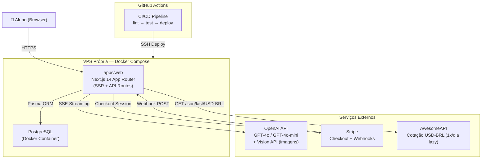

# SOL Fullstack Architecture Document

## Introduction

Este documento define a arquitetura completa do SOL, englobando frontend, backend e infraestrutura. Ele serve como a única fonte de verdade técnica para o desenvolvimento conduzido por agentes de IA, garantindo consistência em todas as camadas da stack. O projeto utiliza uma abordagem monolítica dentro de um monorepo para simplificar o deploy inicial em VPS própria, respeitando o princípio de zero lock-in da Eden Corporate.

### Starter Template or Existing Project

O projeto é baseado em uma estrutura proprietária da Eden Corporate, já inicializada como um monorepo Turborepo. Não foram utilizados templates externos de terceiros.

### Change Log

| Date       | Version | Description                          | Author           |
| ---------- | ------- | ------------------------------------ | ---------------- |
| 2026-02-25 | 1.0     | Initial fullstack architecture draft | Aria (Architect) |
| 2026-02-26 | 2.0     | Novo modelo de precificação: créditos como saldo interno em centavos de real, custo variável por mensagem (tiktoken + cotação USD-BRL), tabela ExchangeRate, metadados de tokens em CreditTransaction, AwesomeAPI como serviço externo | Aria (Architect) |
| 2026-02-26 | 2.1     | Refinamento de schema: User.credits → balanceCents + minBalanceCents, CreditTransaction com inputTokens/outputTokens/costUsd, ExchangeRate com currency+date (@@unique), funções packages/db com assinaturas refinadas | Aria (Architect) |
| 2026-02-27 | 3.0     | Novo modelo de precificação com gate pré-chamada: estimativa de custo máximo (input + MAX_OUTPUT_TOKENS=8192), saldo nunca negativo, remoção de minBalanceCents. Lazy exchange rate (on-demand via AwesomeAPI). CREDIT_PERCENTAGE substitui CREDIT_MARGIN_PERCENT. Funções estimateMaxCost/calculateRealCost. Campo maxOutputTokens em CreditTransaction. Constante MAX_OUTPUT_TOKENS=8192, MIN_COST_CENTS=100. | Aria (Architect) |
| 2026-02-27 | 4.0     | Suporte a anexos no chat (FR11/Story 2.5). Novas dependências: pdf-parse, mammoth, sharp. CreditTransaction com hasAttachments/attachmentTypes/attachmentTokens. POST /api/chat aceita multipart/form-data (retrocompatível com JSON). calculateImageCost() em token-counter.ts. Workflow atualizado com file processing. Runtime nodejs obrigatório. addCredits exchangeRate tornado obrigatório. | Aria (Architect) |
| 2026-02-28 | 5.0     | Admin Console (FR12/Story 4.2). Enum TransactionType adiciona `adjustment`. CreditTransaction ganha `grossAmountCents` (Int?) e `adminEmail` (String?). addCredits() refatorado para union type (purchase | adjustment). Webhook Stripe atualizado para registrar grossAmountCents. Novo módulo packages/db/src/admin.ts com queries de métricas (usuários, uso, financeiras, cotação). Nova rota POST /api/admin/add-credits. Workflow de adição manual de créditos documentado. | Aria (Architect) |

---

## High Level Architecture

### Technical Summary

O SOL é um SaaS monolítico fullstack construído sobre Next.js 14 com App Router, hospedado em VPS própria via Docker Compose. Frontend e backend coexistem no mesmo processo — páginas server-rendered em React Server Components e lógica de negócio em API Routes dentro de `apps/web/app/api/`. A camada de dados usa Prisma com PostgreSQL, ambos containerizados. Integrações externas incluem OpenAI (chat via SSE streaming, incluindo Vision API para imagens), Stripe (pagamentos via Checkout + Webhooks) e AwesomeAPI (cotação USD-BRL lazy on-demand para cálculo de custo por mensagem). O chat suporta anexos de arquivos (imagens, PDFs, DOCX, TXT, MD) processados em memória sem persistência — imagens via Vision API (forçando GPT-4o), documentos via extração de texto (pdf-parse, mammoth). O modelo de precificação usa um gate pré-chamada: antes de cada chamada à OpenAI, o backend estima o custo máximo (input real + tokens de anexos + MAX_OUTPUT_TOKENS=8192 tokens de output × taxa do modelo × cotação USD-BRL) e verifica se o saldo cobre. Se cobrir, executa a chamada e deduz o custo real após streaming. O saldo nunca fica negativo — o gate garante cobertura do pior caso. O painel administrativo em `/admin` (restrito a `role: ADMIN`) exibe métricas reais de usuários, uso e financeiras diretamente via Server Components, com capacidade de adição manual de créditos em reais com auditoria completa. O monorepo Turborepo com `packages/db` garante tipagem compartilhada e permite extrair serviços no futuro sem refatoração significativa.

### Platform and Infrastructure Choice

**Platform:** VPS Própria (Linux)
**Key Services:** Docker, Docker Compose, PostgreSQL 16, Nginx (Reverse Proxy)
**Deployment Host and Regions:** Brasil (São Paulo) para latência mínima.

### Repository Structure

**Structure:** Monorepo
**Monorepo Tool:** Turborepo
**Package Organization:**

- `apps/web`: Next.js application
- `packages/db`: Shared Prisma client and credit logic
- `packages/config`: Shared ESLint/TS configs

### High Level Architecture Diagram



### Architectural Patterns

- **Monolith dentro de Monorepo:** Frontend (RSC) e backend (API Routes) no mesmo processo Next.js - _Rationale:_ Elimina complexidade de rede e simplifica deploy no MVP.
- **Server Components First:** Busca de dados via React Server Components - _Rationale:_ Elimina waterfalls de dados no client e melhora o TTFB.
- **Repository Pattern (packages/db):** Lógica física de créditos encapsulada em pacote compartilhado - _Rationale:_ Garante consistência ACID e permite reuso por scripts externos.
- **SSE Streaming:** Respostas da IA via Server-Sent Events - _Rationale:_ Nativo em Next.js e ideal para UX de chat "vivo".
- **Webhook Idempotente:** Uso de `stripe_payment_id` UNIQUE - _Rationale:_ Previne crédito duplicado em caso de retentativas do Stripe.
- **Gate + Real Cost Pricing:** Gate pré-chamada estima custo máximo (input + 8192 output tokens), verifica saldo e só executa se cobrir. Após streaming, deduz custo real (sempre ≤ estimado). Custo mínimo: MIN_COST_CENTS=100 (1 crédito) - _Rationale:_ Saldo nunca fica negativo, elimina necessidade de minBalanceCents e garante previsibilidade financeira.
- **Lazy Exchange Rate:** Cotação consultada on-demand via `getExchangeRate()` — busca no banco, se não existe chama AwesomeAPI e salva, fallback para última cotação ou `FALLBACK_USD_BRL_RATE` - _Rationale:_ Minimiza dependência externa e garante operação contínua mesmo com API indisponível, sem necessidade de cron job separado.

---

## Tech Stack

| Category           | Technology         | Version           | Purpose                  | Rationale                                              |
| ------------------ | ------------------ | ----------------- | ------------------------ | ------------------------------------------------------ |
| Frontend Language  | TypeScript         | 5.x (strict)      | Toda a codebase          | Type safety end-to-end; `any` proibido                 |
| Frontend Framework | Next.js            | 14 (App Router)   | SSR, routing, API Routes | Monolith fullstack, zero servidor separado             |
| UI Components      | Shadcn/UI          | latest            | Design system            | Customizável, sem lock-in, baseado em Radix            |
| CSS Framework      | Tailwind CSS       | 3.x               | Estilização              | Utilitário-primeiro, integrado ao Shadcn               |
| AI Streaming       | Vercel AI SDK      | latest (lib only) | Streaming SSE no cliente | Abstrai lógica de streaming sem depender da plataforma |
| Backend            | Next.js API Routes | 14                | API REST interna         | Simplicidade e integração nativa com o app             |
| ORM                | Prisma             | 5.x               | Acesso ao banco          | Type-safe, migrations versionadas                      |
| Database           | PostgreSQL         | 16                | Persistência principal   | Self-hosted, production-grade, zero lock-in            |
| Auth               | NextAuth.js        | v5 (Auth.js)      | Sessão e auth            | Credentials Provider, JWT httpOnly                     |
| Payments           | Stripe SDK         | latest            | Checkout + Webhooks      | Gateway robusto com PIX nativo                         |
| Token Counting     | tiktoken           | latest            | Contagem precisa de tokens | Cálculo de custo real por mensagem antes/após chamada OpenAI |
| PDF Extraction     | pdf-parse          | latest            | Extração de texto de PDFs | Leve, sem dependências nativas. PDFs escaneados retornam string vazia (detectado e avisado) |
| DOCX Extraction    | mammoth            | latest            | Extração de texto de DOCX | Requer runtime Node.js (não edge). API Route deve ter `export const runtime = 'nodejs'` |
| Image Dimensions   | sharp              | latest            | Leitura de dimensões de imagens | Cálculo de custo Vision API (tiles 512×512). Requer runtime Node.js |
| Exchange Rate      | AwesomeAPI         | REST              | Cotação USD-BRL (lazy on-demand) | API gratuita, sem autenticação, fallback em 4 níveis   |
| Infra              | Docker Compose     | latest            | Orquestração             | Simples para monolith em VPS                           |

### Configuration & Constants

**Environment Variables (pricing-related):**

| Variable                | Example  | Purpose                                              |
| ----------------------- | -------- | ---------------------------------------------------- |
| `FALLBACK_USD_BRL_RATE` | `"6.00"` | Cotação fallback quando banco e API estão indisponíveis |
| `CREDIT_PERCENTAGE`     | `"0.40"` | Porcentagem do valor pago disponibilizada como saldo (40%) |

**Application Constants:**

| Constant             | Value  | Purpose                                                       |
| -------------------- | ------ | ------------------------------------------------------------- |
| `MAX_OUTPUT_TOKENS`  | `8192` | Teto de segurança para estimativa de custo máximo e `max_tokens` da OpenAI |
| `MIN_COST_CENTS`     | `100`  | Custo mínimo por mensagem = 1 crédito (100 centavos)         |
| `MAX_FILE_SIZE`      | `10MB` | Tamanho máximo por arquivo anexado (10 × 1024 × 1024 bytes)  |
| `MAX_FILES_PER_MSG`  | `3`    | Máximo de arquivos por mensagem                              |
| `MAX_DOC_CHARS`      | `50000`| Limite de caracteres extraídos por documento (rejeitado se exceder) |

**Encoding:** `cl100k_base` (tiktoken) — compatível com GPT-4o e GPT-4o-mini.

**MIME Types Permitidos:**

| Categoria | MIME Types |
| --------- | ---------- |
| Imagens   | `image/jpeg`, `image/png`, `image/gif`, `image/webp` |
| Documentos| `application/pdf`, `text/plain`, `text/markdown`, `application/vnd.openxmlformats-officedocument.wordprocessingml.document` |

---

## Data Models

### User

**Purpose:** Representa o aluno autenticado e seu saldo interno.

```typescript
interface User {
  id: string; // cuid
  email: string;
  passwordHash: string;
  balanceCents: number; // saldo interno em centavos de real (nunca negativo — gate garante)
  createdAt: Date;
  updatedAt: Date;
}
```

### Conversation

**Purpose:** Agrupa mensagens em uma sessão de chat.

```typescript
interface Conversation {
  id: string;
  userId: string;
  title: string;
  createdAt: Date;
}
```

### CreditTransaction

**Purpose:** Registro auditável de movimentações financeiras com metadados de custo completos.

```typescript
interface CreditTransaction {
  id: string;
  userId: string;
  amount: number; // centavos de real (positivo = crédito, negativo = débito)
  type: 'purchase' | 'consumption' | 'adjustment'; // adjustment = adição manual pelo admin
  description: string | null; // título da conversa (consumption), descrição da compra (purchase) ou "Ajuste manual por [adminEmail]: [motivo]" (adjustment)
  stripePaymentId: string | null; // unique — idempotência de webhook (apenas purchase)
  grossAmountCents: number | null; // valor bruto pago pelo aluno no Stripe em centavos (apenas purchase) — base para cálculo de receita
  adminEmail: string | null; // email do admin executor (apenas adjustment) — auditoria
  exchangeRate: number | null; // Decimal — cotação USD-BRL no momento da transação
  inputTokens: number | null; // tokens de input consumidos (apenas consumption)
  outputTokens: number | null; // tokens de output consumidos (apenas consumption)
  modelUsed: string | null; // modelo OpenAI utilizado (ex: "gpt-4o", "gpt-4o-mini")
  costUsd: number | null; // Decimal — custo em dólar da chamada OpenAI (apenas consumption)
  maxOutputTokens: number | null; // max_tokens usado no gate para auditoria (apenas consumption)
  hasAttachments: boolean; // se a mensagem incluiu arquivos (default false)
  attachmentTypes: string[]; // tipos MIME dos arquivos (ex: ["image/jpeg", "application/pdf"]) (default [])
  attachmentTokens: number | null; // tokens adicionais gerados pelos arquivos (apenas consumption)
  createdAt: Date;
}
```

**Invariantes por tipo:**

| Campo | `purchase` | `consumption` | `adjustment` |
|---|---|---|---|
| `stripePaymentId` | ✅ obrigatório (idempotência) | null | null |
| `grossAmountCents` | ✅ valor bruto Stripe | null | null |
| `adminEmail` | null | null | ✅ obrigatório (auditoria) |
| `inputTokens/outputTokens` | null | ✅ | null |
| `costUsd/modelUsed` | null | ✅ | null |
| `exchangeRate` | ✅ cotação do dia | ✅ cotação do dia | ✅ cotação do dia |

### ExchangeRate

**Purpose:** Cache diário de cotação cambial para cálculo de custo.

```typescript
interface ExchangeRate {
  id: string;
  currency: string; // par cambial (ex: "USD-BRL")
  rate: number; // Decimal — cotação (ex: 5.45)
  date: Date; // data da cotação (sem horário, ex: 2026-02-26)
  createdAt: Date;
}
// Constraint: @@unique([currency, date])
```

---

## API Specification

### Chat API

`POST /api/chat`

- **Auth:** Requerido
- **Runtime:** `export const runtime = 'nodejs'` (obrigatório para mammoth e sharp)
- **Content-Type:** Aceita dois formatos (retrocompatível):
  - `application/json`: `{ conversationId?: string, message: string }` — fluxo sem anexos (existente, intocado)
  - `multipart/form-data`: campos `message` (string), `conversationId` (string?), `files` (File[], max 3) — fluxo com anexos
- **Detecção:** Via header `Content-Type`. Se JSON → fluxo existente sem alteração.
- **Response:** `text/event-stream` (SSE)
- **Headers de resposta:** `X-Balance-Cents` (saldo em centavos de real após dedução)
- **Status 400:** Retornado quando arquivo inválido (tipo MIME não permitido, >10MB, >50k chars, PDF escaneado sem texto)
- **Status 402:** Retornado quando `balanceCents` é insuficiente para cobrir o custo máximo estimado (inputTokens × preço_input + MAX_OUTPUT_TOKENS × preço_output) × cotação USD-BRL. O gate garante que o saldo cobre o pior caso antes de executar a chamada OpenAI.

#### Fluxo com Anexos (multipart/form-data)

1. Receber FormData: `message`, `conversationId`, `files` (max 3)
2. Validar cada arquivo: tipo MIME contra allowlist, tamanho ≤ 10MB. Se inválido → 400 com mensagem identificando qual arquivo e por quê
3. Processar cada arquivo:
   - **Imagem:** ler dimensões via sharp, calcular custo Vision via `calculateImageCost()`
   - **PDF:** extrair texto via pdf-parse. Se texto vazio → 400: "Este PDF não contém texto legível. Envie como imagem ou digite o conteúdo."
   - **DOCX:** extrair texto via mammoth
   - **TXT/MD:** ler conteúdo do buffer diretamente
4. Validar conteúdo extraído: se > 50.000 chars → 400: "Documento muito grande. Máximo: ~25 páginas de texto." (nunca truncar)
5. Calcular `totalInputTokens` = tokens das mensagens + tokens do texto extraído (tiktoken) + tokens fixos de imagens (Vision)
6. Determinar modelo: se há imagem → forçar `model = 'gpt-4o'` (Vision requer modelo completo); se não → lógica existente
7. Gate: `estimateMaxCost(totalInputTokens, model, exchangeRate)` — usa modelo efetivo
8. Montar payload OpenAI: imagens como `content[].type: "image_url"` (base64 inline, detail "auto"); documentos como prefixo no texto: `[Documento: {filename}]\n{text}\n\n{message}`
9. Streaming SSE normal → dedução real com metadata: `hasAttachments: true`, `attachmentTypes`, `attachmentTokens`

### Exchange Rate Functions (packages/db)

**`getExchangeRate(currency: string): Promise<Decimal>`**

Busca lazy on-demand com fallback em 4 níveis:

1. Busca cotação do dia na tabela `exchange_rates` onde `currency` = par e `date` = hoje
2. Se encontrar, retorna `rate`
3. Se não encontrar, chama AwesomeAPI (`GET https://economia.awesomeapi.com.br/json/last/USD-BRL`), salva no banco via upsert, retorna `rate`
4. Se a API falhar, busca última cotação disponível para o par (qualquer data)
5. Se banco vazio, retorna `FALLBACK_USD_BRL_RATE` do `.env`
6. Se nada disponível, erro graceful (não crash)

**`updateExchangeRate(currency: string, rate: Decimal): Promise<ExchangeRate>`**

1. Faz upsert na tabela `exchange_rates` com `currency` + `date` = hoje
2. Chamada internamente por `getExchangeRate()` quando busca cotação na API

### Credit Functions (packages/db)

**`deductCredits(userId, costCents, metadata)`**

```typescript
deductCredits(
  userId: string,
  costCents: number,
  metadata: {
    exchangeRate: Decimal;
    inputTokens: number;
    outputTokens: number;
    modelUsed: string;
    costUsd: Decimal;
    conversationTitle: string;
    maxOutputTokens: number;
    hasAttachments?: boolean;       // default false
    attachmentTypes?: string[];     // default []
    attachmentTokens?: number;      // tokens adicionais dos anexos
  }
): Promise<{ balanceCents: number }>
```

- Executa em `$transaction` atômica: UPDATE atômico com `WHERE balanceCents - costCents >= 0`, insert `CreditTransaction`
- Saldo nunca fica negativo — o gate pré-chamada já garantiu cobertura do pior caso
- Lança `InsufficientBalanceError` se UPDATE não afeta nenhuma row

**`addCredits(userId, amountCents, options)`**

```typescript
type AddCreditsOptions =
  | {
      type: 'purchase'
      stripePaymentId: string   // obrigatório — idempotência via UNIQUE
      exchangeRate: Prisma.Decimal
      grossAmountCents: number  // valor bruto pago no Stripe em centavos
    }
  | {
      type: 'adjustment'
      exchangeRate: Prisma.Decimal
      adminEmail: string        // obrigatório — auditoria
      description: string       // motivo do ajuste
    }

addCredits(
  userId: string,
  amountCents: number,
  options: AddCreditsOptions
): Promise<{ balanceCents: number }>
```

- Executa em `$transaction` atômica: increment `balanceCents`, insert `CreditTransaction`
- **`purchase`:** `amountCents = grossAmountCents × CREDIT_PERCENTAGE` (ex: R$69,90 × 0.40 = 2796 centavos). Idempotente via `stripePaymentId` UNIQUE. Registra `grossAmountCents` para rastreio de receita bruta
- **`adjustment`:** adição manual pelo admin. Sem `stripePaymentId`. Registra `adminEmail` e `description: "Ajuste manual por [adminEmail]: [motivo]"`. Sem idempotência por design (admin confirma antes de executar)

**`estimateMaxCost(inputTokens, model, exchangeRate)`**

```typescript
estimateMaxCost(
  inputTokens: number,
  model: string,
  exchangeRate: Decimal
): { maxCostCents: number; maxCostUsd: Decimal }
```

- Calcula custo máximo: `(inputTokens × preço_input + MAX_OUTPUT_TOKENS × preço_output) × exchangeRate × 100`
- `MAX_OUTPUT_TOKENS = 8192` (constante — teto de segurança)
- Retorna `max(Math.ceil(resultado), MIN_COST_CENTS)` onde `MIN_COST_CENTS = 100`

**`calculateRealCost(inputTokens, outputTokens, model, exchangeRate)`**

```typescript
calculateRealCost(
  inputTokens: number,
  outputTokens: number,
  model: string,
  exchangeRate: Decimal
): { costCents: number; costUsd: Decimal }
```

- Calcula custo real: `(inputTokens × preço_input + outputTokens × preço_output) × exchangeRate × 100`
- Retorna `max(Math.ceil(resultado), MIN_COST_CENTS)` onde `MIN_COST_CENTS = 100` (1 crédito mínimo por mensagem)

### Token Counting Functions (packages/db)

**`calculateImageCost(width, height, detail)`**

```typescript
calculateImageCost(
  width: number,
  height: number,
  detail: 'low' | 'high' | 'auto'
): number // tokens
```

- `detail = 'low'`: sempre 85 tokens fixos
- `detail = 'high'`:
  1. Redimensionar para caber em 2048×2048 (escalar pela maior dimensão)
  2. Escalar para que menor dimensão = 768
  3. Calcular tiles de 512×512: `Math.ceil(scaledWidth / 512) × Math.ceil(scaledHeight / 512)`
  4. Custo = `(tiles × 170) + 85`
- `detail = 'auto'`: usar `'high'` se qualquer dimensão > 512, `'low'` caso contrário

_Nota: Esta função é adicionada em `packages/db/src/token-counter.ts` junto com as funções existentes de custo de texto._

### Payments API

`POST /api/payments/checkout`

- **Request:** `{ packageId: string }`
- **Response:** `{ sessionUrl: string }`

### Admin API

#### `POST /api/admin/add-credits`

- **Auth:** Requerido + `role: ADMIN` (verificado server-side — 403 se ausente ou insuficiente)
- **Request:** `{ userEmail: string, amountBRL: number, reason: string }` (validação Zod)
  - `userEmail`: string email válido
  - `amountBRL`: número positivo (valor em reais, não centavos)
  - `reason`: string mínimo 3 caracteres
- **Lógica:**
  1. Verificar session e `role: ADMIN` → 403 se não
  2. Buscar usuário pelo `userEmail` → 404 se não encontrado
  3. `amountCents = Math.round(amountBRL × 100)`
  4. `exchangeRate = getExchangeRate("USD-BRL")`
  5. `addCredits(userId, amountCents, { type: 'adjustment', exchangeRate, adminEmail, description: "Ajuste manual por [adminEmail]: [reason]" })`
- **Response 200:** `{ success: true, userEmail, addedCents, newBalanceCents }`
- **Response 403:** Admin não autenticado
- **Response 404:** Usuário não encontrado

#### `/admin` (Server Component Page)

- **Auth:** Verificação de `role: ADMIN` no Server Component → redirect `/chat` se não autorizado
- **Carregamento de dados:** `Promise.all([...queries])` para carregar todas as métricas em paralelo
- **Módulo de queries:** `packages/db/src/admin.ts` (novo arquivo)

### Admin Metrics Queries (packages/db/src/admin.ts)

**Módulo novo** — funções tipadas para alimentar o painel `/admin` via Server Components.

```typescript
// Métricas de Usuários
getUserMetrics(): Promise<{
  totalUsers: number
  activeUsers7d: number           // ≥1 mensagem nos últimos 7 dias
  usersWithoutUsableBalance: number // balanceCents < MIN_COST_CENTS (100)
  newUsers30d: number
}>

getUsersPage(page: number, pageSize: 20): Promise<{
  users: Array<{ email, balanceCents, totalMessages, createdAt }>
  total: number
}>

// Métricas de Uso
getUsageMetrics(): Promise<{
  totalMessages: number
  messagesToday: number
  messages7d: number
  totalInputTokens: number
  totalOutputTokens: number
  topModel: string
  topModelPercent: number
  avgTokensPerMessage: number
  messagesWithAttachments: number
  messagesWithoutAttachments: number
}>

// Métricas Financeiras
// ATENÇÃO: receita usa grossAmountCents (não amount) — evita dependência do CREDIT_PERCENTAGE
// ATENÇÃO: custo OpenAI usa raw query (SUM(cost_usd * exchange_rate) — Prisma não suporta multiplicação em aggregate
getFinancialMetrics(): Promise<{
  totalRevenueCents: number      // SUM(grossAmountCents) WHERE type = 'purchase'
  revenue30dCents: number
  totalOpenAICostBRL: number     // raw: SUM(cost_usd * exchange_rate) WHERE type = 'consumption'
  grossProfitCents: number       // revenue - openAICost (convertido para centavos)
  grossMarginPercent: number     // (profit / revenue) × 100
  markupPercent: number          // (revenue / cost) × 100
  creditsSoldCents: number       // SUM(amount) WHERE type = 'purchase'
  creditsConsumedCents: number   // SUM(ABS(amount)) WHERE type = 'consumption'
  totalRetainedBalanceCents: number // SUM(balanceCents) todos os usuários
}>

// Métricas de Cotação
getExchangeRateMetrics(): Promise<{
  currentRate: number
  minRate30d: number
  maxRate30d: number
}>
```

**Nota sobre custo OpenAI:** raw query obrigatória porque Prisma aggregate não suporta produto de dois campos:

```sql
SELECT COALESCE(SUM(cost_usd * exchange_rate), 0) AS total_cost_brl
FROM credit_transactions
WHERE type = 'consumption'
  AND cost_usd IS NOT NULL
  AND exchange_rate IS NOT NULL
```

---

## Core Workflows

### Chat & Credit Deduction (Gate + Real Cost)

1. Aluno envia mensagem (com ou sem anexos).
2. **Detecção de formato:** Content-Type `application/json` → fluxo sem anexos; `multipart/form-data` → fluxo com anexos.
3. **[Se anexos]** Validar arquivos: tipo MIME contra allowlist, tamanho ≤ 10MB, máximo 3 arquivos.
4. **[Se anexos]** Processar cada arquivo em memória:
   - **Imagem:** ler dimensões via sharp, calcular tokens Vision via `calculateImageCost(width, height, 'auto')`.
   - **PDF:** extrair texto via pdf-parse. Se vazio → 400 (PDF escaneado).
   - **DOCX:** extrair texto via mammoth.
   - **TXT/MD:** ler buffer diretamente.
   - Validar: se > 50.000 chars → 400 (rejeitado, nunca truncado).
5. **[Se anexos com imagem]** Forçar `model = 'gpt-4o'` (Vision API requer modelo completo).
6. Backend monta contexto: system prompt + resumo das últimas 10 mensagens + mensagem nova + conteúdo extraído de documentos.
7. Conta `totalInputTokens` via `tiktoken`: tokens de mensagens + tokens de texto extraído + tokens fixos de imagens (Vision).
8. Busca cotação do dia via `getExchangeRate("USD-BRL")` (lazy: banco → AwesomeAPI → fallback).
9. Calcula custo máximo via `estimateMaxCost(totalInputTokens, model, exchangeRate)`.
10. **GATE:** `balanceCents >= maxCostCents`? Se **não** → retorna `402 Payment Required`, exibe prompt inline.
11. Se **cobre** → monta payload OpenAI (imagens como `image_url` base64, documentos como prefixo textual), chama com `max_tokens: 8192`, streaming SSE.
12. Stream completo → calcula custo real via `calculateRealCost(totalInputTokens, outputTokensReais, model, exchangeRate)`.
13. Aplica custo mínimo: `costCents = max(resultado, MIN_COST_CENTS=100)`.
14. Deduz custo **real** via `deductCredits(userId, costCents, { exchangeRate, inputTokens, outputTokens, modelUsed, costUsd, conversationTitle, maxOutputTokens, hasAttachments, attachmentTypes, attachmentTokens })`.
15. `CreditTransaction` registrada com todos os campos de auditoria (incluindo anexos) dentro da mesma `$transaction`.
16. Saldo nunca fica negativo — gate garantiu cobertura do pior caso, custo real ≤ estimado.
17. Retorna header `X-Balance-Cents` com `balanceCents` atualizado.
18. Buffers dos arquivos descartados — nenhuma persistência em disco, S3 ou banco.

### Purchase & Credit Addition (Stripe)

1. Aluno escolhe pacote e finaliza compra via Stripe Checkout.
2. Stripe envia webhook `checkout.session.completed`.
3. Extrai `session.amount_total` (valor bruto pago em centavos) como `grossAmountCents`.
4. Backend calcula saldo a creditar: `amountCents = grossAmountCents × CREDIT_PERCENTAGE` (ex: R$69,90 × 0.40 = 2796 centavos).
5. Busca cotação atual via `getExchangeRate("USD-BRL")` para registro.
6. Credita via `addCredits(userId, amountCents, { type: 'purchase', stripePaymentId, exchangeRate, grossAmountCents })` em transação atômica (idempotente via `stripePaymentId` UNIQUE).
7. `CreditTransaction` registra `grossAmountCents` para rastreio correto de receita bruta no painel admin.

### Admin Manual Credit Addition

1. Admin acessa `/admin` (protegido por `role: ADMIN` no Server Component).
2. Preenche formulário: email do usuário + valor em R$ + motivo.
3. Frontend exibe confirmação: "Adicionar R$ X,XX ao saldo de [email]?"
4. Admin confirma → `POST /api/admin/add-credits` com `{ userEmail, amountBRL, reason }`.
5. Backend valida (Zod) → verifica `role: ADMIN` server-side → busca usuário pelo email (404 se não encontrado).
6. Converte: `amountCents = Math.round(amountBRL × 100)`.
7. Busca cotação via `getExchangeRate("USD-BRL")` (auditoria de câmbio do dia).
8. Credita via `addCredits(userId, amountCents, { type: 'adjustment', exchangeRate, adminEmail, description: "Ajuste manual por [adminEmail]: [reason]" })`.
9. `CreditTransaction` registrada com `type: adjustment`, `adminEmail`, `description`, `exchangeRate`, `stripePaymentId: null`, `grossAmountCents: null`.
10. Retorna `{ success: true, userEmail, addedCents, newBalanceCents }`.
11. Sem passar pelo Stripe — sem taxa. Sem idempotência automática (admin confirma antes de executar).

### Exchange Rate Refresh (Lazy On-Demand)

1. `getExchangeRate("USD-BRL")` é chamada a cada mensagem de chat.
2. Busca cotação do dia no banco (`exchange_rates` WHERE `currency` = "USD-BRL" AND `date` = hoje).
3. Se encontrar → retorna (máximo 1 request externo por dia).
4. Se não encontrar → chama AwesomeAPI: `GET https://economia.awesomeapi.com.br/json/last/USD-BRL`.
5. Se API responder → salva via `updateExchangeRate()` (upsert), retorna `rate`.
6. Se API falhar → busca última cotação disponível no banco (qualquer data).
7. Se banco vazio → retorna `FALLBACK_USD_BRL_RATE` do `.env`.
8. Se nada disponível → erro graceful (não crash, log de alerta).

---

## Database Schema

```prisma
model User {
  id              String              @id @default(cuid())
  email           String              @unique
  passwordHash    String
  balanceCents    Int                 @default(0)    // saldo interno em centavos de real (nunca negativo)
  createdAt       DateTime            @default(now())
  updatedAt       DateTime            @updatedAt
  conversations   Conversation[]
  transactions    CreditTransaction[]
}

model CreditTransaction {
  id               String          @id @default(cuid())
  userId           String
  user             User            @relation(fields: [userId], references: [id])
  amount           Int             // centavos de real (positivo = crédito, negativo = débito)
  type             TransactionType // purchase | consumption | adjustment
  description      String?         // título da conversa (consumption), descrição da compra (purchase) ou "Ajuste manual por [adminEmail]: [motivo]" (adjustment)
  stripePaymentId  String?         @unique          // idempotência de webhook (apenas purchase)
  grossAmountCents Int?            // valor bruto pago no Stripe em centavos (apenas purchase) — base para receita bruta
  adminEmail       String?         // email do admin executor (apenas adjustment) — auditoria
  exchangeRate     Decimal?        // cotação USD-BRL no momento da transação
  inputTokens      Int?            // tokens de input consumidos (apenas consumption)
  outputTokens     Int?            // tokens de output consumidos (apenas consumption)
  modelUsed        String?         // modelo OpenAI (ex: "gpt-4o", "gpt-4o-mini")
  costUsd          Decimal?        // custo em dólar da chamada OpenAI (apenas consumption)
  maxOutputTokens  Int?            // max_tokens usado no gate (auditoria — apenas consumption)
  hasAttachments   Boolean         @default(false) // se a mensagem incluiu arquivos
  attachmentTypes  String[]        @default([])    // tipos MIME dos arquivos (ex: ["image/jpeg"])
  attachmentTokens Int?            // tokens adicionais gerados pelos arquivos (apenas consumption)
  createdAt        DateTime        @default(now())

  @@index([userId])
  @@index([type])
}

enum TransactionType {
  purchase
  consumption
  adjustment  // adição manual de créditos pelo admin (sem Stripe)
}

model ExchangeRate {
  id        String   @id @default(cuid())
  currency  String   // par cambial (ex: "USD-BRL")
  rate      Decimal  // cotação (ex: 5.45)
  date      DateTime @db.Date // data da cotação (sem horário)
  createdAt DateTime @default(now())

  @@unique([currency, date])
}
```

_Nota: Saldo negativo é matematicamente impossível. O gate pré-chamada em `POST /api/chat` garante que `balanceCents >= maxCostCents` antes de executar a chamada OpenAI. Como o custo real é sempre ≤ custo máximo estimado, o saldo após dedução é sempre ≥ 0. A função `deductCredits()` usa UPDATE atômico com `WHERE balanceCents - costCents >= 0` como proteção adicional._

---

## Unified Project Structure

```plaintext
sol-saas/
├── apps/web/               # Next.js App
├── packages/db/            # Shared Prisma & Credit Logic
├── docker-compose.yml      # VPS Orchestration
└── turbo.json              # Task Runner
```

---

## Security and Performance

- **Security:** JWT em cookies httpOnly, CSP headers rígidos, Rate Limiting por IP no Chat. Cotação e custos internos nunca expostos ao frontend — aluno vê apenas créditos e estimativa de scripts. UPDATE atômico com `WHERE balanceCents - costCents >= 0` previne race conditions. Validação de MIME type no servidor contra allowlist (não confiar no Content-Type do cliente). Arquivos processados em memória e descartados — nunca persistidos. Rotas `/admin` e `/api/admin/*` verificam `role: ADMIN` server-side (Server Component + API Route) — middleware como primeira barreira, verificação server-side como garantia definitiva. Admin não pode inferir dados de outros admins via `adminEmail` auditado.
- **Performance:** Resposta da primeira palavra em < 3s via SSE. RSC para carregamento zero-latency de dados iniciais. Cotação USD-BRL cacheada por dia na tabela `exchange_rates` (máximo 1 request externo por dia, lazy on-demand).
- **Memory (Anexos):** Limite de 10MB/arquivo × 3 = 30MB max por request. Com 200 usuários concorrentes (NFR8), pior caso teórico ~6GB em pico (improvável — maioria das mensagens não tem anexo). Monitorar uso de memória em produção. Sem storage externo no MVP.
- **Reliability:** Idempotência via `stripe_payment_id` no banco. Cotação com fallback em 4 níveis (dia atual → AwesomeAPI → última salva → env var). Gate pré-chamada garante saldo nunca negativo. Se extração de arquivo falhar → 400, nenhum crédito deduzido, nenhuma chamada OpenAI.
- **Auditoria:** Cada `CreditTransaction` registra campos específicos por tipo: `consumption` → `exchangeRate`, `inputTokens`, `outputTokens`, `modelUsed`, `costUsd`, `maxOutputTokens`, `hasAttachments`, `attachmentTypes`, `attachmentTokens`; `purchase` → `exchangeRate`, `stripePaymentId`, `grossAmountCents` (valor bruto real pago pelo aluno — independente do CREDIT_PERCENTAGE); `adjustment` → `exchangeRate`, `adminEmail`, `description`. Receita bruta sempre calculada via `SUM(grossAmountCents)` — imune a mudanças futuras no `CREDIT_PERCENTAGE`.

---

## Testing Strategy

- **Backend:** Unit tests para o pacote `@repo/db` (lógica de créditos, cálculo de custo por token, conversão cambial) usando Vitest.
- **Integration:** Testes de API Route para o fluxo de chat com mock de OpenAI e mock de cotação.
- **Unit - Token Counting:** Testes de contagem de tokens via tiktoken para diferentes tamanhos de input.
- **Unit - Exchange Rate:** Testes de `getExchangeRate()` e `updateExchangeRate()` com mock de AwesomeAPI e cenários de fallback (cotação do dia, última disponível, env var).
- **Unit - Image Cost:** Testes de `calculateImageCost()` para detail low (85 tokens), high (tiles 512×512) e auto (threshold 512).
- **Integration - Anexos:** Testes de POST /api/chat com multipart/form-data: validação de MIME type, rejeição >10MB, rejeição >50k chars, PDF escaneado, retrocompatibilidade com JSON.
- **Unit - addCredits (refatorado):** Testes dos dois modos de `addCredits()`: `purchase` (com `stripePaymentId` e `grossAmountCents`, idempotência) e `adjustment` (com `adminEmail` e `description`, sem idempotência).
- **Unit - Admin Metrics:** Testes das funções em `packages/db/src/admin.ts` com dados seedados: receita via `grossAmountCents`, custo via raw query `SUM(cost_usd * exchange_rate)`, lucro/margem/markup, métricas de uso (tokens, modelos, mensagens).
- **Integration - Admin API:** Testes de `POST /api/admin/add-credits`: autenticação (401), autorização (403 para `role: USER`), usuário não encontrado (404), validação Zod (400), adição bem-sucedida (200) com verificação de `CreditTransaction` e `balanceCents` atualizados.
- **Integration - Webhook (grossAmountCents):** Testes de `POST /api/webhooks/stripe` verificando que `grossAmountCents = session.amount_total` é persistido corretamente na `CreditTransaction`.

---

## Checklist Results Report

### Executive Summary

- **Readiness:** HIGH (Pronto para implementação por agentes Dev)
- **Project Type:** Fullstack Monolith
- **Critical Risks:**
  - Pressão no DB devido à falta de cache (Redis) no MVP.
  - Dependência de API externa (AwesomeAPI) para cotação — mitigado por fallback em 4 níveis (banco → API → última cotação → env var).
  - Variação cambial pode impactar margem entre compras — mitigado por auditoria completa por transação.
  - Gate conservador (MAX_OUTPUT_TOKENS=8192) pode bloquear usuários com saldo suficiente para mensagens curtas — aceitável como trade-off de segurança financeira.
  - Anexos processados em memória: pico teórico de 30MB/request × 200 concorrentes = ~6GB — mitigado por ser cenário improvável + monitoramento em produção.

### Section Analysis

- Requirements Alignment: 100%
- Tech Stack: 100%
- Implementation Guidance: 100%

### Architecture Veredict: ✅ READY FOR IMPLEMENTATION

---

## Next Steps & Handoff

### Dev Expert Prompt

> @dev — Inicie a implementação do Epic 1 (Foundation & Auth) conforme o PRD (`docs/prd.md`) e a Arquitetura (`docs/architecture.md`). Foque em: setup do monorepo Turborepo, docker-compose com PostgreSQL 16, e autenticação via NextAuth v5 com Credentials Provider. Garanta o uso de TypeScript strict e a estrutura definida no documento de arquitetura.

### UX Expert Prompt

> @ux — Desenvolva o layout principal e o chat baseado na paleta solar e dark mode definidos. Integre os componentes do Shadcn/UI conforme indicado na Seção 10 da Arquitetura.
