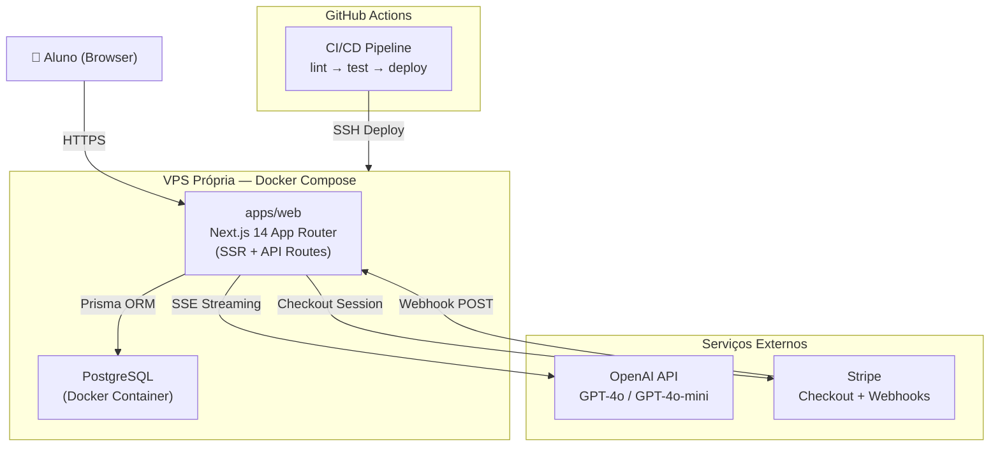

# SOL Fullstack Architecture Document

## Introduction

Este documento define a arquitetura completa do SOL, englobando frontend, backend e infraestrutura. Ele serve como a única fonte de verdade técnica para o desenvolvimento conduzido por agentes de IA, garantindo consistência em todas as camadas da stack. O projeto utiliza uma abordagem monolítica dentro de um monorepo para simplificar o deploy inicial em VPS própria, respeitando o princípio de zero lock-in da Eden Corporate.

### Starter Template or Existing Project

O projeto é baseado em uma estrutura proprietária da Eden Corporate, já inicializada como um monorepo Turborepo. Não foram utilizados templates externos de terceiros.

### Change Log

| Date       | Version | Description                          | Author           |
| ---------- | ------- | ------------------------------------ | ---------------- |
| 2026-02-25 | 1.0     | Initial fullstack architecture draft | Aria (Architect) |

---

## High Level Architecture

### Technical Summary

O SOL é um SaaS monolítico fullstack construído sobre Next.js 14 com App Router, hospedado em VPS própria via Docker Compose. Frontend e backend coexistem no mesmo processo — páginas server-rendered em React Server Components e lógica de negócio em API Routes dentro de `apps/web/app/api/`. A camada de dados usa Prisma com PostgreSQL, ambos containerizados. Integrações externas se limitam a OpenAI (chat via SSE streaming) e Stripe (pagamentos via Checkout + Webhooks). O monorepo Turborepo com `packages/db` garante tipagem compartilhada e permite extrair serviços no futuro sem refatoração significativa.

### Platform and Infrastructure Choice

**Platform:** VPS Própria (Linux)
**Key Services:** Docker, Docker Compose, PostgreSQL 16, Nginx (Reverse Proxy)
**Deployment Host and Regions:** Brasil (São Paulo) para latência mínima.

### Repository Structure

**Structure:** Monorepo
**Monorepo Tool:** Turborepo
**Package Organization:**

- `apps/web`: Next.js application
- `packages/db`: Shared Prisma client and credit logic
- `packages/config`: Shared ESLint/TS configs

### High Level Architecture Diagram



### Architectural Patterns

- **Monolith dentro de Monorepo:** Frontend (RSC) e backend (API Routes) no mesmo processo Next.js - _Rationale:_ Elimina complexidade de rede e simplifica deploy no MVP.
- **Server Components First:** Busca de dados via React Server Components - _Rationale:_ Elimina waterfalls de dados no client e melhora o TTFB.
- **Repository Pattern (packages/db):** Lógica física de créditos encapsulada em pacote compartilhado - _Rationale:_ Garante consistência ACID e permite reuso por scripts externos.
- **SSE Streaming:** Respostas da IA via Server-Sent Events - _Rationale:_ Nativo em Next.js e ideal para UX de chat "vivo".
- **Webhook Idempotente:** Uso de `stripe_payment_id` UNIQUE - _Rationale:_ Previne crédito duplicado em caso de retentativas do Stripe.

---

## Tech Stack

| Category           | Technology         | Version           | Purpose                  | Rationale                                              |
| ------------------ | ------------------ | ----------------- | ------------------------ | ------------------------------------------------------ |
| Frontend Language  | TypeScript         | 5.x (strict)      | Toda a codebase          | Type safety end-to-end; `any` proibido                 |
| Frontend Framework | Next.js            | 14 (App Router)   | SSR, routing, API Routes | Monolith fullstack, zero servidor separado             |
| UI Components      | Shadcn/UI          | latest            | Design system            | Customizável, sem lock-in, baseado em Radix            |
| CSS Framework      | Tailwind CSS       | 3.x               | Estilização              | Utilitário-primeiro, integrado ao Shadcn               |
| AI Streaming       | Vercel AI SDK      | latest (lib only) | Streaming SSE no cliente | Abstrai lógica de streaming sem depender da plataforma |
| Backend            | Next.js API Routes | 14                | API REST interna         | Simplicidade e integração nativa com o app             |
| ORM                | Prisma             | 5.x               | Acesso ao banco          | Type-safe, migrations versionadas                      |
| Database           | PostgreSQL         | 16                | Persistência principal   | Self-hosted, production-grade, zero lock-in            |
| Auth               | NextAuth.js        | v5 (Auth.js)      | Sessão e auth            | Credentials Provider, JWT httpOnly                     |
| Payments           | Stripe SDK         | latest            | Checkout + Webhooks      | Gateway robusto com PIX nativo                         |
| Infra              | Docker Compose     | latest            | Orquestração             | Simples para monolith em VPS                           |

---

## Data Models

### User

**Purpose:** Representa o aluno autenticado e seu saldo.

```typescript
interface User {
  id: string; // cuid
  email: string;
  passwordHash: string;
  credits: number; // int >= 0
  createdAt: Date;
}
```

### Conversation

**Purpose:** Agrupa mensagens em uma sessão de chat.

```typescript
interface Conversation {
  id: string;
  userId: string;
  title: string;
  createdAt: Date;
}
```

### CreditTransaction

**Purpose:** Registro auditável de movimentações financeiras.

```typescript
interface CreditTransaction {
  id: string;
  userId: string;
  amount: number;
  type: 'purchase' | 'consumption';
  stripePaymentId: string | null;
}
```

---

## API Specification

### Chat API

`POST /api/chat`

- **Auth:** Requerido
- **Request:** `{ conversationId?: string, message: string }`
- **Response:** `text/event-stream` (SSE)
- **Status 402:** Retornado quando `credits <= 0`.

### Payments API

`POST /api/payments/checkout`

- **Request:** `{ packageId: string }`
- **Response:** `{ sessionUrl: string }`

---

## Core Workflows

### Chat & Credit Deduction

1. Usuário envia mensagem.
2. Backend valida saldo no DB.
3. Se houver saldo, inicia stream OpenAI.
4. Ao completar o stream (`onCompletion`):
   - Salva resposta no DB.
   - Deduz 1 crédito via `$transaction` atômica em `@repo/db`.

---

## Database Schema

```prisma
model User {
  id            String    @id @default(cuid())
  email         String    @unique
  credits       Int       @default(0)
  conversations Conversation[]
  transactions  CreditTransaction[]
}

model CreditTransaction {
  id              String   @id @default(cuid())
  stripePaymentId String?  @unique
  amount          Int
  type            String   // consumption | purchase
}
```

_Nota: Adicionar CHECK CONSTRAINT manual para `credits >= 0` via migration SQL._

---

## Unified Project Structure

```plaintext
sol-saas/
├── apps/web/               # Next.js App
├── packages/db/            # Shared Prisma & Credit Logic
├── docker-compose.yml      # VPS Orchestration
└── turbo.json              # Task Runner
```

---

## Security and Performance

- **Security:** JWT em cookies httpOnly, CSP headers rígidos, Rate Limiting por IP no Chat.
- **Performance:** Resposta da primeira palavra em < 3s via SSE. RSC para carregamento zero-latency de dados iniciais.
- **Reliability:** Idempotência via `stripe_payment_id` no banco.

---

## Testing Strategy

- **Backend:** Unit tests para o pacote `@repo/db` (lógica de créditos) usando Vitest.
- **Integration:** Testes de API Route para o fluxo de chat com mock de OpenAI.

---

## Checklist Results Report

### Executive Summary

- **Readiness:** HIGH (Pronto para implementação por agentes Dev)
- **Project Type:** Fullstack Monolith
- **Critical Risks:**
  - Gerenciamento manual de constraints SQL (créditos não negativos).
  - Pressão no DB devido à falta de cache (Redis) no MVP.

### Section Analysis

- Requirements Alignment: 100%
- Tech Stack: 100%
- Implementation Guidance: 100%

### Architecture Veredict: ✅ READY FOR IMPLEMENTATION

---

## Next Steps & Handoff

### Dev Expert Prompt

> @dev — Inicie a implementação do Epic 1 (Foundation & Auth) conforme o PRD (`docs/prd.md`) e a Arquitetura (`docs/architecture.md`). Foque em: setup do monorepo Turborepo, docker-compose com PostgreSQL 16, e autenticação via NextAuth v5 com Credentials Provider. Garanta o uso de TypeScript strict e a estrutura definida no documento de arquitetura.

### UX Expert Prompt

> @ux — Desenvolva o layout principal e o chat baseado na paleta solar e dark mode definidos. Integre os componentes do Shadcn/UI conforme indicado na Seção 10 da Arquitetura.
